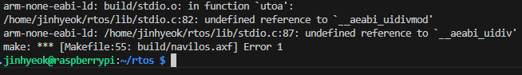

# 임베디드 OS 개발 프로젝트
> ARM 기반 펌웨어 / RTOS의 원리와 구조

## 부록 A

### A.1 ARM 아키텍처 기초 지식

여기서는 ARM 아키텍처에 대한 가장 기본적이고 반드시 알아두어야 할 내용을 정리하여 설명한다.

#### A.1.1 익셉션 벡터 테이블

전원이 켜지면 ARM은 익셉션 벡터 테이블의 리셋 벡터를 읽는다. 익셉션 벡터 테이블의 위치는 조정될 수 있고, 대부분은 기본 위치인 0x00000000 메모리 위치에 익셉션 벡터 테이블을 배치한다.

익셉션은 총 7개 있고 중간의 0x14 오프셋은 사용하지 않는다.

ARM은 익셉션 벡터 테이블에 정의된 상황이 발생하면 프로그램 카운터(PC)를 익셉션 벡터 테이블에 정의된 오프셋 주소로 강제 변환한다. 그리고 익셉션 벡터 테이블에 있는 명령을 바로 실행한다.

익셉션 벡터 테이블의 익셉션은 각각 4바이트씩 할당되어 있다. 여기에 브랜치 명령어를 써 놔서 익셉션을 처리하는 코드로 점프하게 만든다. 이 익셉션을 처리하는 코드를 **익셉션 핸들러** 라고 부른다.

```
0x00 Reset                  전원이 켜지면 실행됨
0x04 Undefined Instruction  잘못된 명령어를 실행했을 때
0x08 SVC(Supervisor Call)   SVC 명령으로 발생시키는 익셉션
0x0C Prefetch Abort         명령어 메모리에서 명령어를 읽다가 문제가 생김
0x10 Data Abort             데이터 메모리에서 데이터를 읽다가 문제가 생김
0x14 Not used               사용하지 않음
0x18 IRQ interrupt          IRQ 인터럽트가 발생했을 때
0x1C FIQ interrupt          FIQ 인터럽트가 발생했을 때
```

정리하면, 익셉션이 발생하면 ARM 코어는 프로그램 카운터를 익셉션 벡터 테이블의 익셉션 벡터 오프셋으로 변경한다. 거기에 브랜치 명령을 쓰고 브랜치 명령에 따라 다시 점프하면 익셉션 핸들러로 진입하고, 이 익셉션 핸들러에서 익셉션을 처리한다.

#### A.1.2 익셉션의 종류

익셉션이란 주변장치 등에서 발생한 신호를 처리하기 위해 순차적으로 진행하던 프로그램의 수행을 끊는 것을 말한다.

익셉션이 발생했을 때 익셉션 핸들러를 처리하고 나도 프로그램이 망가지지 않고 제대로 동작하도록 작업을 해주어야 한다.

익셉션이 발생하면 프로그램 흐름이 다시 원래 위치로 복귀할 수 있도록 ARM은 하드웨어 수준에서 최소한의 작업을 한다.

그 작업이란 R14(LR)에 복귀할 주소를 자동으로 저장하는 것이다.

개발자는 익셉션 핸들러의 마지막에서 R14_[mode] 에 저장된 값을 이용하여 원래 흐름으로 복귀할 수 있다. 다만 ARM의 파이프라인 때문에 각 익셉션별로 정상 복귀를 하기 위해서는 R14값에 각기 다른 연산을 해 줘야 한다.

#### A.1.3 인터럽트

인터럽트는 프로그램의 흐름을 누군가 가로채는 것을 말한다. ARM에서는 인터럽트와 익셉션이 차이 없이 동작한다. 즉 ARM에서는 인터럽트 핸들러와 익셉션 핸들러를 같은 개념으로 생각해도 된다.

인터럽트와 익셉션을 의미적으로 구분하면 인터럽트는 외부 요인에 의해서 발생하는 것이다. 예를 들어 버튼이 눌렸다거나 스마트폰의 액정 화면을 터치했다든가 하는 행동들이 인터럽트를 발생시킨다. 사용자의 행동뿐만 아니라 시간의 흐름에 의해서도 인터럽트는 발생한다. 그 뿐만 아니라 SSD에 데이터를 저장하려고 저장 버튼을 누르는 순간 운영체제는 SSD로 데이터를 보내는데, SSD의 펌웨어 입장에서는 호스트에서 데이터 전송에 해당하는 인터럽트를 전달받게 된다.

ARM은 두 종류의 인터럽트를 제공한다. 하나는 IRQ이고 하나는 FIQ이다. FIQ는 IRQ보다 더 빠른 처리를 목적으로 설계되었다. FIQ가 IRQ보다 빠른 이유는 FIQ 익셉션 동작 모드는 별도로 R8에서 R12까지의 레지스터를 가지고 있기 때문이다. 펌웨어에서 인터럽트 처리를 할 때 R8에서 R12까지만 사용하도록 코드를 작성하면 레지스터를 백업하고 복구하는 시간을 사용하지 않아도 된다.

ARM에는 인터럽트를 감지하는 핀이 IRQ와 FIQ 딱 두개이다. 따라서 인터럽트가 발생했다는 것만 알 수 있지 어떤 인터럽트가 어떤 하드웨어에서 발생했는지를 알 수 없다. 그것을 알려면 인터럽트 컨트롤러에 물어봐야 한다. 인터럽트 컨트롤러는 다음과 같은 기능을 한다.

- 인터럽트가 발생했을 때 해당 인터럽트의 종류를 레지스터에 기록한다.
- 인터럽트가 발생했을 때 ARM의 IRQ 혹은 FIQ에 맞춰서 인터럽트 신호를 준다.
- 특정 인터럽트를 골라서 마스킹(비활성화)할 수 있다.
- 여러 인터럽트 간에 우선순위를 설정할 수 있다.

인터럽트가 발생하면 펌웨어는 다음 세 단계를 수행한다.

1. 인터럽트 컨트롤러에서 인터럽트 소스가 어떤 것인지를 판별한다.
2. 인터럽트 소스에 따라 실행해야 할 인터럽트 서비스 루틴을 선택한다.
3. 해당 인터럽트 소스를 비활성화하고 인터럽트 서비스 루틴으로 진입한다.

#### A.1.5 동작 모드와 뱅크드 레지스터

ARM에는 익셉션과 관련하여 동작 모드 라는 개념이 있다. 특정 익셉션이 특정 동작 모드에 연결되어 있기도 하고 익셉션과 상관없이 존재하는 동작 모드도 있다. 동작 모드는 다음과 같이 모두 7개 이다.

- User 모드(USR): 일반적으로 사용하는 모드로 ARM 상태와 Thumb 상태로 동작한다. 만약 운영체제를 사용한다면 사용자 프로그램은 일반적으로 USR 모드에서 동작한다.

- Fast Interrupt 모드(FIQ): FIQ 익셉션이 발생하면 FIQ 모드로 전환된다. 빠른 처리를 위해서 별도로 레지스터를 몇 개 더 가지고 있다. 이러한 별도의 레지스터를 **뱅크드 레지스터**라고 한다.

- Interrupt 모드(IRQ): IRQ 익셉션이 발생하면 IRQ 모드로 전환된다.

- Supervisor 모드(SVC): 운영체제 등에서 시스템 코드를 수행하기 위한 보호 모드이다. 보통 운영체제에서 시스템 콜을 호출하면 SVC 익셉션을 발생시켜 SVC 모드로 전환한 후에 커널 동작을 수행한다. SVC 익셉션은 메모리나 하드웨어에 상관없이 순수하게 소프트웨어에 의해서 발생하는 익셉션이다.

- Abort 모드(ABT): Data abort나 Prefetch abort가 발생했을 때 전환되는 동작 모드이다.

- System 모드(SYS): 운영체제 등에서 사용자 프로세스가 임시로 커널 모드를 획득해야 하는 경우가 있는데, 이때 SYS 모드를 사용한다. SYS 모드는 익셉션과 연관되어 있지 않고 소프트웨어로 모드 전환을 하여 진입할 수 있다.

- Undefined 모드(UND): Undefined instruction이 발생했을 때 진입하는 동작모드이다.

각 동작 모드에 따라 ARM은 각기 다른 레지스터를 가지고 있기도 하고 동작 모드들이 같은 레지스터를 공유하기도 한다. ARM은 작업 레지스터를 모두 37개 가지고 있다. 32비트 범용 레지스터 31개와 상태 레지스터 6개이다. 항상 동시에 37개를 사용하는 것은 아니고, 동작 모드에 따라 사용할 수 있는 레지스터가 다르다.

동작 모드별로 사용할 수 있는 레지스터의 최대 개수는 범용 레지스터 16개와 상태 레지스터 2개이다.

각 동작 모드별로 직접 접근 가능한 레지스터로 R0 ~ R15와 CPSR이 있다.

R0~R12는 범용 레지스터라고 부른다. 펌웨어가 데이터를 일반적으로 처리할 때 사용하는 레지스터이다.

R13은 스택 포인터(SP) 레지스터라고 한다. 대부분의 소프트웨어는 스택을 기반으로 동작하기 때문에 소프트웨어는 스택의 위치를 알아야 하는데, 이 스택의 위치를 추적하는 레지스터가 SP이다.

R14는 링크 레지스터(LR) 이다. 대부분의 소프트웨어는 서브 루틴 호출 혹은 함수 호출로 구성되어 있다. 예를 들어 funcA() 에서 함수 funcB()를 호출한다면, funcB()가 수행을 마치고 리턴했을 때, funcA()으 호출 지점으로 무사히 되돌아 가야 한다. 그 지점을 **리턴 어드레스**라고 부르고, 이 리턴 어드레스를 저장하는 레지스터가 LR이다.

ARM은 여러 종류의 분기 명령어를 가지고 있다. BL, BLX 같은 분기 명령어를 통해 서브 루틴으로 점프하는데, 점프할 때 ARM은 하드웨어가 자동으로 LR에 리턴 어드레스를 넣어준다.

R15는 프로그램 카운터(PC) 이다. 현재 명령어를 실행하고 그다음 명령어를 읽으려면 그다음 명령어가 있는 메모리 주소를 저장하고 있어야 한다. 분기 명령어가 처리되면 PC는 분기로 점프하여 시작되는 서브 루틴의 시작 주소로 변경되고 변경되기 직전의 주소는 LR에 저장된다.

개별 동작 모드는 모두 SP와 LR을 뱅크드 레지스터로 가지고 있다. 그래야만 각 동작 모드가 독립된 스택 영역을 유지할 수 있고 각 동작 모드가 다른 동작 모드의 영향을 받지 않으면서 다른 동작 모드로 원활하게 복귀할 수 있기 때문이다.

이렇게 각 동작 모드에서 공유하지 않고 전용으로 사용하는 레지스터는 같은 이름을 가지고 있지만, 실제로 독립된 공간에 데이터를 저장한다. 이런 레지스터를 ARM에서는 **뱅크드 레지스터** 라고 부른다.

각 동작 모드별로 SP와 LR 그리고 SPSR이 뱅크드 레지스터이다.

#### A.1.7 프로그램 상태 레지스터

프로그램이 동작하면서 생기는 많은 상태가 있다. 예를 들면 계산 결과가 음수이거나 0일 때 이것을 상태로 가지고 있어야 수행할 수 있는 동작들이 있다. 이런 상태들을 관리하는 레지스터를 **프로그램 상태 레지스터(PSR)** 이라고 한다.

현재 상태를 저장하는 레지스터는 CPSR 이라고 하고, CPSR을 백업하는 레지스터를 SPSR이라고 한다.

CPSR의 [4:0]은 모드 비트이다. 각 동작 모드별로 비트 설정 값은 다음과 같다.

- 10000: USR
- 10001: FIQ
- 10010: IRQ
- 10011: SVC
- 10111: ABT
- 11011: UND
- 11111: SYS

CPSR[4:0]의 값을 변경하면 동작 모드가 변경된다. 익셉션이 발생했을 때는 하드웨어가 알아서 값을 변경한다.

#### A.2 ABI

ABI란 Application Binary Interface의 약자이다. 즉 바이너리 수준에서 애플리케이션이 호환 가능하도록 만든 인터페이스라는 뜻이다. 바이너리 수준이란 쉽게 말해서 컴파일이 완료된 오브젝트 파일을 말한다.

정리하면, 링커가 오브젝트 파일들을 링킹할 수 있도록 함수 호출 방법을 정의한 인터페이스라는 말이다.

- 실행 파일 형식: 컴파일러가 생성하는 바이너리 파일의 구조를 정의.
- 자료형: 프로그래밍 언어가 사용하는 자료형의 실제 크기를 정의.
- 레지스터 사용: 파라미터와 로컬 변수가 레지스터를 몇 개나 사용하는지에 대한 내용을 정의.
- 스택 프레임 조직: 스택을 어떻게 만들지 정의. 예를 들어 스택에 변수가 정의될 때 파라미터가 우선인지 로컬 변수가 우선인지, 선언 순서대로 저장되는지 혹은 선언 순서의 반대로 저장되는지에 대한 내용 정의.
- 호출 규칙: 함수의 인자가 전달되는 방식을 정의. 예를 들어 모든 파라미터가 스택으로 전달되는지 또는 일부는 레지스터를 사용하는지에 대한 정의.

이 책에서 사용하는 GCC의 파일 명은 arm-none-eabi-gcc이다. EABI 는 Embedded ABI로, 임베디드 환경에서 사용하는 ABI를 정해 놓은 것이다.

EABI와 ABI의 가장 큰 차이점은 동적 링크의 지원 유무이다. 윈도우에서 .dll 파일이나 리눅스에서 .so 파일인 동적 라이브러리는 EABI에서 지원되지 않는다. 무조건 정적 링크만 지원된다. 펌웨어는 그 자체로 필요한 모든 가능을 다 포함하고 있는 바이너리여야 한다.

#### A.3 실행 파일 형식

GCC 등의 컴파일러로 오브젝트 파일을 만들고 링커로 라이브러리를 링킹하고 나면 최종 결과물로 실행 파일이 나온다. 이 파일들은 대부분 ELF 파일 형식으로 만들어진다. ELF는 Executable and Linkable Format의 약자이다.

ELF 파일 형식은 크게 두 부분으로 구분된다. 첫 번째는 ELF 헤더이고, 두 번째는 섹션이다. 

ELF 헤더는 ELF 포맷이 지정하는 여러 정보를 담고 있는 자료구조이다. 운영체제나 임베디드 시스템의 로더는 이 ELF 헤더를 읽은 후 필요한 데이터를 찾아서 메모리에 복사하고 CPU의 레지스터 값을 조정해서 파일을 실행한다.

ELF 섹션에는 이름이 있다. 각각 .text, .rdata, .bss, .symtab, .rel.text, .rel.data, .debug, .line, .strtab 이다.

섹션의 이름은 점으로 시작하는 단어이다.

- .text: 컴파일러가 만든 기계어가 위치하는 섹션. 

- .rdata: 읽기 전용 데이터를 말한다. C언어를 기준으로 const로 선언된 값이나 코드 안에 직접 숫자로 써 넣은 값이 여기에 위치한다.

- .data: 초기화된 전역 변수가 위치한다.

- .bss: 초기화되지 않은 전역 변수가 위치한다. 이 섹션에 위치한 전역 변수들은 나중에 0으로 초기화된다. 나중에 0으로 초기화될 것이므로 이 섹션에서 변수들은 자신의 크기만큼 자리를 차지하고 있지 않고, 크기 정보만 가지고 있는다.

- .symtab: 심벌 테이블이다. 전역 변수와 함수에 대한 심벌을 저장한다. 링커가 링킹을 할 때 다른 바이너리 파일의 rel.text와 rel.data에 있는 심벌 정보와 이 섹션에 있는 심벌 정보를 연결해서 메모리 오프셋을 지정해 주는 것이다.

- .rel.text, .rel.data: 다른 파일에 선언된 전역 변수나 함수를 호출할 때 컴파일러는 소스 파일 내에서 해당 심벌을 찾을 수 없으므로 일단 비워두고 이 섹션에 정보를 기록한다. 그러면 나중에 링커가 이 섹션의 데이터를 읽어서 다른 파일의 정보와 연결해 준다.

- .debug: 디버거로 디버깅할 때 바이너리 파일을 읽었는데 변수 이름과 함수 이름이 보인다. 해당 정보가 전역 변수나 함수 이름이면 .symtab에서 읽고 로컬 변수일 때는 이 섹션에서 읽어온다. GCC의 컴파일 옵션에서 -g 옵션을 주어야만 이 섹션이 생성된다.

- .line: 디버거로 디버깅할 때 C언어 한 줄이 어셈블리어 여러 줄로 연결되어 보여진다. 이런 정보가 이 섹션에 기록되어 있다. .debug와 마찬가지로 GCC에서 -g 옵션을 주어야만 생성되는 섹션이다.

- .strtab: ELF 파일 전체에 사용되는 문자열 정보가 이 섹션에 기록되어 있다.

링커는 ELF 파일의 헤더와 섹션 정보를 읽어서 오브젝트 파일을 하나로 묶은 다음 실행 가능한 최종 바이너리 파일을 만들어 낸다. 최종 바이너리 파일 자체도 ELF 파일이다.

## 0. 시작하기 전에

임베디드 컴퓨팅 장치는 자기 자신의 고유하고 한정된 기능을 지속적으로 수행하는 독립된 장비로 정의할 수 있다.

우리 주변에는 어디든 임베디드 시스템이 있다. 키보드, 마우스, 모니터, TV, 스피커, 냉장고 모두 임베디드 시스템이다.

임베디드 시스템은 컴퓨터의 일종이다. 따라서 하드웨어와 소프트웨어로 이루어져 있다. 임베디드 시스템의 소프트웨어를 펌웨어라고 따로 부르기도 한다.

이 책에서는 아무것도 없는 상태에서 어떻게 펌웨어를 만드는지 설명하는 책이다.

보통 애플리케이션 개발시에는 OS가 하드웨어를 모두 제어한다. 

이 책에서는 소프트웨어와 하드웨어의 경계에서 펌웨어가 어떻게 하드웨어를 제어하고 이용하는지에 대한 지식을 얻을 수 있다.


## 1. 임베디드 운영체제

운영체제란 하드웨어를 관리하고, 응용프로그램과 하드웨어 사이에서 인터페이스 역할을 하며 시스템의 동작을 제어하는 시스템 소프트웨어이다.

임베디드 운영체제는, 운영체제의 하위 범부로 운영체제가 가져야 하는 기능 중 필요한 것만 구현하고 포함시켜 임베디드 시스템에 최적화된 효율적인 운영체제이다.

운영체제는 다음과 같이 크게 5가지로 구분할 수 있다.

1. 프로세스 관리

   운영체제에서 작동하는 응용프로그램을 관리하는 기능이다. 현재 CPU를 점유해야 할 프로세스를 결정하고 CPU 자원을 프로세스에게 할당한다. CPU와 프로세스가 여러 개일 때는 공유 자원 접근과 통신 등을 관리한다.

2. 저장장치 관리

   1차 저장장치인 시스템 메인 메모리와 2차 저장장치인 스토리지 디바이스 등을 관리하는 기능이다. 
   
   메인 메모리 관리로는 프로세스에 할당하는 메모리 영역을 지정하고 해제하는 기본적인 기능과, 각 메모리 영역 간의 침범 방지 기능을 한다. 별도의 가상 메모리 관리 하드웨어를 이용해서 가상 메모리 기능을 제공하기도 한다.

   SSD나 HDD같은 2차 저장장치에는 파일 형태로 데이터를 저장한다. 이 파일 데이터를 관리하는 소프트웨어가 파일 시스템이다. 운영체제는 서로 다른 파일 시스템 간에 파일 교환 등을 지원하는 식으로 파일 시스템을 관리한다.

3. 네트워킹 관리

   TCP/IP 기반 인터넷에 연결하거나 다른 특별한 프로토콜 기반 네트워크에 연결할 때 응용프로그램이 네트워크를 사용하려면 운영체제에서 네트워크 프로토콜을 지원해야 한다.

   운영체제는 네트워크 프로토콜에 따라 데이터를 처리해서 응용프로그램이 처리할 수 있는 형태로 전달한다. 마찬가지로 응용프로그램이 보내는 데이터를 네트워크 프로토콜에 맞춰 처리하여 물리적 네트워크에 데이터를 실어 보낸다.

4. 사용자 관리

   운영체제는 한 컴퓨터를 여러 사람이 사용하는 환경을 지원한다. 이를 위해 사용자별로 서로 다른 사용자의 개인적 데이터를 접근할 수 없도록 해야 한다. 
   
   사용자별로 비밀번호, ID, 이름 등을 관리한다.

5. 디바이스 드라이버

   시스템에는 여러 하드웨어가 붙어 있다. 이들을 운영체제에서 인식하고 관리해서 사용할 수 있게 해야한다.

   이를 위해 운영체제 안에서 하드웨어를 추상화하는 계층이 필요한데, 이를 디바이스 드라이버라고 한다.

   운영체제는 다양한 디바이스 드라이버를 효율적으로 관리하는 기능을 갖추고 있다.

<br>
운영체제는 많은 복잡한 일을 하면서도 신뢰성을 보장해야 한다. 그리고 성능도 좋아야 한다.

## 2. 개발 환경 구성하기

임베디드 시스템에서 동작하는 펌웨어를 만들려면 해당 임베디드 시스템에 맞는 컴파일러를 써야 한다.
이 책에서는 ARM에서 동작하는 펌웨어를 만드므로 ARM용 컴파일러를 설치해야 한다.

컴파일을 실행하는 환경과 컴파일의 결과물이 실행될 환경이 다른 경우에 사용하는 컴파일러는 **크로스 컴파일러** 라고 한다.

이 책에서 사용하는 컴파일러는 gcc-arm-none-eabi 이다.

none은 플랫폼이 없다는 뜻으로, 날것 그대로의 ARM 바이너리를 생성해 준다는 뜻이다.

뒤에있는 ABI(Application Binary Interface)는 C언어에서 함수 호출을 어떻게 하느냐를 정해놓은 규약이다.

어떤 레지스터를 몇 번째 파라미터에 배정하고 스택과 힙은 어떻게 쓰고 하는 것 등을 정해놓은 규약이다.

QEMU는 x86, ARM 등 여러 환경을 가상 머신으로 사용할 수 있는 에뮬레이터이다.

이 책에서 사용하는 qemu 패키지는 qemu-system-arm 이다.

QEMU는 지원하는 시스템을 머신(machine) 이라고 부른다. 이 책에서는 대상 머신으로 realview-pb-a8 을 사용한다.

ARM에서 판매하는 ARM RealView Platform Baseboard를 에뮬레이팅한 머신이라고 한다.

## 3. 일단 시작하기

### 3.1 리셋 벡터

ARM 코어에 전원이 들어가면 ARM 코어는 리셋 벡터(메모리 주소 0x00000000)에서 32비트를 읽어서 그 명령을 바로 실행한다.

따라서 가장 먼저 할 일은 리셋 벡터에 명령어를 넣어주는 것이다.

```asm
@ Entry.S

.text       @ .end가 나올 때까지의 모든 코드가 text 섹션이라는 의미
  .code 32  @ 명령어의 크기가 32비트라는 뜻 

  .global vector_start @ 다른 파일에서도 사용 가능한 전역 심볼로 정의.
  .global vector_end

  vector_start: @ 레이블 선언
    MOV R0, R1
  vector_end:
    .space 1024, 0 @ 해당 위치부터 1024바이트를 0으로 채우라는 명령
.end
```

실행 파일이란 소프트웨어를 구성하는 요소를 파일 시스템에 바이너리로 만든 것이다.

소프트웨어는 데이터와 그 데이터를 변경하는 코드로 구성되어 있다고 볼 수 있다.

프로그램을 만들 때 선언하는 변수가 데이터이고, 그 변수의 값을 변경하는 로직이 코드인 것이다.

이 코드를 바이너리로 변경해서 모아 놓은 것을 실행 파일에서는 text 섹션이라고 한다.

```
// 크로스 컴파일러로 오브젝트 파일 생성
arm-none-eabi-as -march=armv7-a -mcpu=cortex-a8 -o Entry.o ./Entry.S

// 오브젝트 파일에는 심벌 정보 등이 포함되어 있어, 바이너리만 뽑아냄
arm-none-eabi-objcopy -O binary Entry.o Entry.bin

// 뽑아낸 바이너리 파일을 16진수 형식으로 출력
hexdump Entry.bin
```

## 3.2 실행 파일 만들기

QEMU가 펌웨어 파일을 읽어서 부팅하려면 입력으로 지정한 펌웨어 바이너리 파일이 ELF 파일 형식이어야 한다.

ELF 파일 형식은 여러 실행 파일 형식 중에 대표적인 형식으로 리눅스의 표준 실행 파일 형식이다.

Entry.o 파일도 ELF 파일이다.

ELF 파일을 만들기 위해서는 링커의 도움이 필요하다. 링커는 여러 오브젝트 파일을 묶어서 하나의 실행 파일로 만드는 프로그램이다. 링커가 동작하려면 링커에 정보를 던져 주는 파일이 필요한데, 이를 **링커 스크립트**라고 한다.

보통 윈도우나 리눅스용 애플리케이션을 만들 때에는 사용하는 운영체제에 맞는 링커 스크립트가 해당 운영체제의 라이브러리에 기본으로 포함되어 있다. 하지만 펌웨어를 개발할 때에는 해당 펌웨어가 동작하는 하드웨어 환경에 맞춰서 펌웨어의 섹션 배치를 세세하게 조정해야 할 일이 많이 있다.

링커 스크립트로 링커의 동작을 제어하면 원하는 형태의 ELF 파일을 생성할 수 있다.

```ld
/* navilos.ld */

ENTRY(vector_start) /* vector_start 주소에서 실행 시작 */
SECTIONS            /* 코드, 데이터, BSS 등이 어떻게 배치될 지 정함 */
{
  . = 0x0; /* '.': 현재 메모리 주소. 즉 이 섹션이 0x00000000 에 위치한다 */

  .text : /* text 섹션의 배치 순서 지정 */
  {
    *(vector_start)
    *(.text .rodata)
  }
  .data :
  {
    *(.data)
  }
  .bss :
  {
    *(.bss)
  }
}
```

```
// 실행 파일 만들기.
// -n: 링커에 섹션의 정렬 자동으로 맞추지 말라고 지시
// -T: 링커 스크립트 파일 명 알려줌
// -nostdlib: 링커가 자동으로 표준 라이브러리 링킹 못하도록 지시
arm-none-eabi-ld -n -T ./navilos.ld -nostdlib -o navilos.axf boot/Entry.o

// 디스어셈블
arm-none-eabi-objdump -D navilos.axf
```

## 3.3 QEMU에서 실행해 보기

만들어 낸 실행 파일은 QEMU로 실행해 볼 수 있다. 아직은 QEMU로 실행해 봤자 화면에 아무것도 나오지 않기 때문에 실제로 뭐가 실행되는지 알 수 없으므로, gdb를 통해서 메모리를 확인한다.

```
// -M: 머신 지정, -kernel: ELF 파일 이름 지정, -S: QEMU 동작하자마자 일시정지 되도록 지정, -gdb tcp::1234,ipv4: gdb와 연결하는 소켓 포트 지정
qemu-system-arm -M realview-pb-a8 -kernel navilos.axf -S -gdb tcp::1234,ipv4

// gdb로 연결
gdb-multiarch navilos.axf
.
.
(gdb) target remote:1234
.
.
(gdb) x/4xb 0 // 0x00000000 메모리 주소에서 4바이트 16진수로 출력
```

## 3.4 빌드 자동화하기
위와 같이 복잡한 과정은 아래와 같이 Makefile을 만들어서 자동화를 할 수 있다.

```
ARCH = armv7-a
MCPU = cortex-a8

CC = arm-none-eabi-gcc
AS = arm-none-eabi-as
LD = arm-none-eabi-ld
OC = arm-none-eabi-objcopy

LINKER_SCRIPT = ./navilos.ld

ASM_SRCS = $(wildcard boot/*.S)
ASM_OBJS = $(patsubst boot/%.S, build/%.o, $(ASM_SRCS))

navilos = build/navilos.axf
navilos_bin = build/navilos.bin

.PHONY: all clean run debug gdb

all: $(navilos)

clean:
	@rm -rf build

run: $(navilos)
	qemu-system-arm -M realview-pb-a8 -kernel $(navilos)

debug: $(navilos)
	qemu-system-arm -M realview-pb-a8 -kernel $(navilos) -S -gdb tcp::1234,ipv4

gdb:
	gdb-multiarch $(navilos)

$(navilos): $(ASM_OBJS) $(LINKER_SCRIPT)
	$(LD) -n -T $(LINKER_SCRIPT) -nostdlib -o $(navilos) $(ASM_OBJS)
	$(OC) -O binary $(navilos) $(navilos_bin)

build/%.o: boot/%.S
	mkdir -p $(shell dirname $@)
	$(AS) -march=$(ARCH) -mcpu=$(MCPU) -g -o $@ $<
```

## 3.5 하드웨어 정보 읽어오기 - 데이터 시트를 읽는 방법

하드웨어와 상호작용한다는 것은 쉽게 말해서 하드웨어에서 정보를 읽어오고 하드웨어에 정보를 쓰는 작업을 한다는 말이다.

하드웨어에 정보를 읽고 쓰기 위해서는 **레지스터**를 이용한다. 레지스터는 하드웨어가 소프트웨어와 상호작용하는 인터페이스이다.

펌웨어 개발자가 어떤 하드웨어를 제어하는 펌웨어를 작성할 때는 그 하드웨어의 레지스터 사용법을 알아야 하는데, 그 사용법은 데이터시트에 나와 있다.

데이터시트는 해당 하드웨어가 가지고 있는 레지스터의 목록과 설명 그리고 레지스터에 어떤 값을 썼을 때 하드웨어가 어떻게 동작하는지를 적어 놓은 문서이다.

```asm
  vector_start:
    LDR R0, =0x10000000 @ R0에 0x10000000이라는 숫자를 넣으라는 것
    LDR R1, [R0] @ R0에 저장된 메모리 주소에서 값을 읽어서 R1에 넣으라는 것
.end
```

메모리 주소 0x10000000 에 어떤 값이 있는지 알려면, RealViewPB의 데이터 시트를 보면 된다.

데이터시트에서 레지스터 주소 0x10000000를 찾으면 ID Register 라고 나온다.

이 레지스터는 하드웨어를 식별할 수 있는 정보를 가진 레지스터이다.

여러 하드웨어에 같은 펌웨어를 사용할 때 펌웨어는 지금 동작하고 있는 하드웨어가 무엇인지 알아야 하는데, 이럴 때 ID Register와 같은 역할을 하는 레지스터에서 고윳값을 읽고 하드웨어를 구분한다.

위 코드를 빌드하고 QEMU를 gdb와 연결한다.

info register(i r) 은 레지스터의 값을 확인하는 명령어이다.

step(s) 은 소스코드를 한 줄 실행하는 명령어이다.

s를 두 번 입력하고, i r 명령어를 실행하면 R1에 데이터시트에 읽은 내용 그대로 값이 들어가 있는 것을 확인할 수 있다.

## 4. 부팅하기

보통 부팅이라고 하면 시스템에 전원이 들어가서 모든 초기화 작업을 마치고 펌웨어가 대기 상태가 될 때까지를 말하거나, 시스템에 전원이 들어가고 ARM 코어가 리셋 익셉션 핸들러를 모두 처리한 다음에 본격적으로 C언어 코드로 넘어가기 직전까지를 말한다.

보통은 전자가 일반적이지만 이 책에서는 후자를 부팅으로 정의한다.

### 4.1 메모리 설계

QEMU는 메모리를 용량 제한 없이 사용할 수 있다.

실제 펌웨어 개발 시에는 성능과 비용 사이에서 최적의 결과를 내기 위해 메모리 구조가 꽤 복잡하지만, 이 책에서는 메모리를 넉넉하게 사용한다.

실행 파일은 메모리를 크게 세 가지로 나누어 사용한다.

- text 영역: 코드가 있는 공간
- data 영역: 초기화한 전역 변수가 있는 공간
- BSS 영역: 초기화하지 않은 전역 변수가 있는 공간

text영역에는 1MB를 할당한다. 익셉션 벡터 테이블을 text 영역에 포함시킬 것이므로 시작 주소는 0x00000000 이다.

크기를 1MB로 설정하면 끝나는 주소는 0x000FFFFF 이다.

개별 동작 모드마다 태스크 스택 영역을 1MB씩 할당한다.

USR, SYS(2MB): 0x00100000 ~ 0x002FFFFF
SVC(1MB): 0x00300000~0x003FFFFF
IRQ(1MB): 0x00400000~0x004FFFFF
FIQ(1MB): 0x00500000~0x005FFFFF
ABT(1MB): 0x00600000~0x006FFFFF
UND(1MB): 0x00700000~0x007FFFFF 

이후 태스크마다 각 1MB씩 스택 영역을 할당하여 총 64MB를 배정한다.


### 4.2 익셉션 벡터 테이블 만들기

```asm
.text       @ .end가 나올 때까지의 모든 코드가 text 섹션이라는 의미
  .code 32  @ 명령어의 크기가 32비트라는 뜻 

  .global vector_start @ 다른 파일에서도 사용 가능한 전역 심볼로 정의.
  .global vector_end

  vector_start: @ 레이블 선언
    LDR PC, reset_handler_addr
    LDR PC, undef_handler_addr
    LDR PC, svc_handler_addr
    LDR PC, pfch_abt_handler_addr
    LDR PC, data_abt_handler_addr
    B .
    LDR PC, irq_handler_addr
    LDR PC, fiq_handler_addr

    reset_handler_addr:    .word reset_handler
    undef_handler_addr:    .word dummy_handler
    svc_handler_addr:      .word dummy_handler
    pfch_abt_handler_addr: .word dummy_handler
    data_abt_handler_addr: .word dummy_handler
    irq_handler_addr:      .word dummy_handler
    fiq_handler_addr:      .word dummy_handler
  vector_end:

  reset_handler:
    LDR R0, =0x10000000
    LDR R1, [R0]

  dummy_handler:
    B .
.end
```

> 익셉션 벡터 테이블에 각 핸들러로 점프하는 코드 작성.
> 각 핸들러는 아직 작성되지 않은 상태.

LDR Reg, Label : 레이블 주소에 저장된 값을 Reg에 저장

LDR Reg, =Label : 레이블의 주소값을 Reg에 저장.

- 이 때 레이블의 주소는 코드 섹션 바로 뒤에 리터럴 풀 형태로 저장. 그 후 LDR Reg, [PC, #offset] 형태로 변환됨.

.word value : 워드 크기의 값을 메모리에 저장하라는 지시어

LDR 명령어에서의 =

- =는 주소를 로드하는데 사용됨
- LDR R0, =0x1234 에서 0x1234는 메모리에 저장되어 있다.
- 즉 =0x1234는 0x1234를 저장하는 주소를 의미하는 것이고, LDR R0, =0x1234 명령어는 해당 주소에 저장되어 있는 0x1234값을 R0에 저장한다.
- LDR R0, =0x1234는 결국 LDR R0, [PC, #offset] 같은 형태로 바뀐다고 보면 된다.
- 만약 #offset이 너무 커서 표현 불가능하면 상수 저장-로드 하는 식으로 코드가 늘어날 수 있다.

MOV 명령에서의 #

- #은 즉시 값을 나타내는데 사용됨.
- MOV R0, #0x12 는 0x12라는 상수 값을 직접 R0 레지스터에 넣는 것
- 즉시 값은 8비트 상수와 회전 값을 결합하여 표현
- 즉시 값은 기계어에 직접 삽입
- #로 표현 불가능하면 = 사용

### 4.3 익셉션 핸들러 만들기

가장 먼저 만들어야 할 익셉션 핸들러는 리셋 익셉션 핸들러이다.

리셋 익셉션 핸들러에서 가장 먼저 해야 할 일은 메모리 맵을 설정해 주는 작업이다.

4.1절에서 설계한 동작 모드별 스택 주소를 각 동작 모드의 뱅크드 레지스터 SP에 설정하는 작업을 하는 것이다.

동작 모드별 스택이 모두 설정되고 나면 C언어 main() 함수로 진입할 것이다.

그 후부터는 어셈블리어가 아닌 C언어로 임베디드 시스템을 제어할 수 있습니다.

ARM은 동작 모드가 7개 있다. 이중 USR모드와 SYS모드는 레지스터를 공유하므로 SP 레지스터는 총 6개가 뱅크드 레지스터로 제공된다.

리셋 익셉션 핸들러에서는 동작 모드를 순서대로 변경해 가면서 SP 레지스터에 정해진 값을 넣는 작업을 수행한다. 이러면 각 동작 모드의 스택이 초기화되는 것이다.

먼저 4.1절에서 설계한 메모리 맵을 C언어 코드로 표현하여 include 디렉터리 안의 MemoryMap.h 파일로 저장한다.

```c
#define INST_ADDR_START       0
#define USRSYS_STACK_START    0x00100000
#define SVC_STACK_START       0x00300000 
#define IRQ_STACK_START       0x00400000
#define FIQ_STACK_START       0x00500000
#define ABT_STACK_START       0x00600000
#define UND_STACK_START       0x00700000
#define TASK_STACK_START      0x00800000
#define GLOBAL_ADDR_START     0x04800000
#define DALLOCK_ADDR_START    0x04900000

#define INST_MEM_SIZE       (USRSYS_STACK_START - INST_ADDR_START)
#define USRSYS_STACK_SIZE   (SVC_STACK_START - USRSYS_STACK_START)
#define SVC_STACK_SIZE      (IRQ_STACK_START - SVC_STACK_START)
#define IRQ_STACK_SIZE      (FIQ_STACK_START - IRQ_STACK_START)
#define FIQ_STACK_SIZE      (ABT_STACK_START - FIQ_STACK_START)
#define ABT_STACK_SIZE      (UND_STACK_START - ABT_STACK_START)
#define UND_STACK_SIZE      (TASK_STACK_START - UND_STACK_START)
#define TASK_STACK_SIZE     (GLOBAL_ADDR_START - TASK_STACK_START)
#define DALLOC_MEM_SIZE     (55 * 1024 * 1024)

#define USRSYS_STACK_TOP    (USRSYS_STACK_START + USRSYS_STACK_SIZE - 4)
#define SVC_STACK_TOP       (SVC_STACK_START + SVC_STACK_SIZE - 4)
#define IRQ_STACK_TOP       (IRQ_STACK_START + IRQ_STACK_SIZE - 4)
#define FIQ_STACK_TOP       (FIQ_STACK_START + FIQ_STACK_SIZE - 4)
#define ABT_STACK_TOP       (ABT_STACK_START + ABT_STACK_SIZE - 4)
#define UND_STACK_TOP       (UND_STACK_START + UND_STACK_SIZE - 4)
```

이후 cpsr에 값을 설정하여 동작 모드를 바꿀 수 있는 값을 아래에 정의하였다.

```c
#define ARM_MODE_BIT_USR 0x10
#define ARM_MODE_BIT_FIQ 0x11
#define ARM_MODE_BIT_IRQ 0x12
#define ARM_MODE_BIT_SVC 0x13
#define ARM_MODE_BIT_ABT 0x17
#define ARM_MODE_BIT_UND 0x1B
#define ARM_MODE_BIT_SYS 0x1F
#define ARM_MODE_BIT_MON 0x16
```

다음은 동작 모드 스택을 초기화하는 리셋 익셉션 핸들러이다.

어셈블리어 코드도 헤더 파일을 포함하는 문법은 C언어와 같다.

```asm
#include "ARMv7AR.h"
#include "MemoryMap.h"

.text       @ .end가 나올 때까지의 모든 코드가 text 섹션이라는 의미
  .code 32  @ 명령어의 크기가 32비트라는 뜻 

  .global vector_start @ 다른 파일에서도 사용 가능한 전역 심볼로 정의.
  .global vector_end

  vector_start: @ 레이블 선언
    LDR PC, reset_handler_addr
    LDR PC, undef_handler_addr
    LDR PC, svc_handler_addr
    LDR PC, pfch_abt_handler_addr
    LDR PC, data_abt_handler_addr
    B .
    LDR PC, irq_handler_addr
    LDR PC, fiq_handler_addr

    reset_handler_addr:    .word reset_handler
    undef_handler_addr:    .word dummy_handler
    svc_handler_addr:      .word dummy_handler
    pfch_abt_handler_addr: .word dummy_handler
    data_abt_handler_addr: .word dummy_handler
    irq_handler_addr:      .word dummy_handler
    fiq_handler_addr:      .word dummy_handler
  vector_end:

  reset_handler:
    MRS r0, cpsr @ move PSR to Register
    BIC r1, r0, #0x1F @ r0에서 하위 5비트 클리어 후 r1에 저장
    ORR r1, r1, #ARM_MODE_BIT_SVC @ r1과 동작모드 비트 or하여 r1에 저장
    MSR cpsr, r1 @ 동작 모드 변경
    LDR sp, =SVC_STACK_TOP @ 해당 동작 모드의 스택 주소 초기화

    MRS r0, cpsr
    BIC r1, r0, #0x1F
    ORR r1, r1, #ARM_MODE_BIT_IRQ
    MSR cpsr, r1
    LDR sp, =IRQ_STACK_TOP

    MRS r0, cpsr
    BIC r1, r0, #0x1F
    ORR r1, r1, #ARM_MODE_BIT_FIQ
    MSR cpsr, r1
    LDR sp, =FIQ_STACK_TOP

    MRS r0, cpsr
    BIC r1, r0, #0x1F
    ORR r1, r1, #ARM_MODE_BIT_ABT
    MSR cpsr, r1
    LDR sp, =ABT_STACK_TOP

    MRS r0, cpsr
    BIC r1, r0, #0x1F
    ORR r1, r1, #ARM_MODE_BIT_UND
    MSR cpsr, r1
    LDR sp, =UND_STACK_TOP

    MRS r0, cpsr
    BIC r1, r0, #0x1F
    ORR r1, r1, #ARM_MODE_BIT_SYS
    MSR cpsr, r1
    LDR sp, =USRSYS_STACK_TOP

  dummy_handler:
    B .
.end
```

> 스택은 높은 주소에서 낮은 주소로 자라고, 메모리는 증가하는 방향으로 사용하기 때문에 SP 에는 스택의 꼭대기 주소를 넣어주어야 한다.

스택은 메모리를 반대방향으로 사용한다. 0x00009088 주소에 데이터를 쓰면 그다음에는 0x00009084 주소에 데이터를 쓴다.

따라서 스택을 초기화 할 때는 아래의 공식으로 스택 꼭대기 주소를 구하여 그 값을 사용한다.

스택의 꼭대기 주소 = 스택의 시작 주소 + 스택의 크기 - 4

스택에 값을 push 할 때 SP가 먼저 감소한 후, 해당 주소에 값을 쓰므로 4바이트는 빼지 않아도 되지만, 이 책에서는 일종의 패딩으로 4바이트를 빼주었다.

헤더파일이 추가되었으므로 Makefile에 헤더파일이 있는 디렉터리 경로 정보를 추가해야 한다.

RTOS와 펌웨어의 기본 동작 모드가 SYS이므로, SYS모드의 스택을 마지막으로 설정한다.

```makefile
build/%.o: boot/%.S
	mkdir -p $(shell dirname $@)
	$(AS) -march=$(ARCH) -mcpu=$(MCPU) -I $(INC_DIRS) -g -o $@ $<
```

-I 옵션은 헤더 파일 디렉터리 경로를 지시하는 옵션이다.

또한 #define 구문은 전처리기에 의해 처리된다. arm-none-eabi-as는 어셈블러일 뿐이고 전처리는 해 주지 않는다. 그래서 전처리기까지 하려면 arm-none-eabi-gcc를 사용해야 한다.

```makefile
$(AS) -march=$(ARCH) -mcpu=$(MCPU) -I $(INC_DIRS) -g -o $@ $<

$(CC) -march=$(ARCH) -mcpu=$(MCPU) -I $(INC_DIRS) -c -g -o $@ $<
```

또한 gcc는 기본적으로 실행 파일을 만드므로 오브젝트 파일을 만들라고 지시하는 -c 옵션도 추가해야 한다.

```makefile
$(CC) -mcpu=$(MCPU) -marm -I $(INC_DIRS) -c -g -o $@ $<
```
> -march 와 -mcpu가 충돌할 수 있다는 warning 때문에 위와 같이 바꾸었다.

### 4.4 메인으로 진입하기

Entry.S의 리셋 익셉션 핸들러 마지막 부분에 아래와 같은 코드를 추가한다.

```asm
BL main
```

BL main : 지정한 주소로 분기하고, 현재 명령어의 다음 주소를 링크 레지스터(LR)에 저장한다.

이 줄로 어셈블리어 코드에서 C언어 코드로 진입할 수 있다.

어셈블리어 코드에서 브랜치 명령(BL)으로 점프를 하려면 점프 대상 레이블이 같은 파일 안에 있어야 한다. 다른 파일에 있다면 링커가 링킹할 수 있도록 레이블을 .global로 선언해야 한다. 컴파일러는 C언어 함수 이름을 링커가 자동으로 접근할 수 있는 전역 심벌로 만든다.

```c
#include "stdint.h"

void main(void) {
  uint32_t* dummyAddr = (uint32_t*)(1024*1024*100);
  *dummyAddr = sizeof(long);
}
```
위 코드는 100MB 주소 영역(0x6400000) 에 의미 없는 값을 쓰는 코드이다.

이후 Makefile 내용을 수정해서 C언어 소스 파일을 컴파일할 수 있게 한다.

```makefile
LINKER_SCRIPT = ./navilos.ld
MAP_FILE = build/navilos.map
@ 링커가 생성하는 파일.
@ 링커는 링킹 작업을 할 때 심벌에 할당된 메모리 주소를 map 파일에 기록함.

C_SRCS = $(wildcard boot/*.c)
C_OBJS = $(patsubst boot/%.c, build/%.o, $(C_SRCS))
@ C언어 소스 파일이 컴파일되어 만들어진 오브젝트 파일 이름 저장 변수

$(navilos): $(ASM_OBJS) $(C_OBJS) $(LINKER_SCRIPT)
	$(LD) -n -T $(LINKER_SCRIPT) -nostdlib -o $(navilos) $(ASM_OBJS) \
	$(C_OBJS) -Map=$(MAP_FILE) @ map 파일 생성
	$(OC) -O binary $(navilos) $(navilos_bin)
	$(OD) -D -mcpu=$(MCPU) -marm -D -S $(navilos) > $(navilos_asm)
	@ 만들어진 실행 파일을 디스어셈블하여 navilos.S 에 저장

build/%.os: $(ASM_SRCS)
	mkdir -p $(shell dirname $@)
	$(CC) -marm -mcpu=$(MCPU) -I $(INC_DIRS) -c -g -o $@ $<

build/%.o: $(C_SRCS)
	mkdir -p $(shell dirname $@)
	$(CC) -marm -mcpu=$(MCPU) -I $(INC_DIRS) -c -g -o $@ $<
```

x/8wx 메모리주소 : 메모리 주소로부터 8개를 4바이트씩 16진수로 출력하라는 명령


0x6400000 메모리 주소에 sizeof(long) 인 4가 저장되어 있다.

어셈블리 코드에서 C언어의 main 함수로의 진입에 성공했음을 알 수 있다.

### 4.5 요약

이 장에서는 펌웨어의 초기화 코드를 작성하였다. 

ARM 프로세서의 최초 진입 코드를 만들었고, 앞으로 만들 rtos의 메모리 맵을 구성하였다.

## 5. UART

QEMU를 사용하는 환경에서 쓸 수 있는 하드웨어는 제한되어 있다. 이 장에서 작업할 첫 번째 하드웨어는 UART 이다.

### 5.1 UART 출력하기

UART는 Universal Asynchronous Receiver/Transmitter의 약자로, 범용 비동기화 송수신기라는 뜻이다. 실무에서는 주로 UART라고 쓰고, 유아트라고 읽는다.

RealViewPB에는 PL011 이라는 UART 하드웨어 모듈이 붙어있다. ARM 홈페이지에서 이 하드웨어의 데이터시트를 확인할 수 있다.

UART는 보통 콘솔 입출력용으로 사용한다. UART는 어떤 데이터 값이든 주고 받을 수 있어서, 아스키 데이터도 주고 받을 수 있다.

터미널 프로그램을 UART 포트와 연결하면 UART를 통해서 받은 아스키 코드를 그 코드에 해당하는 문자로 화면에 출력한다. 그러면 터미널 프로그램을 사용해서 임베디드 시스템을 제어할 수 있다.

UART를 사용하기 위해 가장 먼저 해야 할 일은 UART 하드웨어의 레지스터를 코드로 만드는 것이다.

데이터시트를 보면, PL011 에는 꽤 많은 레지스터를 가지고 있는데, 하드웨어를 사용하는 목적은 매우 다양하므로 제조사 입장에서 그 다양한 요구사항을 최대한 만족하도록 많은 기능을 추가해 넣었기 때문이다.

실제 레지스터가 각 비트별로 어떤 의미를 가졌고 어떻게 설정하는지는 데이터시트에 다 설명되어 있다.

UARTDR은 데이터 레지스터로, 한 번에 8비트, 즉 1바이트씩 통신할 수 있는 하드웨어이다.


그림 5.2를 어떻게 코드로 옮길 수 있을까?

두 가지 방법이 있는데, 첫 번째는 C언어 매크로를 이용하는 방법이고, 두 번째는 구조체를 이용하는 방법이다. 이 책에서는 두 번째 방법을 이용한다.

```c
typedef union UARTDR_t {
  uint32_t all;
  struct {
    uint32_t DATA:8; // 7:0 (8 비트의 unsigned int)
    uint32_t FE:1;   // 8   (1 비트의 unsigned int)
    uint32_t PE:1;   // 이러한 방식은 구조체 비트 필드라고 부른다.
    uint32_t BE:1;   // 구조체 비트 필드를 사용하면 구조체 멤버를 비트 단위로 저장할 수 있다.
    uint32_t OE:1;
    uint32_t reserved:20;
  } bits; // 익명 구조체. 구조체 정의, 인스턴스 선언 합친 형태
}

typedef union UARTCR_t {
  ...
}

typedef struct PL011_t {
  UARTDR_t uartdr;
  ...
  UARTCR_t uartcr;
} PL011_t;
```

각 레지스터별로 비트 오프셋은 구조체의 비트 멤버 변수 선언을 사용하여 정의한다.

컴파일러는 자동으로 비트 시프트와 마스킹 연산을 수행하여 비트필드의 크기와 위치에 맞게 값을 저장한다.

이렇게 레지스터를 코드로 옮기면, 아래와 같이 작업할 수 있다.

```c
PL011_t* Uart = (PL011_t*)UART_BASE_ADDR; // 데이터시트를 보면 RealViewPB에서 UART의 기본 주소는 0x10009000이다.

Uart->uartdr.DATA = data & 0xFF;
if (Uart->uartdr.FE || Uart->uartdr.PE || Uart->uartdr.BE || Uart->uartdr.OE) {
  // 에러 처리 코드
}
```

hal 이라는 이름으로 디렉터리를 새로 만들고, 그 밑에 rvpb 디렉터리를 만든다. 그 안에 Uart.h 파일을 만들고 그 파일에 PL011의 레지스터를 코딩해 넣는다.

구조를 이렇게 한 것은 여러 플랫폼을 지원하는 것을 염두에 두었기 때문이다.

예를 들어 라즈베리파이로 확장한다고 하면 라즈베리파이 보드가 종속된 하드웨어 코드는 hal/rasppi 라는 디렉터리를 만들고 그 안에 넣을 것이다.

다음으로 Reg.c 파일을 만들고, UART 하드웨어를 제어할 수 있는 변수를 선언할 것이다.

```c
volatile PL011_t* Uart = (PL011_t*)UART_BASE_ADDRESS0;
```

> 컴파일러는 보통 메모리 주소를 여러 번 읽으면 첫 번째 값만 읽고 캐싱하여 최적화하려고 한다.
> 하지만 하드웨어 레지스터는 그렇게 하면 안되고, 매번 메모리를 직접 읽고 써야 하므로 volatile을 붙여서 이 변수 대상으로는 최적화 하지 말고 직접 접근해야 한다는 것을 컴파일러에게 알려주는 것이다.

앞으로 초기화하는 하드웨어가 추가될 때마다 해당 하드웨어의 레지스터 구조와 베이스 주소를 연결해서 추가할 것이다.

#### 5.1.1 UART 공용 인터페이스

PL011 은 RealViewPB의 UART 이다. 다른 플랫폼은 다른 종류의 UART 하드웨어를 가지고 있을 것이다.

이들 각자의 레지스터와 접근 변수는 지금까지 설명한 방식으로 만들 수 있다.

개별 하드웨어는 각자의 방식으로 동작하더라도 이를 사용하는 코드는 공용 인터페이스를 통해서 같은 방식으로 사용할 수 있어야 한다.

일종의 디바이스 드라이버 같은 것이 필요한 것이다.

실제로 윈도우나 리눅스는 PC에서 쓰는 수많은 하드웨어를 제어할 수 있어야 하므로, 디바이스 드라이버 레이어가 매우 복잡하다.

보통 펌웨어에서는 그렇게 극단적으로 범용성을 생각할 필요는 없고, 적당한 수준의 범용성만 만족하면 된다.

그래서 공용 인터페이스 API만 정의해 놓고, 해당 API를 갖자의 하드웨어가 구현하는 식으로 범용성을 추구한다.

이러한 공용 인터페이스 혹은 API 설계를 HAL(Hardware Abstraction Layer) 이라고 한다. 서로 다른 하드웨어를 추상화 계층이 중계해 주는 것이다.


위 그림처럼 설계하면, 기능 코드를 변경하지 않아도 펌웨어를 다른 하드웨어에 이식할 수 있다.

첫 작업으로 UART 공용 HAL 인터페이스를 정의한다. 이름은 HalUart.h 이다.

위 그림의 HW A가 hal/rvpb 가 되고 HW B는 hal/rasppi 가 된다.

HalUart.h 는 RealViewPB와 라즈베리파이 보드가 공통으로 접근하는 인터페이스 이므로 hal 바로 밑에 위치하게 된다.

```c
// UART 공용 인터페이스
#ifndef HAL_HALUART_H_
#define HAL_HALUART_H_

void Hal_uart_init(void);
void Hal_uart_put_char(uint8_t ch);

#endif /* HAL_HALUART_H_ */
```

먼저 출력부터 테스트할 것이기 때문에 UART 하드웨어를 초기화하는 Hal_uart_init() 함수와 UART로 알파벳 한 글자를 보내서 최종적으로 터미널에 알파벳 한 글자를 출력하는 Hal_uart_put_char() 함수를 정의하였다.

이렇게 HalUart.h 파일을 만들어 놓고 각 하드웨어 HAL 구현체에서는 HalUart.h 파일을 #include로 추가하고 각자 하드웨어에 맞춰서 구현하는 것이다.

즉 한 헤더 파일에 대해서 여러 소스 파일이 존재하는 것이다. 그리고 펌웨어 바이너리를 만들 때, 여러 C 소스 파일 중에서 현재 타깃에 맞는 하드웨어의 C 소스 파일만 컴파일해서 사용하는 것이다.

```
HalUart.h 
- hal/rvpb/Uart.c (RealViewPB가 타깃일 때 선택하여 컴파일)
- hal/rasppi/Uart.c
- hal/.../Uart.c
```

이렇게 여러 플랫폼을 지원 가능하게끔 디자인한다.

#### 5.1.2 UART 공용 인터페이스 구현

지금까지는 UART 공용 인터페이스 API를 설계하였고, 이제 해당 API를 만족하는 코드를 구현해야 한다.

```c
#include "stdint.h"
#include "Uart.h"
#include "HalUart.h"

extern volatile PL011_t* Uart; // Uart 변수 extern으로 불러오기

void Hal_uart_init(void) {
  // UART 하드웨어 초기화
  Uart->uartcr.bits.UARTEN = 0; // 하드웨어 끄기
  Uart->uartcr.bits.TXE = 1; // 출력 켜기
  Uart->uartcr.bits.RXE = 1; // 입력 켜기
  Uart->uartcr.bits.UARTEN = 1; // 하드웨어 다시 켜기
}

void Hal_uart_put_char(uint8_t ch) {
  while(Uart->uartfr.bits.TXFF); // UART 하드웨어의 출력 버퍼가 0이 될 때까지(출력 버퍼가 빌 때까지) 기다림
  Uart->uartdr.bits.DATA = (ch & 0xFF); // 데이터 레지스터를 통해서 알파벳 한 글자를 출력 버퍼로 보냄
}
```

실물 하드웨어를 초기화하려면 훨씬 복잡한 코드를 작성해야 하지만, QEMU는 생략하여도 UART가 동작한다.

정상 작동한다면 Hal_uart_put_char 함수가 실행 완료되면, UART를 통해서 데이터가 호스트로 전송된다.

```c
#include "stdint.h"
#include "HalUart.h"

static void Hw_init(void);

void main(void) {
  Hw_init();

  uint32_t i = 100;
  while(i--) {
    Hal_uart_put_char('N');
  }
}

static void Hw_init(void){
  Hal_uart_init();
}
```
위 코드를 통해 UART 초기화가 제대로 되었고, 출력 코드가 정상인지 확인할 수 있다.

이후 Makefile도 수정한다.

```makefile
ARCH = armv7-a
MCPU = cortex-a8

TARGET = rvpb // TARGET 추가

CC = arm-none-eabi-gcc
AS = arm-none-eabi-as
LD = arm-none-eabi-ld
OC = arm-none-eabi-objcopy
OD = arm-none-eabi-objdump

LINKER_SCRIPT = ./navilos.ld
MAP_FILE = build/navilos.map

ASM_SRCS = $(wildcard boot/*.S)
ASM_OBJS = $(patsubst boot/%.S, build/%.os, $(ASM_SRCS))

VPATH = boot \
        hal/$(TARGET) // %.* 형식에서 VPATH에 추가된 디렉토리에서 %.* 파일을 찾는다.

C_SRCS = $(notdir $(wildcard boot/*.c))
C_SRCS += $(notdir $(wildcard hal/$(TARGET)/*.c))
C_OBJS = $(patsubst %.c, build/%.o, $(C_SRCS))

INC_DIRS = -I include \
           -I hal     \
					 -I hal/$(TARGET)

CFLAGS = -c -g -std=c11

navilos = build/navilos.axf
navilos_bin = build/navilos.bin
navilos_asm = build/navilos.S

.PHONY: all clean run debug gdb

all: $(navilos)

clean:
	@rm -rf build

run: $(navilos)
	qemu-system-arm -M realview-pb-a8 -kernel $(navilos) -nographic // -nographic 옵션을 추가하면 QEMU는 GUI를 출력하지 않고 시리얼 포트 입출력을 현재 호스트의 콘솔과 연결한다.

debug: $(navilos)
	qemu-system-arm -M realview-pb-a8 -kernel $(navilos) -S -gdb tcp::1234,ipv4

gdb:
	gdb-multiarch $(navilos)

$(navilos): $(ASM_OBJS) $(C_OBJS) $(LINKER_SCRIPT)
	$(LD) -n -T $(LINKER_SCRIPT) -nostdlib -o $(navilos) $(ASM_OBJS) $(C_OBJS) -Map=$(MAP_FILE)
	$(OC) -O binary $(navilos) $(navilos_bin)
	$(OD) -D -mcpu=$(MCPU) -marm -D -S $(navilos) > $(navilos_asm)

build/%.os: %.S
	mkdir -p $(shell dirname $@)
	$(CC) -marm -mcpu=$(MCPU) $(INC_DIRS) -c -g -o $@ $<

build/%.o: %.c
	mkdir -p $(shell dirname $@)
	$(CC) -marm -mcpu=$(MCPU) $(INC_DIRS) -c -g -o $@ $<
```


### 5.2 Hello, World!

지금 만들고 있는 펌웨어에서는 printf() 함수조차 만들어 써야 한다.

printf() 함수를 만들기 전에 기초 작업으로 문자열 출력을 해보자.

전략은 단순하다. 앞 장에서 문자 한 개를 출력하는 함수를 만들었으므로, 이 함수를 반복 호출해서 서로 다른 문자를 연속 출력하면 된다.

문자를 한 개 출력하는 함수는 UART 하드웨어에 직접 접근해야 구현 가능하다. 하지만 문자열을 출력하는 함수는 UART 하드웨어를 직접 건드리는 작업이 아니라, UART 하드웨어를 직접 접근하는 함수를 다시 호출하는 방식으로 구현하여 계층을 나눌 것이다

lib 디렉터리를 만들고, 그 안에 stdio.c와 stdio.h 두 파일을 생성한다.

```c
// stdio.h
#ifndef LIB_STDIO_H_
#define LIB_STDIO_H_

uint32_t putstr(const char* s);

#endif

// stdio.c
#include "stdint.h"
#include "stdio.h"
#include "HalUart.h"

uint32_t putstr(const char* s) {
  uint32_t c = 0;
  while(*s) {
    Hal_uart_put_char(*s++);
    ++c;
  }
  return c;
}
```

Makefile 도 수정하여 lib 디렉터리 밑에 있는 *.c 파일들도 빌드에 포함한다.

```makefile
VPATH = ... \ lib
C_SRCS += $(notdir $(wildcard lib/*.c))
INC_DIRS = ... \ -I lib
```

main() 함수에 적절한 코드를 추가해서 "Hello World!"를 출력해보자.

```c
void main(void) {
  Hw_init();

  uint32_t i = 100;
  while(i--) {
    Hal_uart_put_char('N');
  }
  Hal_uart_put_char('\n');

  putstr("Hello World!\n");
}
```


### 5.3 UART로 입력 받기

지금까지 UART 출력을 구현했다. 출력을 구현했으니 UART 입력을 구현하자.

UART 출력을 할 때에는, 먼저 보내기 버퍼가 비어 있는지 확인한 다음, 비어 있으면 데이터 레지스터를 통해서 데이터를 보내기 버퍼로 보낸다.

그러면 하드웨어가 알아서 나머지 작업을 처리해 주고, 하드웨어와 연결된 콘솔에 데이터가 나타난다.

입력은 출력의 반대이다. 입력은 받기 버퍼가 채워져 있는지 확인한 다음, 받기 버퍼에 데이터가 있으면 데이터 레지스터를 통해서 데이터를 하나 읽어오면 된다.

데이터는 콘솔과 하드웨어를 통해서 전달되어 레지스터에서 펌웨어가 읽어가기를 기다리고 있을 것이다.

UART 에서 1바이트 데이터를 읽어오는 코드를 단순하게 작성하고, 최적화해 나가자.

```c
uint8_t Hal_uart_get_char(void) {
  uint8_t data;

  while(Uart->uartfr.bits.RXFE);

  // Check for an error flag
  if(Uart->uartdr.bits.BE || Uart->uartdr.bits.FE || 
     Uart->uartdr.bits.OE || Uart->uartdr.bits.PE) {
      //Clear the error
      Uart->uartrsr.bits.BE = 1;
      Uart->uartrsr.bits.FE = 1;
      Uart->uartrsr.bits.OE = 1;
      Uart->uartrsr.bits.PE = 1;
      return 0;
  }

  data = Uart->uartdr.bits.DATA;
  return data;
}
```

위 코드는 직관적이지만 매우 비효율적이다.

1. 에러를 확인하기 위해 레지스터를 4번이나 접근한다.

2. 에러 플래그를 클리어 하는데도 레지스터 접근, 비트 시프트, 데이터 복사가 4번 발생한다.

즉 매우 비효율적이다. 위의 코드를 아래와 같이 1차로 최적화할 수 있다.

```c
uint8_t Hal_uart_get_char(void) {
  uint8_t data;

  while(Uart->uartfr.bits.RXFE);

  // Check for an error flag
  if(Uart->uartdr.all & 0xFFFFFF00) {
    // Clear the error
    Uart->uartrsr.all = 0xFF;
    return 0;
  }

  data = Uart->uartdr.bits.DATA;
  return data;
}
```

레지스터 접근이 두번으로 줄었고, 비교 연산 한 번, 데이터 입력 연산도 한 번으로 줄었다. 여기서 아래와 같이 더 최적화 할 수 있다.

```c
uint8_t Hal_uart_get_char(void) {
  uint32_t data;

  while(Uart->uartfr.bits.RXFE);

  data = Uart->uartdr.all;

  // Check for an error flag
  if(data & 0xFFFFFF00) {
    // Clear the error
    Uart->uartrsr.all = 0xFF;
    return 0;
  }

  return (uint8_t)(data & 0xFF); // 32비트를 8비트로 변환하면 상위 비트는 버리고, 하위 비트(LSB) 쪽이 반환된다.
}
```

data를 32비트로 선언하고, uartdr.all을 받아오면 에러 플래그와 데이터를 한 번에 받아올 수 있으므로 하드웨어 레지스터에 접근하는 횟수를 줄일 수 있다.

하드웨어 레지스터에 접근하는 시간보다 로컬변수에 접근하는 속도가 훨씬 빠르기 때문에(로컬 변수는 보통 스택에 생성되거나 ARM의 범용 레지스터에 할당된다) 이 방식이 더 나은 방식이다.

main() 함수에 아래와 같은 코드를 추가하고 결과를 확인해 보자. 제대로 동작한다면, UART에서 1바이트 데이터를 읽어서 그대로 UART에 출력할 것이므로 입력을 100개까지 그대로 화면에 출력할 것이다.

```c
i = 100;
  while(i--) {
    uint8_t ch = Hal_uart_get_char();
    Hal_uart_put_char(ch);
  }
```


에코 기능이 잘 동작하는 것을 확인할 수 있다.

### 5.4 printf 만들기

그냥 문자열을 출력하는 것과 printf() 함수의 결정적인 차이는 printf() 함수에는 포맷을 지정할 수 있다는 것이다. 즉 %s %c %x %u 같이 데이터를 출력하는 형식을 지정할 수 있다는 것이다.

펌웨어에서도 printf() 함수는 로그나 디버깅 등에 매우 유용하고 자주 사용되는 함수이므로 반드시 만들어야 한다.

실제 printf() 함수는 꽤 복잡하고 기능이 많지만, 펌웨어는 그 많은 기능이 다 필요하지 않으므로 필요한 기능만 최소로 구현하도록 하겠다.

printf() 함수 이름을 그대로 사용하면, 컴파일러 최적화 과정에서 문제가 생길 수 있기 때문에 여기서는 debug_printf() 라는 이름으로 함수를 만든다.

보통 잠재적인 문제를 피하기 위해 표준 라이브러리 함수를 다시 만들어 사용하는 경우에는 함수 이름을 똑같게 만들지는 않는다고 한다.

```c
// 최소 하나의 고정 인자는 있어야 한다.
// format은 고정인자, ... 은 가변인자이다.
uint32_t debug_printf(const char* format, ...) { 
  va_list args; // 가변 인자를 가리킬 수 있는 참조자 선언
  va_start(args, format); // va_start(참조자, 가변인자 이전에 위치한 마지막 고정인자). 참조자가 가변인자를 실제로 참조할 수 있게 함
  vsprintf(print_buf, format, args);
  va_end(args); // 메모리 해제

  return putstr(printf_buf);
}
```

debug_printf() 함수는 가변인자를 이용하여 설계한다.

%u, %x 등의 형식 문자를 처리하는 코드는 vsprintf() 함수에서 구현한다.

전통적으로 C언어는 가변 인자를 처리하는 데 stdarg.h에 있는 va_start, va_end, va_arg 매크로와 va_list 라는 자료형을 사용한다. 이는 표준 라이브러리가 아니라 컴파일러의 빌트인 함수로 지원된다.

컴파일러의 빌트인 함수이므로 컴파일러마다 이름이 조금씩 달라서, 컴파일러의 빌트인 함수를 전통적인 이름으로 재정의해서 사용하겠다.

> 라이브러리 함수는 실제로 구현된 코드가 있고, 이를 링크 시 외부에서 가져와 실행한다.
>
> 반면 빌트인 함수는 컴파일러가 이를 인식하고, 호출을 만나면 컴파일러 수준에서 특정 명령어로 변환하거나 최적화된 코드를 생성해준다.

```c
#ifndef INCLUDE_STDARG_H_
#define INCLUDE_STDARG_H_

typedef __builtin_va_list va_list;
// __builtin_va_list: typedef __va_list_tag __builtin_va_list[1]
// typedef char ch10[10]; ch10 str == char str[10];
// typedef char *pchar; pchar c == char* c;
// typedef void (*func)(int); func f; f: (void (*)(int)) 형 변수

#define va_start(v,l)  __builtin_va_start(v,l)
#define va_end(v)      __builtin_va_end(v)
#define va_arg(v,l)    __builtin_va_arg(v,l)

#endif
```

다음 단계는 vsprintf() 함수를 만드는 것이다. 이 함수는 가변 인자의 정보를 담고 있는 va_list 타입의 파라미터를 받아서 처리한다. vsprintf() 함수는 %c, %u, %x, %s만 구현한다. (문자, 부호 없는 10진수, 부호 없는 16진수, 문자열)

```c
uint32_t vsprintf(char* buf, const char* format, va_list arg) {
  uint32_t c = 0;

  char ch;
  char* str;
  uint32_t uint;
  uint32_t hex;

  for (uint32_t i = 0; format[i]; ++i) {
    if (format[i] == '%') {
      ++i;
      switch(format[i]) {
      case 'c':
        ch = (char)va_arg(arg, int32_t);
        buf[c++] = ch;
        break;
      case 's':
        str = (char*)va_arg(arg, char*);
        if (str == NULL) {
          str = "(null)";
        }
        while (*str) {
          buf[c++] = (*str++);
        }
        break;
      case 'u':
        uint = (uint32_t)va_arg(arg, uint32_t);
        c += utoa(&buf[c], uint, utoa_dec);
        break;
      case 'x':
        hex = (uint32_t)va_arg(arg, uint32_t);
        c += utoa(&buf[c], hex, utoa_hex);
        break;
      }
    }
    else {
      buf[c++] = format[i];
    }

    if (c >= PRINTF_BUF_LEN) {
        buf[0] = '\0';
        return 0;
      }
  }

  buf[c] = '\0';
  return c;
}

uint32_t utoa(char* buf, uint32_t val, utoa_t base) {
  uint32_t c = 0;
  int32_t idx = 0;
  char tmp[11];

  do {
    uint32_t t = val % (uint32_t)base;
    if (t >= 10) {
      t += 'A' - 10 - '0';
    }
    tmp[idx++] = (t + '0');
    val /= base;
  } while(val);

  // reverse
  --idx; // idx를 부호 있는 정수형으로 선언한 이유
  while (idx >= 0) {
    buf[c++] = tmp[idx--];
  }

  return c;
}
```

va_arg(참조자, 참조 대상 자료형) 형태로 사용한다.

C언어 표준에 따르면 char, short는 가변 인자 리스트에 전달될 때 int로 자동 변환된다.



utoa() 함수에서 나머지와 나누기 연산자를 사용했는데, ARM은 기본적으로 나누기와 나머지를 지원하는 하드웨어가 없다고 간주한다.

따라서 GCC가 이를 소프트웨어로 구현해 놓은 라이브러리 함수로 자동으로 링킹을 한다.

따라서 gcc에 -lgcc (libgcc) 옵션을 주어서 gcc의 저수준 라이브러리를 추가해주어야 한다. 운영체제와 독립적인 기본적인 수학 연산과 런타임 기능을 제공한다.

```makefile
LD = arm-none-eabi-gcc // GCC로도 링킹을 할 수 있다. 내부적으로 GCC가 LD를 호출하게 된다. 그 과정에서 몇 가지 번거로운 옵션을 알아서 추가해준다.

LDFLAGS = -nostartfiles -nostdlib -nodefaultlibs -static -lgcc
// -lgcc 앞의 모든 옵션은 표준 라이브러리를 사용하지 않겠다는 의미.

$(LD) -n -T $(LINKER_SCRIPT) -nostdlib -o $(navilos) $(ASM_OBJS) $(C_OBJS) -Wl,-Map=$(MAP_FILE) $(LDFLAGS)

// LD 가 gcc로 바뀜. LDFLAGS 추가. -Wl,-Map=$(MAP_FILE) : 링커에 특정 옵션 전달. (링크된 파일에 대한 메모리 맵 출력 지시)
```


debug_printf() 함수 테스트용으로 추가한 코드의 결과이다.

### 5.5 요약

이 장에서는 글자를 화면에 출력하고 키보드로 입력을 받았다.

그리고 printf() 함수를 임베디드 환경에서 쓰려면 어떤 과정과 작업이 필요한지 설명했다.

문자의 입출력이 당연한 것이 아니라 하드웨어를 제어해서 구현하는 기능이라는 것을 배웠다.

다음 장에서는 인터럽트를 통해서 키보드 입력을 받는 법을 배운다.

## 6. 인터럽트 

인터럽트는 임베디드 시스템을 포함한 모든 컴퓨팅 시스템의 꽃이다.

컴퓨팅 시스템은 사람이든 다른 시스템이든 외부의 다른 존재와의 상호작용을 인터럽트로 처리한다.

키보드를 누르면 키보드 안에서 동작하는 펌웨어는 인터럽트를 받아서 처리하고 그 결과로 PC에 정해진 신호를 보낸다. 그러면 PC에서도 인터럽트가 발생하고 이 인터럽트를 운영체제가 받아서 처리한다. 그리고 운영체제는 정해진 신호를 모니터로 보낸다. 그러면 모니터에 달려있는 하드웨어는 PC에서 받은 신호로 인터럽트를 발생시킨다. 모니터에 있는 펌웨어는 이 인터럽트를 받아서 적절한 처리를 하고 그 결과로 화면에 글자가 출력된다.

사용자와 상호작용하는 것뿐만 아니라 그냥 하드웨어 자체적으로 인터럽트가 발생하는 것도 있다. 타이머 같은 종류의 인터럽트이다.

인터럽트를 처리하기 위해서는 먼저 인터럽트 컨트롤러를 초기화하고 사용하는 코드를 작성해야 한다. 이후 실제 인터럽트를 발생시키는 하드웨어와 인터럽트 컨트롤러를 연결해야 한다.

예를 들어 UART 하드웨어는 인터럽트를 발생시킨다. 그러므로 UART 하드웨어가 인터럽트 컨트롤러로 인터럽트 신호를 보낸다. 인터럽트 컨트롤러는 ARM 코어로 인터럽트를 보낸다. 펌웨어에서 cpsr의 IRQ 혹은 FIQ 마스크를 끄면 IRQ나 FIQ가 발생했을 때 코어가 자동으로 익셉션 핸들러를 호출한다. 따라서 익셉션 핸들러도 작성해야 한다. 익셉션 핸들러에서 적절한 인터럽트 핸들러를 호출하면 인터럽트 처리를 완료한 것이다.

main() 함수의 마지막에 while(true)로 무한 루프를 도는 코드를 추가하자.

```c
void main(void) {
  ...
  Printf_test();

  while(true);
}
```

이러면 Printf_test() 함수가 끝난 후 펌웨어가 무한 루프를 돌기 때문에 키보드를 눌러도 아무런 반응이 없다. QEMU가 그냥 멈춰있는 것처럼 보이게 된다.

인터럽트를 사용하면 이 무한 루프 상황에서도 어떤 동작을 하게 할 수 있다.

### 6.1 인터럽트 컨트롤러

RealViewPB에는 Generic Interrupt Controller라는 이름의 인터럽트 컨트롤러 하드웨어가 달려 있다.

줄여서 GIC라고 부른다. GIC는 나름의 방식으로 인터럽트를 처리한다.

GIC는 레지스터를 크게 두 그룹으로 구분한다.

하나는 CPU Interface registers이고, 다른 하나는 Distributor registers 이다.

가장 먼저 할 일은 GIC의 레지스터 구조체를 만드는 일이다. 이후 실제 인스턴스를 선언하기 위해 hal/rvpb/Regs.c 파일을 수정한다. 구조체 포인터 변수를 선언하고 베이스 주소를 할당하는 것이다. 그러면 이제 구조체 포인터로 GIC의 레지스터를 제어할 수 있는 인스턴스가 생긴다.

```c
#include "stdint.h"
#include "Uart.h"
#include "Gic.h"

volatile PL011_t* Uart = (PL011_t*)UART_BASE_ADDRESS0;
volatile GicCput_t* GicCpu = (GicCput_t*)GIC_CPU_BASE;
volatile GicDist_t* GicDist = (GicDist_t*)GIC_DIST_BASE;
```

레지스터 구조체도 만들었고 제어 인스턴스도 만들었으니 이제 공용 API를 설계해야 한다. UART때 한 것처럼 할 수 있는 한 일반적이고 공통적인 요소를 뽑아서 API를 설계해야 한다. hal/HalGic.c 파일을 만든다.

```c
#ifndef HAL_HALGIC_H_
#define HAL_HALGIC_H_

#include "stdint.h"

#define INTERRUPT_HANDLER_NUM 255

typedef void (*InterHdlr_fptr)(void);

void Hal_interrupt_init(void);
void Hal_interrupt_enable(uint32_t interrupt_num);
void Hal_interrupt_disable(uint32_t interrupt_num);
void Hal_interrupt_register_handler(InterHdlr_fptr handler, uint32_t interrupt_num);
void Hal_interrupt_run_handler(void);

#endif
```

초기화 함수, 인터럽트 활성화 함수, 인터럽트 비활성화 함수, 인터럽트 핸들러 등록 함수, 인터럽트 핸들러를 호출하는 함수이다.

Hal_interrupt_enable, Hal_interrupt_disable 함수는 파라미터로 인터럽트 번호를 받는다. 대부분 임베디드 시스템은 인터럽트를 한 개 이상 처리하므로 인터럽트 각각을 구분하는 번호를 부여한다. 앞의 UART 는 44번이다. 따라서 Hal_interrupt_enable 함수에 44를 전달하면 44번을 켜고, Hal_interrupt_disable 함수에 44를 전달하면 44번 인터럽트를 끈다.

Hal_interrupt_register_handler 함수와 Hal_interrupt_run_handler 함수는 개별 인터럽트별로 따로 연결해야 하는 인터럽트 핸들러를 등록하고 실행하는 역할을 하는 함수이다. 

ARM은 모든 인터럽트를 IRQ나 FIQ 핸들러로 처리하므로 IRQ나 FIQ 핸들러에서 개별 인터럽트의 핸들러를 구분해야 한다. 개별 인터럽트의 핸들러를 구분해서 핸들러를 실행하는 함수가 Hal_interrupt_run_handler 이다.

```c
void Hal_interrupt_init(void) {
  GicCpu->cpucontrol.bits.Enable = 1; // GicCpu 컨트롤러 켜기
  GicCpu->prioritymask.bits.Prioritymask = GIC_PRIORITY_MASK_NONE;
  // 모든 인터럽트 허용. 인터럽트 우선순위 사용하면서 정교하게 제어할 것이 아니므로 단순하게 모두 허용
  GicDist->distributorctrl.bits.Enable = 1; // GicDist 컨트롤러 켜기

  for(uint32_t i = 0; i < INTERRUPT_HANDLER_NUM; ++i) {
    sHandlers[i] = NULL;
  }

  enable_irq(); // ARM의 CPSR을 제어해서 코어 수준의 IRQ를 켜는 함수
}
void Hal_interrupt_enable(uint32_t interrupt_num) {
  if ((interrupt_num < GIC_IRQ_START) || (GIC_IRQ_END < interrupt_num)) {
    return;
  }

  uint32_t bit_num = interrupt_num - GIC_IRQ_START; 

  if (bit_num < GIC_IRQ_START) {
    SET_BIT(GicDist->setenable1, bit_num);
  }
  else {
    bit_num -= GIC_IRQ_START;
    SET_BIT(GicDist->setenable2, bit_num);
  }
}
void Hal_interrupt_disable(uint32_t interrupt_num) {
  if ((interrupt_num < GIC_IRQ_START) || (GIC_IRQ_END < interrupt_num)) {
    return;
  }

  uint32_t bit_num = interrupt_num - GIC_IRQ_START;

  if (bit_num < 32) {
    CLR_BIT(GicDist->setenable1, bit_num);
  }
  else {
    bit_num -= 32;
    CLR_BIT(GicDist->setenable2, bit_num);
  }
}
void Hal_interrupt_register_handler(InterHdlr_fptr handler, uint32_t interrupt_num) {
  sHandlers[interrupt_num] = handler;
}
void Hal_interrupt_run_handler(void) {
  uint32_t interrupt_num = GicCpu->interruptack.bits.InterruptID; // 하드웨어에서 대기중인 인터럽트 IRQ 번호

  if (sHandlers[interrupt_num] != NULL) {
    sHandlers[interrupt_num]();
  }

  GicCpu->endofinterrupt.bits.InterruptID = interrupt_num; // 인터럽트 컨트롤러에 해당 인터럽트에 대한 처리가 끝났다는 것을 알려줌
}
```

GIC는 인터럽트를 64개 관리할 수 있다. 그래서 각각 32개씩 레지스터 두 개에 할당해놓고 이름을 Set Enable1과 Set Enable2 레지스터라고 붙여놨다. IRQ의 시작 번호는 32이다.

인터럽트 번호는 인터럽트 컨트롤러에 의해 미리 정의된다. GIC는 인터럽트 라인과 IRQ 번호를 매핑하여 관리한다.

GIC는 32~95 총 64개를 관리한다.

CPSR을 제어하려면 어셈블리어를 사용해야 한다.

두 가지 방법이 있다. Entry.S 처럼 어셈블리어 소스 파일을 만들어 완전히 어셈블리어로 작성하는 방법과 C언어 소스 파일을 만들고 C언어 함수 속에서 인라인 어셈블리어를 사용하는 방법이다.

아래는 인라인 어셈블리어를 사용한 코드이다.

```c
void enable_irq(void) {
  __asm__ ("PUSH {r0, r1}");
  __asm__ ("MRS r0, cpsr");
  __asm__ ("BIC r1, r0, #0x80");
  __asm__ ("MSR cpsr, r1");
  __asm__ ("POP {r0, r1}");
}
```

인라인 어셈블리어를 사용하면 장점이 있다. 스택에 레지스터를 백업 및 복구하는 코드와 리턴 처리하는 코드를 컴파일러가 자동으로 만든다.

### 6.2 UART 입력과 인터럽트 연결

GIC를 설정하는 작업을 마무리하였다. 그런데 GIC만 설정해서는 실제로 인터럽트를 활용할 수 없다. 왜냐하면 인터럽트를 발생시키는 하드웨어와 연결되어 있지 않기 때문이다.

인터럽트를 받고 처리할 준비를 했으므로 하드웨어를 설정해서 인터럽트 컨트롤러로 인터럽트를 보내야 인터럽트를 활용할 수 있다.

가장 먼저 작업하는 하드웨어는 UART이다.

```c
static void interrupt_handler(void);

void Hal_uart_init(void) {
  // Enable UART
  Uart->uartcr.bits.UARTEN = 0;
  Uart->uartcr.bits.TXE = 1;
  Uart->uartcr.bits.RXE = 1;
  Uart->uartcr.bits.UARTEN = 1;

  // Enable input interrupt
  Uart->uartimsc.bits.RXIM = 1;

  // Register UART interrupt handler
  // Hal_interrupt_enable(UART_INTERRUPT0); -> 인터럽트를 사용할 때에만 키자
  Hal_interrupt_register_handler(interrupt_handler, UART_INTERRUPT0); // static 함수지만 주솟값으로 전달하면 호출 가능
}

static void interrupt_handler(void) {
  uint8_t ch = Hal_uart_get_char();
  Hal_uart_put_char(ch);
}
```

먼저 UART에 input 인터럽트를 활성화 시키고, GIC의 UART 인터럽트도 활성화 시킨다. 이후 interrupt_handler 함수를 핸들러로 연결한다.

이제 Main.c 파일에서 하드웨어 초기화 코드를 수정한다. 인터럽트와 UART가 독립되어 있지 않고 연결되었으므로 초기화 순서를 맞춰줘야 한다.

> 책에서는 UART를 초기화 할 때, GIC의 UART 입력 인터럽트 번호를 활성화했지만, 그렇게 하면 기존의 Hal_uart_get_char() 함수를 사용할 수 없게 되어 주석 처리 하였다.
>
> 인터럽트를 감지해야 할 때 Hal_interrupt_enable(UART_INTERRUPT0); 를 받도록 하자.

```c
static void Hw_init(void){
  Hal_interrupt_init();
  Hal_uart_init();
}
```

Hal_uart_init 함수 내부에서 인터럽트 관련 함수를 호출하므로, 그 전에 인터럽트 컨트롤러를 초기화해야 한다.

### 6.3 IRQ 익셉션 벡터 연결

인터럽트가 발생하면 인터럽트 컨트롤러는 이 인터럽트를 접수해서 ARM 코어로 바로 전달한다.

인터럽트는 FIQ와 IRQ 두 종류가 있는데, 이 책에서는 IRQ만 사용하므로 ARM 코어는 인터럽트를 받으면 IRQ 익셉션을 발생시킨다. 

이후 동작 모드가 IRQ 모드로 바뀌고, 익셉션 벡터 테이블의 IRQ 익셉션 벡터로 바로 점프한다. 그래서 하드웨어 동작을 빼고 소프트웨어 동작만 보면, 인터럽트 종류가 무엇이든 일단 익셉션 벡터 테이블의 IRQ 익셉션 핸들러가 무조건 실행된다. 그렇다면 남은 작업은 익셉션 벡터 테이블의 IRQ 익셉션 벡터와 인터럽트 컨트롤러의 인터럽트 핸들러를 연결하는 작업이다.

```c
#include "stdbool.h"
#include "stdint.h"
#include "HalGic.h"

__attribute__ ((interrupt ("IRQ"))) void Irq_handler(void) {
  Hal_interrupt_run_handler();
}

__attribute__ ((interrupt ("FIQ"))) void Irq_handler(void) {
  while (true);
}
```

위 코드는 GCC의 확장 기능을 활용해 익셉션 핸들러 함수를 선언하였다. __attribute__는 GCC의 컴파일러 확장 기능을 사용하겠다는 지시어이다. GCC 매뉴얼을 보면 매우 많은 __attribute__ 기능을 볼 수 있는데, 이중 __attribute__ ((interrupt("IRQ")))와 __attribute__ ((interrupt ("FIQ))) 는 ARM용 GCC의 전용 확장 기능이다. 

IRQ와 FIQ 핸들러에 진입하는 코드와 나가는 코드를 자동으로 만들어 준다. 익셉션 종류마다 파이프라인 내에서 유발되는 단계가 다르고, 그에 따른 PC 주소(LR에 저장되는 값) 이 다르기 때문에 익셉션별로 다르게 처리해주어야 하는데, 이를 자동으로 만들어준다.

위 코드를 빌드하고 생성된 오브젝트 파일을 역어셈블하면 다음과 같은 코드가 나온다.

```asm
sub    lr, lr, #4 // LR에서 4를 뺀다
push   {r0, r1, r2, r3, r4, fp, ip, lr}
add    fp, sp, #28
bl     0 <Hal_interrupt_run_handler>
sub    sp, fp, #28
ldm    sp!, {r0, r1, r2, r3, r4, fp, ip, pc}^
// sp!: 데이터를 스택에서 로드한 이후 sp 증가시킴
// ^: PC를 복원할 경우 함께 쓰이면 SPSR->CPSR 복사 동작 수행함

```

만약 attribute 없이 코드를 작성하면 아래와 같은 코드를 만들어 낸다.

```asm
push    {fp, lr}
add     fp, sp, #4
bl      0 <Hal_interrupt_run_handler>
pop     {fp, pc}
```

이러면 LR에서 4를 빼는 코드가 없기 때문에, IRQ 익셉션 핸들러를 수행하고 제대로 된 위치로 복귀하지 못하고 펌웨어가 오작동하게 된다.

익셉션 핸들러를 만들었으니 이제 간단하게 익셉션 벡터 테이블에서 위 코드의 함수 이름으로 연결만 해주면 된다.

```asm
...
irq_handler_addr: .word Irq_Handler
fiq_handler_addr: .word Fiq_Handler
```

> 어셈블리 파일에서는 함수의 프로토타입 선언이 필요하지 않다. 링커가 해결해준다.

```c
void main(void) {
  Hw_init();

  uint32_t i = 100;
  while(i--) {
    Hal_uart_put_char('N');
  }
  Hal_uart_put_char('\n');

  putstr("Hello World!\n");

  Printf_test();

  i = 100;
  while(i--) {
    uint8_t ch = Hal_uart_get_char();
    Hal_uart_put_char(ch);
  }
  Hal_uart_put_char('\n');

  Hal_interrupt_enable(UART_INTERRUPT0);
  while(true);
  Hal_interrupt_disable(UART_INTERRUPT0);
}
```

100바이트를 UART로부터 입력 받은 후 개행하고, UART 인터럽트를 켠 후 무한반복문을 돌며 UART 입력 인터럽트가 들어올 때 처리할 수 있도록 하였다.


## 7. 타이머

이번에 다룰 하드웨어는 타이머이다. 임베디드 시스템에서는 시간에 의존해서 동작을 제어해야 하는 상황이 꽤나 많다. 그러려면 시간이 얼마나 흘렀는지 측정해야 하고, 그 기능을 해주는 것이 타이머이다.

일반적으로 타이머는 목표 카운트 레지스터와 측정 카운트 레지스터를 조합해서 활용한다. 목표 카운트 레지스터 값을 지정하고 측정 카운트 레지스터를 증가 혹은 감소로 설정한다.

측정 카운트가 증가할 때는 0부터 시작해서 목표 카운트 값과 같아지면 인터럽트를 발생한다. 반대로 측정 카운트가 감소할 때에는 목표 카운트부터 시작해서 0이 되면 인터럽트를 발생시킨다.

RealViewPB는 SP804라는 타이머 하드웨어를 가지고 있다. 이 타이머는 측정 카운터가 감소하는 형식이다. 우리의 목표는 일정 시간 간격으로 타이머 인터럽트를 발생시켜서 얼마만큼 시간이 지났는지 알아내는 것이다. 이것을 알아내면 대표적으로 delay() 함수를 구현할 수 있다.

### 7.1 타이머 하드웨어 초기화

새로운 하드웨어를 추가하는 첫 작업은, 해당 하드웨어의 레지스터를 구조체로 추상화하여 hal에 추가하는 작업이다.

```c
typedef union TimerXControl_t {
  uint32_t all;
  struct {
    uint32_t OneShot : 1;     //0
    uint32_t TimerSize : 1;   //1
    uint32_t TimerPre : 2;    //3:2
    uint32_t Reserved0 : 1;   //4
    uint32_t IntEnable : 1;   //5
    uint32_t TimerMode : 1;   //6
    uint32_t TimerEn : 1;     //7
    uint32_t Reserved1 : 24;  //31:8
  } bits;
} TimerXControl_t;
...
typedef struct Timer_t {
  uint32_t        timerxload;     // 0x00
  uint32_t        timerxvalue;    // 0x04
  TimerXControl_t timerxcontrol;  // 0x08
  uint32_t        timerxintclr;   // 0x0C
  TimerXRIS_t     timerxris;      // 0x10
  TimerXMIS_t     timerxmis;      // 0x14
  uint32_t        timerxbgload;   // 0x18
} Timer_t;
```

Timer_t 타입의 구조체를 보면 레지스터 7개가 정의되어 있다. timerxload는 카운터의 목표 값을 지정하는 레지스터이다. timerxvalue는 감소하는 레지스터이다. 그래서 타이머가 켜지면 timerxvalue에 timerxload 값을 복사하고 timerxvalue가 감소한다. 감소하다가 0이 되면 인터럽트가 발생하는 것이다.

timerxcontrol은 타이머 하드웨어의 속성을 설정하는 레지스터이다. timerxintclr은 인터럽트 처리가 완료되었음을 타이머 하드웨어에 알려주는 레지스터이다.

TimerXControl_t의 OneShot이 1이면 타이머 인터럽트가 한 번 발생하고 타이머가 바로 꺼진다. TimerSize는 timerxload와 timerxvalue의 크기를 설정한다. 0이면 16비트만 사용하고 1이면 32비트를 모두 사용한다. TimerPre는 클럭마다 카운터를 줄일지, 16번마다 줄일지, 256번마다 줄일지를 설정한다. 여기서는 클럭마다 카운터를 줄이도록 설정한다.

IntEnable은 타이머 하드웨어의 인터럽트를 켠다. 

TimerMode는 timerxload를 사용할지 사용하지 않을지를 결정한다. 0이면 사용하지 않는다. timerxload를 사용하지 않으면 timerxvalue는 최댓값(0xFFFF or 0xFFFFFFFF) 부터 0까지 카운트가 내려가야 인터럽트가 발생한다. 이걸 하드웨어 제조업체는 프리-러닝(free-running) 모드라고 이름 붙여놓았다.

1일때는 timerxload를 사용한다. 그래서 timerxload에 지정한 값부터 0까지 카운트가 내려가면 인터럽트가 발생한다. 하드웨어 제조업체는 이 모드를 피리오딕 모드라고 이름 붙여놓았다. 이 책에서는 피리오딕 모드를 사용한다.

TimerEn은 타이머 하드웨어 전체를 끄고 켜는 레지스터이다.

TIMER_CPU_BASE는 타이머 하드웨어 레지스터가 할당되어 있는 메모리 주소이다. RealViewPB의 데이터시트에 보면 0x10011000에 타이머 0과 1이 할당되어 있다. 여기서 멀티타이머는 고려하지 않는다.

TIMER_INTERRUPT는 타이머 하드웨어가 인터럽트를 발생시킬 때 GIC에 전달하는 인터럽트 번호이다.

UART와 GIC와 마찬가지로 hal/HalTimer.h 파일을 만들어 공용 인터페이스 API를 확정하고, 그것에 맞추어 구현 코드를 만든다.

```c
#ifndef HAL_HALTIMER_H_
#define HAL_HALTIMER_H_

void Hal_timer_init();

#endif
```

API는 하나씩 추가해 나갈 것이다.

```c
#include "stdint.h"
#include "Timer.h"
#include "HalTimer.h"
#include "HalInterrupt.h"

extern volatile Timer_t* Timer;

static void interrupt_handler(void);

static uint32_t internal_1ms_counter;

void Hal_timer_init(void) {
  // interface reset
  Timer->timerxcontrol.bits.TimerEn = 0;
  Timer->timerxcontrol.bits.TimerMode = 0;
  Timer->timerxcontrol.bits.OneShot = 0;
  Timer->timerxcontrol.bits.TimerSize = 0;
  Timer->timerxcontrol.bits.TimerPre = 0;
  Timer->timerxcontrol.bits.IntEnable = 1;
  Timer->timerxload = 0;
  Timer->timerxvalue = 0xFFFFFFFF;

  // set periodic mode
  Timer->timerxcontrol.bits.TimerMode = TIMER_PERIOIC;
  Timer->timerxcontrol.bits.TimerSize = TIMER_32BIT_COUNTER;
  Timer->timerxcontrol.bits.OneShot = 0;
  Timer->timerxcontrol.bits.TimerPre = 0;
  Timer->timerxcontrol.bits.IntEnable = 1;

  uint32_t interval_1ms = TIMER_INTERVAL / 100;

  Timer->timerxload = interval_1ms;
  Timer->timerxcontrol.bits.TimerEn = 1;

  internal_1ms_counter = 0;

  // Register Timer interrupt handler
  Hal_interrupt_enable(TIMER_INTERRUPT);
  Hal_interrupt_register_handler(interrupt_handler, TIMER_INTERRUPT);
}

static void interrupt_handler(void) {
  ++internal_1ms_counter;
  Timer->timerxintclr = 1;
}
```

타이머 하드웨어를 초기화 하는 부분은 SP804의 데이터시트에서 절차를 찾아 그대로 코드로 옮긴 것이다.

이후의 코드는 피리오딕 모드로 1밀리초 간격으로 인터럽트를 발생하게 타이머를 설정하는 코드이다. interval_1ms 변수의 값이 로드 레지스터로 들어가게 된다.

마지막 부분은 인터럽트 핸들러를 등록하는 부분이다. 이 핸들러는 1밀리초마다 실행될 것이므로 internal_ims_counter 변수의 값은 1밀리초마다 1씩 증가하게 된다. 변수 값을 증가시킨 다음에는 반드시 타이머 하드웨어에서 인터럽트를 클리어해야 한다. 그렇지 않으면 하드웨어가 인터럽트 신호를 계속 GIC에 보내서 원하는 동작을 하지 않게 된다.

### 7.2 타이머 카운터 오버플로

임베디드 시스템에 전원이 들어오면 숫자가 증가하기 시작해서 전원이 꺼질 때까지 계속 증가한다. 여기서 고려할 점은 이 변수의 크기가 32비트이므로 최대 크기까지 카운터가 증가하고 나면 다시 변수의 값이 0이 된다는 것이다. 그래서 타이머 카운터를 이용하는 코드를 만들 때에는 항상 이 오버플로 문제를 염두에 두고 작성해야 한다.

32비트 변수의 최댓값은 0xFFFFFFFF이고, 10진수로는 4295967295이다. 1밀리초마다 1씩 증가하므로 타이머 카운트가 1000씩 올라갈 때마다 1초가 지난 것이다. 1000으로 나누면 약 4295967 이다. 즉 약 4294967초, 약 49.7일 정도 계속 켜 놓으면 타이머 카운터가 오버플로를 일으켜서 0이 된다.

다음 절에서 만들 delay() 함수는 타이머 카운터를 사용한다. 그래서 타이머 카운터 오버플로가 생겼을 때도 정상 동작하는지를 확인해야 한다.

### 7.3 delay() 함수

타이머 하드웨어를 활성화하고 타이머 카운터를 만들어서 시간을 측정하는 이유는 다양한 형태의 시간 지연 함수를 만들어 사용하기 위해서이다.

이 장에서는 가장 간단한 형태의 시간 지연 함수인 delay() 함수를 만든다. delay() 함수는 특정 시간만큼 아무 일도 하지 않고 시간이 지날 때까지 기다리는 함수이다.

먼저 Timer.c의 카운터 값을 외부 파일에서 받아올 수 있도록 Hal_timer_get_1ms_counter 함수를 추가한다.

이제 이 함수를 이용해서 delay() 함수의 본체를 만든다.

```c
void delay(uint32_t ms) {
  uint32_t goal = Hal_timer_get_1ms_counter() + ms;
  while(goal != Hal_timer_get_1ms_counter());
}
```

```c
void main(void) {
  Hw_init();

  uint32_t i = 100;
  while(i--) {
    Hal_uart_put_char('N');
  }
  Hal_uart_put_char('\n');

  putstr("Hello World!\n");

  Printf_test();

  Timer_test();
}

static void Timer_test(void) {
  while(true) {
    debug_printf("current_count: %u\n", Hal_timer_get_1ms_counter());
    delay(1000);
  }
}
```


### 7.4 요약

이 장에서는 타이머 하드웨어를 제어하는 방법을 공부하였다. 임베디드 시스템에서 시간을 다루는 일은 매우 중요하다. 중요한 동기화 처리를 위해 일정 시간 동안 어떤 정보를 기다려야 하는 상황은 매우 흔하다. 이럴 때 시간을 정확하게 제어할 수 있어야 딱 필요한 시간만큼만 기다릴 수 있다.

다음장에서는 태스크를 구현한다. 지금까지는 펌웨어 자체를 구현했다면 이제부터는 펌웨어를 RTOS라고 부를 수 있는 기능들을 만들 것이다.

## 8. 태스크

### 8.1 태스크 컨트롤 블록

태스크 컨트롤 블록이란 개별 태스크 자체를 추상화하는 자료구조를 말한다. 태스크 블록에 포함되는 내용은 다양할 수 있지만, 이 책에서는 필수적인 내용만 태스크 컨트롤 블록에 구현한다.

태스크는 운영체제에서 동작하는 프로그램 그 자체이다. 태스크가 바뀐다는 것은 동작하는 프로그램이 바뀐다는 말이다.

예를 들어 워드프로세서에 어떤 내용을 타이핑하고 있다가 화면을 전환해서 웹 브라우저에서 또 다른 내용을 타이핑한다면 그 순간 워드 프로세서 프로그램이 웹 브라우저 프로그램으로 바뀐 것이다.

이것을 RTOS 용어로 바꾸면 현재 실행중인 태스크가 워드 프로세서 태스크에서 웹 브라우저 태스크로 전환(switching) 되었다고 표현한다.

태스크 간 전환이 생길 때 프로그램의 흐름에 어떤 문제가 생기면 안된다. 이것을 보장하기 위해서 태스크 컨트롤 블록은 현재 진행 중인 프로그램의 현재 상태 정보를 기록하고 있어야 한다. 이 프로그램의 현재 상태 정보를 **컨텍스트**라고 한다.

컨텍스트 말고도 태스크의 이름, 번호, 우선순위 등 개발자가 판단하여 태스크를 관리하는 데 필요한 부수적인 정보를 태스크 컨트롤 블록에 넣을 수 있다.

태스크 컨트롤 블록 구현은 RTOS 커널을 만드는 첫 번째 작업이다. kernel이라는 디렉터리를 새로 만들고 task.c 파일과 task.h 파일을 만들겠다.

```c
#ifndef KERNEL_TASK_H_
#define KERNEL_TASK_H_

#include "MemoryMap.h"

#define NOT_ENOUGH_TASK_NUM 0xFFFFFFFF
#define USR_TASK_STACK_SIZE 0x100000 // 각 태스크의 스택 사이즈는 1MB
#define MAX_TASK_NUM (TASK_STACK_SIZE / USR_TASK_STACK_SIZE) // 64MB / 1MB = 64개 태스크 운영 가능

typedef struct KernelTaskContext_t {
  uint32_t spsr;
  uint32_t r0_r12[13];
  uint32_t pc;
} KernelTaskContext_t;

typedef struct KernelTcb_t {
  uint32_t sp;
  uint8_t* stack_base;
} KernelTcb_t;

typedef void (*KernelTaskFunc_t)(void);

void Kernel_task_init(void);
uint32_t Kernel_task_create(KernelTaskFunc_t startFunc);

#endif
```

KernelTaskContext_t와 KernelTcb_t가 테스크 컨트롤 블록이다. KernelTaskContext_t는 컨텍스트를 추상화한 자료구조이다. ARM의 프로그램 상태 레지스터와 범용 레지스터를 백업할 수 있는 영역을 구조체로 확보해 놓은 것이다.

KernelTcb_t에는 스택 관련 정보를 저장하고 있다. sp는 스택 포인터이고, stack_base는 컨텍스트에 포함되지 않는 부가 데이터이다. 개별 태스크의 스택 베이스 주소를 저장한다.

태스크 컨텍스트는 결국 레지스터와 스택 포인터의 값이다. 스택 포인터도 레지스터의 일부이므로 태스크 컨텍스트를 전환한다는 것은 코어의 레지스터 값을 다른 태스크의 것으로 바꾼다는 말과 같다.

> 각 태스크는 종료하지 않는다고 가정했으므로, lr 레지스터 값은 저장하지 않아도 된다.

### 8.2 태스크 컨트롤 블록 초기화

이제 실제 메모리에 태스크 컨트롤 블록 인스턴스를 만들고 기본값을 할당하는 코드를 작성한다. kernel/task.c 파일에 코드를 작성한다.

```c
static KernelTcb_t sTask_list[MAX_TASK_NUM];
static uint32_t sAllocated_tcb_index;

static uint32_t cpsr_cp;
void Kernel_task_init(void) {
  sAllocated_tcb_index = 0;
  sCurrent_tcb_index = 0;

  __asm__ ("MRS r0, cpsr");
  __asm__ ("LDR r1, =cpsr_cp");
  __asm__ ("STR r0, [r1]");

  for (uint32_t i = 0; i < MAX_TASK_NUM; ++i) {
    sTask_list[i].stack_base = (uint8_t*)(TASK_STACK_START + (i * USR_TASK_STACK_SIZE));
    sTask_list[i].sp = (uint32_t)sTask_list[i].stack_base + USR_TASK_STACK_SIZE - 4;

    sTask_list[i].sp -= sizeof(KernelTaskContext_t);
    KernelTaskContext_t* ctx = (KernelTaskContext_t*)sTask_list[i].sp;
    // ctx->spsr = ARM_MODE_BIT_SYS;
    ctx->spsr = cpsr_cp;
  }
}
```

태스크 컨트롤 블록을 64개 배열로 선언했다. sAllocated_tcb_index 변수는 생성한 태스크 컨트롤 블록 인덱스를 저장하고 있는 변수다. 태스크를 생성할 때마다 하나씩 이 변수의 값을 늘린다.

Kernel_task_create() 함수가 한 번 호출될 때마다 sTake_list 배열에서 태스크 컨트롤 블록을 한 개씩 사용한다.

Kernel_task_init() 함수에서는 sTask_list 배열을 초기화한다.

각 태스크마다 stack_base 주소를 할당하고, 스택 포인터 값을 계산한다. 스택은 주소가 작아지는 방향으로 자라나므로, 스택 포인터는 stack_base + USR_TASK_STACK_SIZE가 된다. 이 책에서는 스택 사이의 간격을 표시하기 위해 4바이트를 빼주었다.

이 책에서의 RTOS는 컨텍스트를 해당 태스크의 **스택**에 저장한다. 태스크의 컨텍스트를 어디에 저장하느냐는 개발자가 설계를 어떻게 하느냐에 따라 달라지는 문제이지 정답은 없다.

이 책에서는 단순히 ctx->spsr 값을 ARM_MODE_BIT_SYS 로 초기화하는데, 이렇게 하지 않고 현재 cpsr 값을 cpsr_cp 에 복사하고, 이 값을 ctx->spsr 값에 저장해주었다.


태스크가 전환될 때, 전환되는 태스크는 스택에서 컨텍스트를 모두 pop 하여 레지스터로 옮기기 때문에 동작중인 태스크의 스택에는 태스크 컨텍스트가 존재하지 않는다.

### 8.3 태스크 생성

이 함수는 태스크로 동작할 함수를 태스크 컨트롤 블록에 등록한다. 그리고 태스크 컨트롤 블록을 커널에 만든다.

```c
uint32_t Kernel_task_create(KernelTaskFunc_t startFunc) {
  KernelTcb_t* new_tcb = &sTask_list[sAllocated_tcb_index++];

  if (sAllocated_tcb_index > MAX_TASK_NUM) {
    return NOT_ENOUGH_TASK_NUM;
  }

  KernelTaskContext_t* ctx = (KernelTaskContext_t*)new_tcb->sp;
  ctx->pc = (uint32_t)startFunc;

  return (sAllocated_tcb_index - 1);
}
```

파라미터로 들어오는 함수의 시작 주소를 PC에 넣어준다. 이 코드가 태스크 함수를 태스크 컨트롤 블록에 등록하는 코드이다. 등록한 함수의 sTask_list 상의 인덱스 값을 태스크 컨트롤 블록의 아이디로 사용하고, 반환한다.

보통은 전체 시스템을 각 기능별로 나누어 개발하고 해당 기능을 실행하는 태스크 함수를 대표로 하나 만든다. 그리고 펌웨어가 시작될 때 RTOS를 초기화하는 코드에서 개별적으로 태스크를 등록한다. 

이 책에서는 Main.c 파일에 더미 태스크 함수를 만들고 커널에 등록한다.

```c
void User_task0(void);
void User_task1(void);
void User_task2(void);

static void Kernel_init(void) {
  uint32_t taskId;

  Kernel_task_init();

  void (*f[3])(void) = { User_task0, User_task1, User_task2 };

  for(uint32_t idx = 0; idx < 3; ++idx) {
    taskId = Kernel_task_create(f[idx]);
    if(NOT_ENOUGH_TASK_NUM == taskId) {
      debug_printf("Task%u creation fail\n", idx);
    }
  }
}

void User_task0(void) {
  debug_printf("User Task #0\n");
  while(true);
}
void User_task1(void) {
  debug_printf("User Task #1\n");
  while(true);
}
void User_task2(void) {
  debug_printf("User Task #2\n");
  while(true);
}
```

함수 포인터를 파라미터로 Kernel_task_create()에 넘긴다. 해당 함수 포인터는 태스크 컨트롤 블록의 PC에 저장된다. 그러면 나중에 컨텍스트 스위칭을 할 때 ARM 코어의 PC 레지스터에 태스크 컨트롤 블록의 PC 값이 저장된다. 그 순간 해당 태스크 함수가 호출되는 것이다.

현재 각각의 태스크의 마지막 부분은 while 무한 루프인데, 지금까지 만든 rtos의 태스크 관리 설계에는 태스크의 종료를 보장하는 기능이 없기 때문이다.

### 8.4 요약

이 장에서는 태스크 컨트롤 블록 자료 구조를 설계하고 구현했다. 그리고 태스크 컨트롤 블록에 함수 포인터를 연결해서 함수를 태스크로 만들었다.

각 태스크 함수는 겉보기에는 그냥 C언어 함수와 다를 바 없이 생겼지만 각 태스크 함수는 스택 주소와 레지스터를 독립적으로 가지고 있다. 따라서 기능적으로 완전히 독립된 프로세스라고 볼 수 있다.

다음 장에서는 스케줄러를 만들고, 그 스케줄러로 태스크의 동작 순서를 결정한다.

## 9. 스케줄러

스케줄러란 지금 실행 중인 태스크 다음에 실행할 태스크가 무엇인지 골라주는 것이다.

### 9.1 간단한 스케줄러

가장 간단한 스케줄러는 현재 실행중인 태스크 컨트롤 블록의 바로 다음 태스크 컨트롤 블록을 선택하면 된다. 

다른 추가 계산 없이 그냥 인덱스를 계속 증가시키면서 대상을 선택하는 알고리즘을 **라운드 로빈 알고리즘** 이라고 한다. 인덱스가 정해진 최댓값에 이르면 그 다음 인덱스는 0이 된다.

```c
static uint32_t sCurrent_tcb_index;
static KernelTcb_t* Scheduler_round_robin_algorithm(void) {
  ++sCurrent_tcb_index;
  sCurrent_tcb_index %= sAllocated_tcb_index;

  return &sTask_list[sCurrent_tcb_index];
}
```
sCurrent_tcb_index에 현재 실행 중인 태스크의 태스크 컨텍스트 블록 인덱스를 저장한다. 이렇게 만든 알고리즘 코드를 컨텍스트 스위칭에 적용하면 된다.

### 9.2 우선순위 스케줄러

우선순위 스케줄러란 태스크 우선순위가 있어서 스케줄러가 낮은 우선순위 태스크를 높은 우선순위 태스크가 동작하는 동안 다음에 동작할 태스크로 선택하지 않는 것을 말한다.

태스크 컨트롤 블록에 우선순위 멤버 변수를 추가하여 구현할 수 있다.

### 9.3 요약

스케줄러는 여러 알고리즘으로 구현할 수 있다. 스케줄러로 어떤 알고리즘을 쓰느냐에 따라 태스크 컨트롤 블록의 설계가 달라지기도 한다. 이 책에서는 이해하기 쉬운 코드를 만드는 것을 가장 중요한 목표로 하고 있으므로 가장 기본적인 라운드 로빈 스케줄러를 만들었다.

다음 장에서는 컨텍스트 스위칭을 구현하여 멀티태스킹 커널을 만들어 본다.

## 10. 컨텍스트 스위칭

컨텍스트 스위칭이란 컨텍스트를 전환한다는 뜻이다. 태스크란 동작하는 프로그램이고, 동작하는 프로그램의 정보는 컨텍스트이다. 이 컨텍스트를 어딘가에 저장하고 또 다른 어딘가에서 컨텍스트를 가져다가 프로세서 코어에 복구하면 다른 프로그램이 동작한다. 바로 태스크가 바뀐 것이다.

앞에서 태스크 컨텍스트를 스택에 저장했으므로, 컨텍스트 스위칭은 다음 과정으로 진행된다.

1. 현재 동작하고 있는 태스크의 컨텍스트를 현재 스택에 백업한다.
2. 다음에 동작할 태스크 컨트롤 블록을 스케줄러에서 받는다.
3. 2에서 받은 태스크 컨트롤 블록에서 스택 포인터를 읽는다.
4. 3에서 읽은 태스크의 스택에서 컨텍스트를 읽어서 ARM 코어에 복구한다.
5. 다음에 동작할 태스크의 직전 프로그램 실행 위치로 이동한다. 이러면 이제 현재 동작하고 있는 태스크가 된다.

```c
static KernelTcb_t* sCurrent_tcb;
static KernelTcb_t* sNext_tcb;

void Kernel_task_scheduler(void) {
  sCurrent_tcb = &sTask_list[sCurrent_tcb_index];
  sNext_tcb = Scheduler_round_robin_algorithm();

  Kernel_task_context_switching();
}

__attribute__ ((naked)) void Kernel_task_context_switching(void){
  __asm__ ("B Save_context");
  __asm__ ("B Restore_context");
}
```

```__attribute__``` ((naked)) 는 GCC의 컴파일러 어트리뷰트 기능인데, 어트리뷰트를 naked라고 설정하면 컴파일러가 함수를 컴파일할 때 자동으로 만드는 스택 백업, 복구, 리턴 관련 어셈블리어가 전혀 생성되지 않고 내부에 코딩한 코드 자체만 그대로 남는다.

```asm
  // push {fp}
  // add fp, sp, #0
  b <Save_context>
  b <Restore_context>
  // sub sp, fp, #0
  // pop {fp}
  // bx lr
```

컨텍스트를 스택에 백업하고 스택에서 복구할 것이므로 컨텍스트 스위칭을 할 때 되도록 스택을 그대로 유지하는 것이 좋다. 그래서 위와 같은 방식을 사용하였다.

또한 Save_context와 Restore_context에서 ARM 인스트럭션 B를 사용한 것 역시 LR을 변경하지 않기 위함이다.

> lr은 함수 내부에서 다른 함수를 호출하는 부분이 있을 때만 함수 맨 처음에 스택에 push 한다.
> lr에 다른 값이 덮어씌워질 일이 없기 때문이다.
> 각 동작모드마다 lr은 뱅크드 레지스터로 설정되어 있기 때문에, 인터럽트가 발생된다 하더라도 lr은 덮어 씌워지지 않는다.


### 10.1 컨텍스트 백업하기

앞에서 봤던 컨텍스트 자료 구조를 보자.
```c
typedef struct KernelTaskContext_t {
  uint32_t spsr;
  uint32_t r0_r12[13];
  uint32_t pc;
} KernelTaskContext_t;
```
spsr, r0_r12, pc 순서이다. C언어에서 구조체의 멤버 변수는 메모리 주소가 작은 값에서부터 큰 값으로 배정된다. 하지만 스택은 메모리 주소가 큰 값에서 작은 값으로 진행한다. 따라서 KernelTaskContext_t에 맞춰 컨텍스트를 스택에 백업할 때는 pc, r0_r12, spsr 순서로 백업해야 의도한 자료 구조 의미에 맞는 메모리 주소에 값이 저장된다.

```c
static __attribute__ ((naked)) void Save_context(void) {
  // save current task context into the current task stack
  __asm__ ("PUSH {lr}"); // Kerenl_task_context_switching을 호출한 함수에서의 PC + 4가 저장되어 있다.
  __asm__ ("PUSH {r0, r1, r2, r3, r4, r5, r6, r7, r8, r9, r10, r11, r12}");
  // 왼쪽부터 낮은 주소로 들어간다. 즉 전부 삽입했을 때 맨 왼쪽이 저장된 위치가 스택 top이 된다.
  __asm__ ("MRS r0, cpsr");
  __asm__ ("PUSH {r0}");
  // save current task stack pointer into the current TCB
  __asm__ ("LDR r0, =sCurrent_tcb"); // sCurrent_tcb의 주소값이 r0에 저장
  __asm__ ("LDR r0, [r0]"); // r0에 저장된 메모리 주소에서 값을 읽어서 r0에 저장 (sCurrent_tcb 값 저장됨)
  __asm__ ("STMIA r0!, {sp}"); // r0에 저장된 값을 베이스 메모리 주소로 해서 SP를 저장
}
```
아래 세 코드는 다음과 같이 표현할 수 있다.

(uint32_t)(*sCurrent_tcb) = ARM_코어_SP_레지스터값;

태스크 컨트롤 블록 자료 구조인 KernelTcb_t의 첫 번째 멤버 변수가 sp이므로 포인터 값을 읽어서 그대로 사용할 수 있다. (만약 두 번째라면 4바이트를 더해서 저장해야 했을 것이다.)

### 10.2 컨텍스트 복구하기
컨텍스트를 복구하는 작업은 컨텍스트를 백업하는 작업의 역순이다. 정확하게 반대로 동작하는 코드를 작성하면 된다.

```c
static __attribute__ ((naked)) void Restore_context(void) {
  // restore next task stack pointer from the next TCB
  __asm__ ("LDR r0, =sNext_tcb");
  __asm__ ("LDR r0, [r0]");
  __asm__ ("LDMIA r0!, {sp});
  // restore next task context from the next task stack
  __asm__ ("POP {r0}");
  __asm__ ("MSR cpsr, r0");
  __asm__ ("POP {r0, r1, r2, r3, r4, r5, r6, r7, r8, r9, r10, r11, r12}");
  __asm__ ("POP {pc}");
}
```

첫 번째 작업은 sNext_tcb에서 스택 포인터 값을 읽어오는 작업이다.

이후 스택에 저장되어 있는 cpsr 값을 꺼내어 ARM 코어의 CPSR에 값을 쓴다. 그 다음 R0부터 R12까지의 범용 레지스터를 복구하고 그 다음 스택 값을 꺼내 PC에 저장한다.

마지막 줄이 실행되는 순간 ARM 코어는 컨텍스트가 백업된 직후의 코드 위치로 PC를 옮기고 실행을 이어서 하게 된다.

```c
__attribute__ ((naked)) void Kernel_task_context_switching(void){
  __asm__ ("B Save_context");
  __asm__ ("B Restore_context");
}
```
이 책의 저자는 위와 같이 코드를 작성하였다. 근데 이렇게 하면 단순히 Save_context와 Restore_context가 메모리 상 연속된 위치에 저장되기 때문에 Save_context와 Restore_context가 실행되는 것이고, 두 번째 B 명령어가 실행되는 건 아닌것 같다. (B Save_context를 하면 PC가 Save_context 시작 주소로 바뀌고 PC를 복구하지 않는다.)

따라서 나는 Kernel_task_context_switching 함수 내부에 두 함수의 구현을 모두 집어넣는 방식으로 구현하였다.

```c
__attribute__ ((naked)) void Kernel_task_context_switching(void) {
  // 1. Save context

  // save current task context into the current task stack
  __asm__ ("PUSH {lr}");
  __asm__ ("PUSH {r0, r1, r2, r3, r4, r5, r6, r7, r8, r9, r10, r11, r12}");
  __asm__ ("MRS r0, cpsr");
  __asm__ ("PUSH {r0}");
  // save current task stack pointer into the current TCB
  __asm__ ("LDR r0, =sCurrent_tcb");
  __asm__ ("LDR r0, [r0]");
  __asm__ ("STMIA r0!, {sp}");

  // 2. Restore context

  // restore next task stack pointer from the next TCB
  __asm__ ("LDR r0, =sNext_tcb");
  __asm__ ("LDR r0, [r0]");
  __asm__ ("LDMIA r0!, {sp}");
  // restore next task context from the next task stack
  __asm__ ("POP {r0}");
  __asm__ ("MSR cpsr, r0");
  __asm__ ("POP {r0, r1, r2, r3, r4, r5, r6, r7, r8, r9, r10, r11, r12}");
  __asm__ ("POP {pc}");
}
```

### 10.3 yield 만들기

스케줄러와 컨텍스트 스위칭을 합쳐서 **스케줄링**이라고 한다. 그렇다면 언제 스케줄링할 것인지를 결정해야 한다.

만약 정기적으로 발생하는 타이머 인터럽트에 연동해서 스케줄링을 하고 각 태스크가 일정한 시간만 동작하고 다음 태스크로 전환되는 시스템이라면 이 시스템의 운영체제를 **시분할 시스템** 이라고 한다.

태스크가 명시적으로 스케줄링을 요청하지 않았는데 커널이 강제로 스케줄링을 하는 시스템을 **선점형 멀티태스킹 시스템** 이라고 한다.

반대로 태스크가 명시적으로 스케줄링을 요청하지 않으면 커널이 스케줄링하지 않는 시스템을 **비선점형 멀티태스킹 시스템** 이라고 한다.

일반적으로 시분할 시스템은 거의 선점형 멀티태스킹 시스템이다. RTOS를 시분할로 할지 하지 않을지, 그리고 선점형으로 할지 비선점형으로 할지 하는 결정은 RTOS가 동작할 임베디드 시스템의 요구사항에 따라 달라진다.

이 책에서는 시분할이 아닌 시스템에 비선점형 스케줄링을 사용한다. 이 말은 스케줄링을 하려면 태스크가 명시적으로 커널에 스케줄링을 요청해야 한다는 말이다. 태스크가 커널에 스케줄링을 요청하는 동작은 태스크가 CPU 자원을 다음 태스크에 양보한다는 의미로 해석할 수 있다. 그래서 일반적으로 이런 동작을 하는 함수의 이름은 양보한다는 의미로 yield를 많이 쓴다.

kernel/Kernel.h 와 kernel/Kernel.c 에 yield 함수를 만들도록 하겠다.

```c
#ifndef KERNEL_KERNEL_H_
#define KERNEL_KERNEL_H_

#include "task.h"

void Kernel_yield(void);

#endif

#include "stdint.h"
#include "stdbool.h"

#include "Kernel.h"

void Kernel_yield(void) {
  Kernel_task_scheduler(); // lr은 이 다음 리턴 코드의 위치를 가리킬 것.
}
```

구현은 매우 간단하다. Kernel_task_scheduler() 함수를 직접 호출하는 것이 전부이다. 태스크가 더 이상 할 일이 없을 때 Kernel_yield() 함수를 호출하면 즉시 스케줄러를 호출해서 다음에 동작할 태스크를 선정한다. 그리고 컨텍스트 스위칭을 수행한다.

Kernel_yield()를 호출한 태스크의 컨텍스트를 스택에 백업하고 스케줄러가 선정해 준 태스크의 스택 포인터를 복구한다. 그리고 스택 포인터로부터 컨텍스트를 복구한다.

그러면 다음에 동작할 코드의 위치는 태스크의 Kernel_yield()의 리턴 코드 직전이다. 즉 스케줄링 직후로 돌아와서 다음 태스크가 CPU를 사용하는 것이다.

### 10.4 커널 시작하기

스케줄러도 있고 컨텍스트 스위칭도 만들었기 때문에 커널을 시작해서 태스크 세 개를 동작시킬 수 있다. 방법은 매우 간단하다. 그냥 스케줄러를 실행하면 된다.

다만 처음 커널을 시작할 때는 주의해주어야 한다. 커널을 시작할 때에는 시작하는 태스크의 스택에 컨텍스트가 존재한다. 또한 이 스택에는 태스크를 추상화한 함수의 주소가 존재한다. 

따라서 맨 처음 태스크를 시작할 때는 스택에서 컨텍스트를 빼내어 저장하도록 하고 그 이후부터는 앞에서 만들었던 스케줄링 함수를 호출하면 된다.

최초 스케줄링을 처리하는 함수인 Kernel_task_start() 함수를 task.c 에 생성한다.

```c
void Kernel_task_start(void) {
  sNext_tcb = &sTask_list[sCurrent_tcb_index];

  // restore next task stack pointer from the next TCB
  __asm__ ("LDR r0, =sNext_tcb");
  __asm__ ("LDR r0, [r0]");
  __asm__ ("LDMIA r0!, {sp}");
  // restore next task context from the next task stack
  __asm__ ("POP {r0}");
  __asm__ ("MSR cpsr, r0");
  __asm__ ("POP {r0, r1, r2, r3, r4, r5, r6, r7, r8, r9, r10, r11, r12}"); // 쓰레기 값들로 채워짐
  __asm__ ("POP {pc}");
}
```

맨 처음에 시작하는 태스크는 위와 같이 스택에서 컨텍스트 값을 빼내기만 한다.

아래는 task.h와 task.c 완성본이다.

```c
#ifndef KERNEL_TASK_H_
#define KERNEL_TASK_H_

#include "MemoryMap.h"
#include "stdint.h"

#define NOT_ENOUGH_TASK_NUM 0xFFFFFFFF
#define USR_TASK_STACK_SIZE 0x100000
#define MAX_TASK_NUM (TASK_STACK_SIZE / USR_TASK_STACK_SIZE)

typedef struct KernelTaskContext_t {
  uint32_t spsr;
  uint32_t r0_r12[13];
  uint32_t pc;
} KernelTaskContext_t;

typedef struct KernelTcb_t {
  uint32_t sp;
  uint8_t* stack_base;
} KernelTcb_t;

typedef void (*KernelTaskFunc_t)(void);

void Kernel_task_init(void);
uint32_t Kernel_task_create(KernelTaskFunc_t startFunc);
void Kernel_task_scheduling(void);
void Kernel_task_start(void);

static KernelTcb_t* Scheduler_round_robin(void);
static __attribute__ ((naked)) void Kernel_task_context_switching(void);

#endif
```

```c
#include "stdint.h"
#include "stdbool.h"

#include "ARMv7AR.h"
#include "task.h"

static KernelTcb_t sTask_list[MAX_TASK_NUM];
static uint32_t sAllocated_tcb_index;

static uint32_t sCurrent_tcb_index;
static KernelTcb_t* sCurrent_tcb;
static KernelTcb_t* sNext_tcb;

static uint32_t cpsr_cp;
void Kernel_task_init(void) {
  sAllocated_tcb_index = 0;
  sCurrent_tcb_index = 0;

  __asm__ ("MRS r0, cpsr");
  __asm__ ("LDR r1, =cpsr_cp");
  __asm__ ("STR r0, [r1]");

  for (uint32_t i = 0; i < MAX_TASK_NUM; ++i) {
    sTask_list[i].stack_base = (uint8_t*)(TASK_STACK_START + (i * USR_TASK_STACK_SIZE));
    sTask_list[i].sp = (uint32_t)sTask_list[i].stack_base + USR_TASK_STACK_SIZE - 4;

    sTask_list[i].sp -= sizeof(KernelTaskContext_t);
    KernelTaskContext_t* ctx = (KernelTaskContext_t*)sTask_list[i].sp;
    ctx->spsr = cpsr_cp;
  }
}

uint32_t Kernel_task_create(KernelTaskFunc_t startFunc) {
  KernelTcb_t* new_tcb = &sTask_list[sAllocated_tcb_index++];

  if (sAllocated_tcb_index > MAX_TASK_NUM) {
    return NOT_ENOUGH_TASK_NUM;
  }

  KernelTaskContext_t* ctx = (KernelTaskContext_t*)new_tcb->sp;
  ctx->pc = (uint32_t)startFunc;

  return (sAllocated_tcb_index - 1);
}

void Kernel_task_scheduling(void) {
  sCurrent_tcb = &sTask_list[sCurrent_tcb_index];
  sNext_tcb = Scheduler_round_robin();

  Kernel_task_context_switching();
}

void Kernel_task_start(void) {
  sNext_tcb = &sTask_list[sCurrent_tcb_index];
  __asm__ ("LDR r0, =sNext_tcb");
  __asm__ ("LDR r0, [r0]");
  __asm__ ("LDMIA r0!, {sp}");

  __asm__ ("POP {r0}");
  __asm__ ("MSR cpsr, r0");
  __asm__ ("POP {r0, r1, r2, r3, r4, r5, r6, r7, r8, r9, r10, r11, r12}"); // 쓰레기 값들로 채워짐
  __asm__ ("POP {pc}"); // 태스크 함수의 위치로 점프
}

static KernelTcb_t* Scheduler_round_robin(void) {
  ++sCurrent_tcb_index;
  sCurrent_tcb_index %= sAllocated_tcb_index;

  return &sTask_list[sCurrent_tcb_index];
}

static __attribute__ ((naked)) void Kernel_task_context_switching(void) {
  // 1. Save context

  // save current task context into the current task stack
  __asm__ ("PUSH {lr}");
  __asm__ ("PUSH {r0, r1, r2, r3, r4, r5, r6, r7, r8, r9, r10, r11, r12}");
  __asm__ ("MRS r0, cpsr");
  __asm__ ("PUSH {r0}");
  // save current task stack pointer into the current TCB
  __asm__ ("LDR r0, =sCurrent_tcb");
  __asm__ ("LDR r0, [r0]");
  __asm__ ("STMIA r0!, {sp}");

  // 2. Restore context

  // restore next task stack pointer from the next TCB
  __asm__ ("LDR r0, =sNext_tcb");
  __asm__ ("LDR r0, [r0]");
  __asm__ ("LDMIA r0!, {sp}");
  // restore next task context from the next task stack
  __asm__ ("POP {r0}");
  __asm__ ("MSR cpsr, r0");
  __asm__ ("POP {r0, r1, r2, r3, r4, r5, r6, r7, r8, r9, r10, r11, r12}");
  __asm__ ("POP {pc}");
}
```

다음은 Main.c 이다.

```c
void main(void) {
  Hw_init();

  uint32_t i = 100;
  while(i--) {
    Hal_uart_put_char('N');
  }
  Hal_uart_put_char('\n');

  putstr("Hello World!\n");

  Printf_test();

  Kernel_init();
  Kernel_start();
}

static void Kernel_init(void) {
  uint32_t taskId;

  Kernel_task_init();

  taskId = Kernel_task_create(User_task0);
  if (taskId == NOT_ENOUGH_TASK_NUM) {
    putstr("Task0 creation fail\n");
  }

  taskId = Kernel_task_create(User_task1);
  if (taskId == NOT_ENOUGH_TASK_NUM) {
    putstr("Task0 creation fail\n");
  }

  taskId = Kernel_task_create(User_task2);
  if (taskId == NOT_ENOUGH_TASK_NUM) {
    putstr("Task0 creation fail\n");
  }
}

void User_task0(void) {
  uint32_t local = 0;
  while(true) {
    debug_printf("User Task #0 SP=0x%x\n", &local);
    delay(1000);
    Kernel_yield();
  }
}
void User_task1(void) {
  uint32_t local = 0;
  while(true) {
    debug_printf("User Task #1 SP=0x%x\n", &local);
    delay(1000);
    Kernel_yield();
  }
}
void User_task2(void) {
  uint32_t local = 0;
  while(true) {
    debug_printf("User Task #2 SP=0x%x\n", &local);
    delay(1000);
    Kernel_yield();
  }
}
```


모든 태스크의 스택 공간은 1MB 씩이다.

TASK_STACK_START 는 0x00800000 이다.

따라서 태스크 컨트롤 블록 초기화 후 할당된 Task0의 스택 포인터의 초기값은 0x00800000 + 1M - 4(padding) = 0x008FFFFC가 될 것이다.

여기서 컴파일러가 사용하는 스택이 몇 개 되고, 그 다음에 로컬 변수가 스택에 잡히므로 스택 메모리 주소가 0x8FFFF0 으로 출력된 것이다.

마찬가지 원리로 Task1과 Task2의 스택도 잘 출력되었다.

### 10.5 요약

이 장에서는 컨텍스트 스위칭을 만들었다. 일반적으로 쉽게 이해할 수 있는 함수의 호출-리턴 관계가 아니라 강제로 컨텍스트를 백업-리스토어 하는 과정이라 어렵다. 이제 여러 태스크가 동시에 동작하는 것처럼 보인다. 그렇다면 이 태스크간에 정보 교환을 할 수 있어야 한다. 다음 장에서는 이벤트를 구현해서 태스크 간에 간단한 신호를 주고받는다.

## 11. 이벤트

어떤 임베디드 시스템에 있는 버튼을 사용자가 눌렀다. 시스템 내부적으로는 버튼에 연결된 스위치에서 전기가 연결된다. 컨트롤러는 해당 전기 신호를 인식하여 ARM 코어에 인터럽트를 보낸다. IRQ나 FIQ의 핸들러에서 인터럽트 컨트롤러의 레지스터를 읽어서 해당 인터럽트의 핸들러를 호출하면 인터럽트 핸들러에서 버튼이 눌렸을 때의 처리를 한다.

지금은 RTOS 커널이 태스크를 관리하고 있으므로 좀 더 멋있고 유연하게 동작하려면 인터럽트 핸들러의 구체적인 기능을 태스크로 옮기는 것이 좋다. 그렇다면 인터럽트와 태스크 간의 연결 매체가 필요한데 이 때 사용하는 것이 이벤트이다.

### 11.1 이벤트 플래그

이벤트는 개발자가 정한 어떤 값으로 전달된다. 개발자가 처리할 수 있는 어떠한 형태로든 이벤트를 만들 수 있다.

여기서는 이벤트를 비트맵으로 치리한다. 각각의 이벤트 값을 겹치지 않는 비트 위치에 할당하는 것이다.

특정 비트 위치에 독립된 이벤트를 할당해서 이벤트가 있다 없다를 표시하는 방식으로, **이벤트 플래그** 라고 부른다.

이것을 처리하는 커널의 기능을 kernel/event.h 와 kernel/event.c 로 만든다.

```c
#ifndef KERNEL_EVENT_H_
#define KERNEL_EVENT_H_

#include "stdbool.h"

typedef enum KernelEventFlag_t {
  KernelEventFlag_UartIn = 0x00000001,

  ...

  KernelEventFlag_Empty = 0x00000000,
} KernelEventFlag_t;

void Kernel_event_flag_init(void);
void Kernel_event_flag_set(KernelEventFlag_t event);
void Kernel_event_flag_clear(KernelEventFlag_t event);
bool Kernel_event_flag_check(KernelEventFlag_t event);

#endif
```

```c
#include "stdint.h"
#include "stdbool.h"

#include "stdio.h"
#include "event.h"

static uint32_t sEventFlag;

void Kernel_event_flag_init(void) {
  sEventFlag = 0;
}
void Kernel_event_flag_set(KernelEventFlag_t event) {
  sEventFlag |= (uint32_t)event;
}
void Kernel_event_flag_clear(KernelEventFlag_t event) {
  sEventFlag &= ~((uint32_t)event);
}
bool Kernel_event_flag_check(KernelEventFlag_t event) {
  if(sEventFlag & (uint32_t)event) {
    Kernel_event_flag_clear(event);
    return true;
  }
  return false;
}
```

32비트 변수 sEventFlag는 이벤트 플래그 32개를 기록하는 커널 자료 구조이다.

태스크에서는 커널 API를 통해서 이벤트를 처리하도록 한다. 따라서 Kernel.c에 Kernel_send_events()와 Kernel_wait_events() 함수를 추가한다.

```c
void Kernel_send_events(uint32_t event_list) {
  for(uint32_t i = 0; i < 32; ++i) {
    if((event_list >> i) & 1) {
      KernelEventFlag_t sending_event = KernelEventFlag_Empty;
      sending_event = (KernelEventFlag_t)SET_BIT(sending_event, i);
      Kernel_event_flag_set(sending_event);
    }
  }
}

KernelEventFlag_t Kernel_wait_events(uint32_t waiting_list) {
  for(uint32_t i = 0; i < 32; ++i) {
    if((waiting_list >> i) & 1) {
      KernelEventFlag_t waiting_event = KernelEventFlag_Empty;
      waiting_event = (KernelEventFlag_t)SET_BIT(waiting_event, i);

      if(Kernel_event_flag_check(waiting_event)) {
        return waiting_event;
      }
    }
  }

  return KernelEventFlag_Empty;
}
```

이벤트를 전달할때는 누가 이벤트를 받아서 처리하는지 상관 없이 일단 보내고 끝낸다. 마찬가지로 이벤트를 기다리는 함수도 어디서 보낸 이벤트인지 상관 없이 그냥 처리한다.

위 함수에서 파라미터는 KernelEventFlag_t 가 아니라 그냥 uint32_t 이다. 이는 한 번에 이벤트를 여러 개 보내고 받기 위한 구현이다. 이벤트를 여러 개 보내거나 받을 때 커널 API를 여러번 호출하는게 아니라, 비트맵을 이용해서 한 번에 보내거나 받는다.

```c
Task#1
Kernel_send_events(event1 | event2 | event3)

Task#2
Kernel_wait_events(event1 | event3)

Task#3
Kernel_wait_events(event2)
```

### 11.2 인터럽트와 이벤트

이벤트는 인터럽트와 엮어서 사용하는 것이 일반적이다. 지금까지의 구현은 UART 인터럽트 핸들러에서 UART 입력 인터럽트가 발생하면 UART 하드웨어에서 입력된 글자를 받아서 다시 그대로 UART로 출력하는 일을 한다.

여기서의 목표는 이 기능을 태스크의 이벤트 핸들러로 옮기는 것이다.

우선은 UART 인터럽트 핸들러에 태스크의 이벤트 핸들러가 동작하는 것을 확인한다.

```c
static void interrupt_handler(void) {
  uint8_t ch = Hal_uart_get_char();
  Hal_uart_put_char(ch);
  Kernel_send_events(KernelEventFlag_UartIn);
}
```

위와 같이 한 줄을 추가함으로써 인터럽트와 이벤트의 연결이 끝난다. 이후 태스크에서 이벤트를 받아서 처리하는 코드를 넣고 시험한다.

> Main.c 가 너무 커져서, boot/Tasks.c 와 boot/Tasks.h 를 만들어 태스크 관련 함수를 따로 빼주었다.

```c
// Tasks.c
void add_task(KernelTaskFunc_t f, uint32_t t_id) {
  uint32_t taskId;

  taskId = Kernel_task_create(f);
  if (taskId == NOT_ENOUGH_TASK_NUM) {
    debug_printf("Task%u creation fail\n", t_id);
  }
}

void User_task0(void) {
  uint32_t local = 0;
  debug_printf("User Task #0 SP=0x%x\n", &local);

  while(true) {
    KernelEventFlag_t handle_event = Kernel_wait_events(KernelEventFlag_UartIn);
    switch(handle_event) {
    case KernelEventFlag_UartIn:
      debug_printf("\nEvent handled\n");
      break;
    }
    Kernel_yield();
  }
}
void User_task1(void) {
  uint32_t local = 0;
  debug_printf("User Task #1 SP=0x%x\n", &local);
  while(true) {
    Kernel_yield();
  }
}
void User_task2(void) {
  uint32_t local = 0;
  debug_printf("User Task #2 SP=0x%x\n", &local);
  while(true) {
    Kernel_yield();
  }
}
```


키보드를 누르면 해당 자판의 글자가 화면에 나오고, 이벤트 목록에 UartIn 이벤트가 추가된다.

User_task0 에서는 UartIn 이벤트가 있는지 확인한 후, 있다면 Event handled 문자열을 출력한다.

### 11.3 사용자 정의 이벤트

이벤트를 꼭 인터럽트와 연관지어 사용해야 하는것은 아니다. 필요하다고 생각되면 사용하지 않는 이벤트 플래그 하나에 이름을 주어서 태스크에서 태스크로 이벤트를 보낼 수도 있다.

KernelEventFlag_CmdIn = 0x00000002 로 정의하여 이 이벤트 플레그를 Task0에서 보내고, Task1 에서 받도록 해보겠다.

```c
void User_task0(void) {
  uint32_t local = 0;
  debug_printf("User Task #0 SP=0x%x\n", &local);

  while(true) {
    KernelEventFlag_t handle_event = Kernel_wait_events(KernelEventFlag_UartIn);
    switch(handle_event) {
    case KernelEventFlag_UartIn:
      debug_printf("\nEvent handled by Task0\n");
      Kernel_send_events(KernelEventFlag_CmdIn);
      break;
    }
    Kernel_yield();
  }
}
void User_task1(void) {
  uint32_t local = 0;
  debug_printf("User Task #1 SP=0x%x\n", &local);
  while(true) {
    KernelEventFlag_t handle_event = Kernel_wait_events(KernelEventFlag_CmdIn);
    switch(handle_event) {
    case KernelEventFlag_CmdIn:
      debug_printf("\nEvent handled by Task1\n");
      break;
    }
    Kernel_yield();
  }
}
```

UART 인터럽트 핸들러에서 UartIn 이벤트를 보내고 스케줄러이 의해 Task0이 실행되면 UartIn 이벤트를 확인하고 받아온다. 그리고 이벤트 처리 코드를 실행한다.

이 이벤트 처리 코드 안에서 또 다시 Kernel_send_events 커널 API를 호출해서 CmdIn 이벤트를 보낸 후 스케줄링을 한다. 다음에 스케줄링을 받은 태스크는 Task1이고, CmdIn 이벤트를 기다린다.


### 11.4 여러 이벤트 플래그를 동시에 보내고 처리하기

이벤트 플래그를 설계할 때 비트맵을 사용한 가장 큰 이유는 바로 이벤트 플래그를 동시에 여러 개 보내고 받을 수 있게끔 코딩할 수 있게 하기 위해서이다.

KernelEventFlag_CmdOut = 0x00000004 이벤트를 추가한다.

그리고 UART 인터럽트 핸들러에서 동시에 여러개 이벤트를 보내도록 수정한다.

```c
static void interrupt_handler(void) {
  uint8_t ch = Hal_uart_get_char();
  Hal_uart_put_char(ch);
  Kernel_send_events(KernelEventFlag_UartIn | KernelEventFlag_CmdIn);
  if(ch == 'X') {
    Kernel_send_events(KernelEventFlag_CmdOut);
  }
}
```

위 코드를 보면 이벤트 플래그 두 개를 비트 OR 연산자로 이어 한번에 보낸다. 추가로 대문자 X를 눌렀을 때 KernelEventFlag_CmdOut 이벤트를 발생시키도록 하였다.

```c
void User_task0(void) {
  uint32_t local = 0;
  debug_printf("User Task #0 SP=0x%x\n", &local);

  while(true) {
    KernelEventFlag_t handle_event = Kernel_wait_events(KernelEventFlag_UartIn | KernelEventFlag_CmdOut);
    switch(handle_event) {
    case KernelEventFlag_UartIn:
      debug_printf("\nEvent handled by Task0\n");
      break;
    case KernelEventFlag_CmdOut:
      debug_printf("\nCmdOut Event by Task0\n");
      break;
    }
    Kernel_yield();
  }
}
```

이후 User_task0 에서 UartIn과 CmdOut 이벤트를 비트맵으로 설정하여 동시에 기다릴 수 있도록 하였다.

이렇게 하면 비트맵으로 설정한 두 이벤트 중 하나가 커널에 대기 중일 때 해당 이벤트 값을 Kernel_wait_events() 함수가 리턴한다. 물론 이벤트 두 개를 동시에 처리하지는 않고, 호출 한 번에 한 개씩 받아온다.


위 결과를 보면 X가 입력되었을 때 Task0이 UartIn 이벤트를 응답하고, Task1이 CmdIn 이벤트를 응답하고, 다시 Task0이 CmdOut 이벤트를 응답한다.

while문을 돌며 모든 이벤트를 다 응답한 경우에만 Kernel_yield() 함수를 호출하도록 변경할 수도 있을 것이다.

어느 쪽이 더 좋은게 아니라, RTOS가 동작하는 임베디드 시스템의 요구사항에 따라서 코드를 다르게 작성해야 할 뿐이다.

이벤트는 어떤 태스크를 어떤 상황에서 골라서 동작시켜야 할지를 제어하는 아주 유용한 수단이다. 실제로 윈도우나 리눅스 같은 범용 운영체제에서도 폭넓게 사용되는 개념이다.

### 11.5 요약

이 장에서는 이벤트 기능을 만들었다. 이벤트 플래그를 비트맵으로 만들어서 각 태스크가 이벤트를 보내고 받도록 하였다.

이벤트는 태스크 간 정보 전달 뿐 아니라 인터럽트 핸들러에서 태스크로 정보를 전달할 때도 유용하게 쓸 수 있다. 이벤트로는 매우 단편적인 정보만 전달할 수 있는데, 다음 장에서는 다량의 데이터를 전달할 수 있는 메시징 기능을 만든다.

## 12. 메시징

이제 인터럽트 핸들러에서 태스크로 혹은 태스크에서 태스크로 이벤트를 보낼 수 있다. 하지만 충분하지 않다. 이벤트 이상의 더 많은 정보를 보낼 수 없기 때문이다. 문자 자체를 전달할 방법을 만들어야 한다.

따라서 메시징 기능을 만들 것이다. 메시징은 임의의 데이터를 메시지라는 이름으로 전송하는 기능이다.

실생활에 비유하면 이벤트는 일종의 벨이다. 알릴 것이 있으면 그저 벨이 땡 하고 울리는 것이다.

메시징은 사서함 같은 것이다. 우체국의 사서함처럼 정해진 공간이 있고 그 공간에 편지가 쌓인다. 그리고 사서함의 주인이 필요할 때 사서함에 쌓인 편지를 가져오는 것이다.

우체국에서 사서함 주인의 집으로 연결된 벨이 있어서 사서함에 편지가 도착할 때마다 우체국에서 벨을 울려준다면, 사서함 주인은 벨이 울릴 때 우체국으로 가서 편지를 가져올 수 있을 것이다.

이벤트와 메시징을 섞어서 사용하면 이와 같은 원리로 데이터를 다룰 수 있다.

kernel 디렉터리 밑에 msg.h와 msg.c 파일을 만들어 그 안에 메시징 기능을 구현한다.

### 12.1 메시지 큐

메시징 기능의 설계는 메시지를 어떻게 관리할 것이냐 하는 결정에서 시작한다. 여기서는 큐로 결정하였다.

메시지를 큐로 관리한다고 하여 **메시지 큐** 라고 부른다.

큐는 FIFO(First In First Out)혹은 선입선출 이라고 불리는 데이터 구조이다. 먼저 들어간 데이터가 먼저 나온다는 뜻이다. 여기서는 배열로 큐를 구현한다.

```c
#ifndef KERNEL_MSG_H_
#define KERNEL_MSG_H_

#define MSG_Q_SIZE_BYTE 512

typedef enum KernelMsgQ_t {
  KernelMsgQ_Task0,
  KernelMsgQ_Task1,
  KernelMsgQ_Task2,

  KernelMsgQ_Num
} KernelMsgQ_t;

typedef struct KernelCirQ_t {
  uint32_t front;
  uint32_t rear;
  uint8_t Queue[MSG_Q_SIZE_BYTE];
} KernelCirQ_t;

void Kernel_msgQ_init(void);
bool Kernel_msgQ_is_empty(KernelMsgQ_t Qname);
bool Kernel_msgQ_is_full(KernelMsgQ_t Qname);
bool Kernel_msgQ_enqueue(KernelMsgQ_t Qname, uint8_t data);
bool Kernel_msgQ_dequeue(KernelMsgQ_t Qname, uint8_t* out_data);

#endif
```

큐의 정의에 따라 뒤에 데이터를 넣고 앞에서 데이터를 뺀다. 이 책에서는 태스크당 한 개씩의 메시지 큐를 배정한다.

```c
#include "stdint.h"
#include "stdbool.h"
#include "stdlib.h"

#include "msg.h"

static KernelCirQ_t sMsgQ[KernelMsgQ_Num];

void Kernel_msgQ_init(void) {
  for (uint32_t i = 0; i < KernelMsgQ_Num; ++i) {
    sMsgQ[i].front = 0;
    sMsgQ[i].rear = 0;
  }
}
bool Kernel_msgQ_is_empty(KernelMsgQ_t Qname) {
  if (Qname >= KernelMsgQ_Num) {
    return false;
  }
  if (sMsgQ[Qname].front == sMsgQ[Qname].rear) {
    return true;
  }
  return false;
}
bool Kernel_msgQ_is_full(KernelMsgQ_t Qname) {
  if (Qname >= KernelMsgQ_Num) {
    return false;
  }
  if (((sMsgQ[Qname].rear) + 1) % MSG_Q_SIZE_BYTE == sMsgQ[Qname].front) {
    return true;
  }
  return false;
}
bool Kernel_msgQ_enqueue(KernelMsgQ_t Qname, uint8_t data) {
  if (Qname >= KernelMsgQ_Num) {
    return false;
  }
  if (Kernel_msgQ_is_full(Qname)) {
    return false;
  }
  ++sMsgQ[Qname].rear;
  sMsgQ[Qname].rear = (sMsgQ[Qname].rear + 1) % MSG_Q_SIZE_BYTE;

  sMsgQ[Qname].Queue[sMsgQ[Qname].rear] = data;
  return true;
}
bool Kernel_msgQ_dequeue(KernelMsgQ_t Qname, uint8_t* out_data) {
  if (Qname >= KernelMsgQ_Num) {
    return false;
  }
  if (Kernel_msgQ_is_empty(Qname)) {
    return false;
  }
  ++sMsgQ[Qname].front;
  sMsgQ[Qname].front = (sMsgQ[Qname].front + 1) % MSG_Q_SIZE_BYTE;
  
  *out_data = sMsgQ[Qname].Queue[sMsgQ[Qname].front];

  return true;
}
```

이후 커널 API로 조금 더 활용성 높게 만든다. 메시지 큐의 enqueue 함수와 dequeue 함수는 1바이트 크기의 데이터만 처리할 수 있도록 만들 것에 비해 커널 API는 count 크기만큼의 데이터를 한번에 처리할 수 있도록 설계하였다.

따라서 데이터를 넣거나 빼는 도중에 count 크기만큼 처리를 다 마치지 못했는데 메시지 큐가 꽉 차거나 비어 버리는 상황을 처리해주어야 한다.

```c
bool Kernel_send_msg(KernelMsgQ_t Qname, void* data, uint32_t count) {
  uint8_t* d = (uint8_t*)data;

  for(uint32_t i = 0; i < count; ++i) {
    if(!Kernel_msgQ_enqueue(Qname, *d)) {
      for(uint32_t j = 0; j < i; ++j) {
        uint8_t rollback;
        Kernel_msgQ_dequeue(Qname, &rollback);
      }
      return false;
    }
    ++d;
  }

  return true;
}

uint32_t Kernel_recv_msg(KernelMsgQ_t Qname, void* out_data, uint32_t count) {
  uint8_t* d = (uint8_t*)out_data;

  for(uint32_t i = 0; i < count; ++i) {
    if(!Kernel_msgQ_dequeue(Qname, d)) {
      return i;
    }
    ++d;
  }

  return count;
}
```

큐에 데이터를 넣다가 큐가 꽉 찼다면 지금까지 넣은 데이터를 다시 빼내는 작업을 수행한다.

큐에서 데이터를 읽다가 큐가 비었다면, 지금까지 읽은 바이트 수만 리턴하고 호출하는 쪽에서 처리하도록 한다.

### 12.2 태스크 간 데이터 전달

이 장에서는 앞 절에서 만든 메시징 기능을 이용하여 적당한 예제를 만든다. UART 인터럽트 핸들러에서 이벤트와 함께 UART를 통해서 들어온 키보드 입력 값을 메시지 큐로 보낸다.

```c
static void interrupt_handler(void) {
  uint8_t ch = Hal_uart_get_char();
  Hal_uart_put_char(ch);
  
  Kernel_send_msg(KernelMsgQ_Task0, &ch, 1);
  Kernel_send_events(KernelEventFlag_UartIn);
}
```

UART 입력 인터럽트가 들어오면, Task0용 메시지 큐에 UART 입력으로 받은 값을 전달하고, UartIn 이벤트를 보낸다.

Task0은 UartIn 이벤트를 기다리고 있다가 이벤트가 발생하면 메시지 큐에서 1바이트 값을 읽는다. Task0은 UART 인터럽트 핸들러에서 이벤트가 오면 메시지 큐에서 1바이트를 읽어서 내부 버퍼에 읽은 값을 계속 쌓아둔다. 그러다가 엔터 키가 입력되면 지금까지 버퍼에 쌓아 두었던 값을 Task1의 메시지 큐에 넣고 CmdIn 이벤트를 보낸다.

```c
void User_task0(void) {
  uint32_t local = 0;
  debug_printf("User Task #0 SP=0x%x\n", &local);

  uint8_t cmdBuf[16];
  uint8_t cmdBufIdx = 0;
  uint8_t uartch = 0;

  while(true) {
    KernelEventFlag_t handle_event = Kernel_wait_events(KernelEventFlag_UartIn);
    switch(handle_event) {
    case KernelEventFlag_UartIn:
      Kernel_recv_msg(KernelMsgQ_Task0, &uartch, 1);

      if (uartch == '\r') {
        cmdBuf[cmdBufIdx] = '\0';
        
        while(true) {
          if(!Kernel_send_msg(KernelMsgQ_Task1, &cmdBufIdx, 1)) {
            Kernel_yield();
          }
          else if(!Kernel_send_msg(KernelMsgQ_Task1, cmdBuf, cmdBufIdx)) {
            uint8_t rollback;
            Kernel_recv_msg(KernelMsgQ_Task1, &rollback, 1);
            Kernel_yield();
          }
          else {
            break;
          }
        }

        Kernel_send_events(KernelEventFlag_CmdIn);
        cmdBufIdx = 0;
      }
      else {
        cmdBuf[cmdBufIdx] = uartch;
        cmdBufIdx = (cmdBufIdx + 1) % 16;
      }
      break;
    }
    Kernel_yield();
  }
}
```

Task0은 UartIn 이벤트 발생 시 내부 버퍼에 값을 계속해서 저장하다가, 엔터 입력 시 Task1의 버퍼에 먼저 메시지의 길이를 보내고, 이어서 메시지 데이터를 보낸다.

```c
void User_task1(void) {
  uint32_t local = 0;
  debug_printf("User Task #1 SP=0x%x\n", &local);

  uint8_t cmdlen = 0;
  uint8_t cmd[16] = {0, };

  while(true) {
    KernelEventFlag_t handle_event = Kernel_wait_events(KernelEventFlag_CmdIn);
    switch(handle_event) {
    case KernelEventFlag_CmdIn:
      Kernel_recv_msg(KernelMsgQ_Task1, &cmdlen, 1);
      Kernel_recv_msg(KernelMsgQ_Task1, cmd, cmdlen);
      cmd[cmdlen] = 0;
      debug_printf("\nRecv Cmd: %s\n", cmd);
      break;
    }
    Kernel_yield();
  }
}
```

메시지 큐는 FIFO이므로 보낸 순서 그대로 받으면 된다.

Task1 에서는 CmdIn 이벤트를 받으면 먼저 데이터 길이를 받는다. 이후 데이터 길이 만큼을 버퍼에서 읽어 cmd 로컬 배열에 저장한다. 마지막으로 cmd 로컬 배열의 내용을 debug_printf() 함수로 출력한다.

사용자가 키보드를 누르면 UART 인터럽트 핸들러에서는 입력된 키보드 값을 일단 그대로 화면에 출력한다. 그 다음 그 값을 Task0의 큐로 보낸다. Task0은 UART 인터럽트 핸들러에서 받은 키보드 입력을 1바이트씩 버퍼에 쌓아둔다.

그러다가 엔터 키가 입력되면 Task1으로 모아둔 입력 값을 한 번에 보낸다. Task1은 이것을 받아서 화면에 출력한다.


### 12.3 요약

이번 장에서는 메시지 큐 형태로 메시징 기능을 만들었다. 태스크나 인터럽트 간에 데이터를 전달하고 싶을 때는 큐에 데이터를 넣기만 하면 된다.

또한 데이터를 받을 때는 큐에서 데이터를 꺼내기만 하면 된다.

이벤트를 조합해서 필요한 정보를 어떤 태스크가 보내고 받는지를 제어한다.

## 13. 동기화

**동기화(synchronization)**라는 용어는 운영체제에서 어떤 작업을 **아토믹 오퍼레이션(atomic operation)** 으로 만들어 준다는 의미이다. 어떤 작업이 아토믹하다는 것을 쉽게 표현하면 해당 작업이 끝날때까지 컨텍스트 스위칭이 발생하지 않는다는 말이다. 멀티코어 환경에서는 아토믹 동작이 진행 중일 때, 컨텍스트 스위칭 뿐만 아니라 다른 코어가 해당 동작에 끼어들지 못하게 하는 것을 의미한다.

어떤 작업이 아토믹하게 구현되어야만 한다면 해당 작업을 **크리티컬 섹션** 이라고 부른다.

즉 **동기화**란 어떤 작업이 **크리티컬 섹션**이라고 판단되었을 경우, 해당 크리티컬 섹션을 **아토믹 오퍼레이션**으로 만들어 주는 것을 말한다.

동기화를 구현하는 알고리즘에는 여러 종류가 있다. 그중 많이 쓰이는 세 가지를 이 책에서 구현한다.

첫 번째는 **세마포어**, 두 번째는 **뮤텍스**, 세 번째는 **스핀락** 이다.

### 13.1 세마포어

**세마포어**는 동기화 알고리즘 중에서 가장 유명한 알고리즘 중 하나이다.

세마포어의 의사 코드는 다음과 같다.

```
Test(S) {
  while S <= 0;
  --S;
}

Release(S) {
  ++S;
}
```

Test 함수는 이름 그대로 크리티컬 섹션에 진입 가능한지를 확인해 보는 함수이다. 다른 의미로는 세마포어를 잠글 수 있는지 확인하는 것이다.

Release 함수는 크리티컬 섹션을 나갈 때 호출해서 세마포어를 놓아주는 혹은 세마포어의 잠금을 푸는 역할을 한다.

여기서 동기화를 구현하는 중요한 개념이 나온다. 바로 잠금과 잠금의 해제이다. 크리티컬 섹션에 들어갈 때 잠그고 크리티컬 섹션을 나올 때 잠금을 푸는 것이다.

잠겨있는 도중에는 컨텍스트 스위칭도 발생하지 않고, 다른 코어가 끼어들지 못한다.

동기화 첫 번째로 세마포어를 구현하겠다. kernel 디렉터리 밑에 synch.h 파일과 synch.c 파일을 만든다.

```c
#include "synch.h"

#define DEF_SEM_MAX 8

static int32_t sSemMax;
static int32_t sSem;

void Kernel_sem_init(int32_t max) {
  sSemMax = (max >= DEF_SEM_MAX) ? DEF_SEM_MAX : max;

  sSem = sSemMax;
}
bool Kernel_sem_test(void) {
  if(sSem <= 0) {
    return false;
  }
  --sSem;
  return true;
}
void Kernel_sem_release(void) {
  ++sSem;
  if(sSem >= sSemMax) {
    sSem = sSemMax;
  }
}
```

Kernel_sem_init 함수는 세마포어의 초기화 함수인데, max 파라미터로 세마포어의 최댓값을 받는다.

예를 들어 max 값이 1이면 크리티컬 섹션에는 컨텍스트가 딱 한 개만 진입할 수 있다.

이런 세마포어를 **바이너리 세마포어** 라고 부른다. 이 값이 2개면 컨텍스트 2개까지, 3이면 컨텍스트 세 개까지 진입 가능하다.

세마포어는 커널 API를 통해서 사용한다. Kernel.c 파일에 세마포어용 커널 API를 구현한다.

```c
void Kernel_lock_sem(void) {
  while (!Kernel_sem_test()) {
    Kernel_yield();
  }
}

void Kernel_unlock_sem(void) {
  Kernel_sem_release();
}
```

세마포어의 의사 코드에서 while 무한 루프로 대기하는 기능을 여기서는 Kernel_yield() 함수를 호출해서 스케줄링을 하는 것으로 구현하였다. 이렇게 해야만 해당 크리티컬 섹션의 잠금을 소유하고 있는 다른 태스크로 컨텍스트가 넘어가서 세마포어의 잠금을 풀어줄 수 있기 때문이다.

지금까지 만든 rtos는 비선점형 스케줄링이고, 시분할 시스템이 아니기 때문에 동기화 문제가 발생하기 어렵다. 그래서 억지로 이상한 코드를 작성해서 상황을 만든다. 다음과 같이 UART 인터럽트 핸들러 코드를 수정한다.

```c
static void interrupt_handler(void) {
  uint8_t ch = Hal_uart_get_char();

  if (ch != 'X') {
    Hal_uart_put_char(ch);
    Kernel_send_msg(KernelMsgQ_Task0, &ch, 1);
    Kernel_send_events(KernelEventFlag_UartIn);
  }
  else {
    Kernel_send_events(KernelEventFlag_CmdOut);
  }
}
```

이후 Tasks.c를 수정한다.

```c
static uint32_t shared_value;
static void Test_critical_section(uint32_t p, uint32_t taskId) {
  debug_printf("User Task #%u Send=%u\n", taskId, p);
  shared_value = p;
  Kernel_yield();
  delay(1000);
  debug_printf("User Task #%u Send=%u\n", taskId, shared_value);
}

void User_task0(void) {
  uint32_t local = 0;
  debug_printf("User Task #0 SP=0x%x\n", &local);

  uint8_t cmdBuf[16];
  uint8_t cmdBufIdx = 0;
  uint8_t uartch = 0;

  while(true) {
    KernelEventFlag_t handle_event = Kernel_wait_events(KernelEventFlag_UartIn | KernelEventFlag_CmdOut);
    switch(handle_event) {
    case KernelEventFlag_UartIn: ...
    case KernelEventFlag_CmdOut:
      Test_critical_section(5, 0);
      break;
    }
    Kernel_yield();
  }
}
```

크리티컬 섹션을 만들려면 여러 태스크 혹은 여러 코어가 공유하는 공유 자원이 있어야 한다. 이 공유 자원 역할을 하는 것이 shared_value 전역 변수이다.

Test_critical_section 함수가 호출되면, 태스크의 번호와 어떤 입력을 넘겼는지를 출력하고 공유자원의 값을 바꾼다.

이후 Kernel_yield() 함수를 호출해서 억지스러운 스케줄링을 한다.

1초 딜레이를 준 후, 태스크 번호와 공유 변수의 값을 출력한다. 이러면 다음과 같은 결과가 나온다.


X 키를 누를 때마다 Task0이 숫자 5를 shared_value 변수에 전달했다는 것을 디버그 메시지로 출력한다.

Test_critical_section() 함수는 반드시 입력으로 전달한 값과 공유 변수의 값이 같아야만 제 역할을 했다고 볼 수 있다.

그런데 만약 같은 Test_critical_section() 함수를 Task2에서 동시에 호출한다면 어떻게 될까?

다음처럼 User_task2 코드를 수정해서 크리티컬 섹션에 동시에 접근하는 코드를 만든다.

```c
void User_task2(void) {
  uint32_t local = 0;
  debug_printf("User Task #2 SP=0x%x\n", &local);
  while(true) {
    Test_critical_section(3, 2);
    Kernel_yield();
  }
}
```

Task2는 Test_critical_section() 함수에 3을 전달한다. 이 상태에서 실행하면 Test2의 출력이 계속 나온다.


이러면 Task2가 Task0이 shared_value에 5를 넣는 동작을 방해하는 형태가 된다. 그래서 Task0에서 shared_value를 출력하는 시점에서 다음과 같이 shared_value 값을 3으로 출력하는 결과가 중간에 보인다.

Task0은 5를 보냈으므로 위와 같은 출력이 나오는 것은 분명히 잘못된 결과이다.

Task0이 shared_value 값을 5로 저장하였지만, Task2로 컨텍스트 스위칭애 됐을 때 shared_value의 값이 3으로 바뀐 것이다.

약간 억지스럽긴 하지만 멀티코어 환경에서 크리티컬 섹션에 이와 비슷한 성격의 공유 자원 문제는 매우 자주 발생한다. 여러 코어가 공유하는 자원에 대한 값을 바꾸고 사용하는 코드라면 개발자가 판단해서 이것을 크리티컬 섹션으로 식별하고 반드시 동기화 처리를 해야만 한다.

그럼 바이너리 세마포어를 만들어서 크리티컬 섹션에 동기화 처리를 해보도록 하겠다.

```c
static void Kernel_init(void) {
  ...
  Kernel_sem_init(1);
  ...
}
```

Kernel_sem_init() 함수에 1을 전달하여 바이너리 세마포어를 만든다.

```c
static void Test_critical_section(uint32_t p, uint32_t taskId) {
  Kernel_lock_sem();
  debug_printf("User Task #%u Send=%u\n", taskId, p);
  shared_value = p;
  Kernel_yield();
  delay(1000);
  debug_printf("User Task #%u Shared Value=%u\n", taskId, shared_value);
  Kernel_unlock_sem();
}
```

크리티컬 섹션에 진입할 때 Kernel_lock_sem() 커널 API를 사용해서 세마포어를 잠그고, 크리티컬 섹션이 끝나면 Kernel_unlock_sem() 커널 API를 사용해서 세마포어의 잠금을 풀어준다.

크리티컬 섹션으로 식별된 Text_critical_section() 함수의 동작을 아토믹 오퍼레이션으로 만든 것이다.

이제 다시 실행하여 동작을 확인하여 보겠다.


위와 같이 Task2의 입력값이 Task0에 출력되는 현상이 생기지 않는다. 이것으로 세마포어가 제대로 동작하는 것을 확인할 수 있다.

### 13.2 뮤텍스

또 다른 동기화 알고리즘으로 **뮤텍스** 가 있다. 뮤텍스는 바이너리 세마포어의 일종이다. 여기에 특별한 점이 있는데, 그것은 **소유** 의 개념이다.

세마포어는 잠금에 대한 소유 개념이 없으므로 누가 잠근 세마포어이든 간에 누구나 잠금을 풀 수 있다. 그러나 뮤텍스는 소유의 개념이 있다.

즉 뮤텍스를 잠근 태스크만이 뮤텍스의 잠금을 풀 수 있다는 말이다. 다시 말해 뮤텍스는 바이너리 세마포어에 소유의 개념을 더한 동기화 알고리즘이라고 할 수 있다.

뮤텍스는 synch.c 파일과 synch.h 파일에 추가하여 구현한다.

```c
typedef struct KernelMutex_t {
  uint32_t owner;
  bool lock;
} KernelMutext_t;

void Kernel_mutex_init(void);
bool Kernel_mutex_lock(uint32_t owner);
bool Kernel_mutex_unlock(uint32_t owner);
```

위의 함수는 각각 초기화, 잠금, 해제 함수로 세마포어와 같다. 다만 다른 점은 파라미터로 소유자를 받는다는 것이다.

뮤텍스는 KernelMutex_t 구조체로 구현되었고, owner과 lock 변수 두 개가 선언되어 있다. 뮤텍스의 소유자와 잠김을 표시하는 변수를 추상화한 구조체이다.

다음은 뮤텍스를 구현한 코드이다.

```c
static KernelMutex_t sMutex;
void Kernel_mutex_init(void) {
  sMutex.owner = 0;
  sMutex.lock = false;
}
bool Kernel_mutex_lock(uint32_t owner) {
  if(sMutex.lock) {
    return false;
  }

  sMutex.owner = owner;
  sMutex.lock = true;
  return true;
}
bool Kernel_mutex_unlock(uint32_t owner) {
  if (owner == sMutex.owner) {
    sMutex.lock = false;
    return true;
  }
  return false;
}
```
뮤텍스 자료 구조를 전역 변수로 만들고 제어한다.

뮤텍스 자료 구조의 lock 멤버 변수는 true일 때가 잠김이다.

잠겨있는 상태에서 Kernel_mutex_lock이 호출되면 false를 리턴하고 함수를 끝낸다. 뮤텍스가 잠겨있지 않다면 소유자를 뮤텍스 전역 변수에 등록하고 lock 멤버 변수를 true로 만들어 뮤텍스를 잠그고 true를 리턴한다.

잠금을 해제할 때는 우선 파라미터로 넘어온 owner의 값과 뮤텍스 전역 변수에 저장되어 있는 owner 값을 비교해서 같을 때만 뮤텍스의 잠금을 푼다. 소유자를 확인하고 뮤텍스를 잠갔던 소유자일 때만 뮤텍스의 잠금 해제를 허용하는 것이다.

뮤텍스의 소유자가 아닌 태스크에서 뮤텍스의 잠금 해제를 요청하면 무시하고 false를 리턴한다.

다음은 뮤텍스를 제어하는 커널 API 이다.

```c
void Kernel_lock_mutex(void) {
  while(true) {
    uint32_t current_task_id = Kernel_task_get_current_task_id();
    if(!Kernel_mutex_lock(current_task_id)) {
      Kernel_yield();
    }
    else {
      break;
    }
  }
}

void Kernel_unlock_mutex(void) {
  uint32_t current_task_id = Kernel_task_get_current_task_id();
  if(!Kernel_mutex_unlock(current_task_id)) {
    Kernel_yield();
  }
}
```

뮤텍스의 커널 API는 뮤텍스 함수가 false를 리턴할 때 Kernel_yield() 함수를 호출하고, 뮤텍스의 소유자를 뮤텍스에 알려준다.

뮤텍스 예제를 진행하기 전에 세마포어와의 차이를 확인할 수 있는 예제를 먼저 진행한다.

세마포어를 Task0에서 잠그고, Task1에서 잠금을 푸는 것이다.

```c
// Uart.c
static void interrupt_handler(void) {
  uint8_t ch = Hal_uart_get_char();

  if (ch == 'U') {
    Kernel_send_events(KernelEventFlag_Unlock);
    return;
  }
  if (ch == 'X') {
    Kernel_send_events(KernelEventFlag_CmdOut);
    return;
  }

  Hal_uart_put_char(ch);
  Kernel_send_msg(KernelMsgQ_Task0, &ch, 1);
  Kernel_send_events(KernelEventFlag_UartIn);
}

// Tasks.c
static void Test_critical_section(uint32_t p, uint32_t taskId) {
  Kernel_lock_sem();
  debug_printf("User Task #%u Send=%u\n", taskId, p);
  shared_value = p;
  Kernel_yield();
  delay(1000);
  debug_printf("User Task #%u Shared Value=%u\n", taskId, shared_value);
  // Kernel_unlock_sem();
}
```

Test_critical_section에서 크리티컬 섹션이 진입하면서 세마포어를 잠그기만 하고 해제는 하지 않도록 바꾼다.


User Task #2 Send=3
User Task #2 Shared Value=3
[멈춤]. U 키를 누르면
User Task #2 Send=3
User Task #2 Shared Value=3

크리티컬 섹션에 진입했을 때, Task2 자신이 잠갔던 세마포어에 걸려서 크리티컬 섹션에 진입하지 못한다. 이 상태에서 대문자 U를 입력하면 Task1이 세마포어를 푼다. 세마포어가 풀렸으므로 Task2가 크리티컬 섹션을 한 번 식행하고 다시 또 멈춘다. 이 과정이 반복된다.

이처럼 세마포어는 잠그는 주체와 푸는 주체가 달라져도 상관이 없다. 아무나 잠그고 아무나 풀 수 있다. 잠그고 푸는 횟수와 순서만 맞으면 된다.

뮤텍스틑 소유자라는 개념이 추가되었으므로 이와는 다르게 동작한다.

만약 위 예제에서 Kernel_lock_sem을 Kernel_lock_mutex로, Kernel_unlock_sem 을 Kernel_unlock_mutex로 바꾼다면, U키를 눌러도 직전 예제처럼 동작하지 않는다. 뮤텍스를 잠근 주체는 Task2이므로, Task1에서 뮤텍스를 풀 수 없기 때문이다.

다음은 Test_critical_section을 원래 목적에 맞게 뮤텍스를 이용해서 아토믹하게 만들어주는 예제이다.

```c
static void Test_critical_section(uint32_t p, uint32_t taskId) {
  //Kernel_lock_sem();
  Kernel_lock_mutex();
  debug_printf("User Task #%u Send=%u\n", taskId, p);
  shared_value = p;
  Kernel_yield();
  delay(1000);
  debug_printf("User Task #%u Shared Value=%u\n", taskId, shared_value);
  // Kernel_unlock_sem();
  Kernel_unlock_mutex();
}
```


Task2의 출력이 계속되는 중간에 키보드의 대문자 X를 입력하여 Task0이 크리티컬 섹션에 끼어들게 만든다.

뮤텍스로 크리티컬 섹션을 보호하고 있으므로 Task2가 잠근 뮤텍스는 Task2가 풀고 나오고, Task0이 잠근 뮤텍스는 Task0이 풀고 나온다. 크리티컬 섹션의 결과가 의도한 대로 잘 나오는 것을 볼 수 있다.

### 13.3 스핀락

스핀락(spin lock)은 바쁜 대기(busy waiting) 개념의 크리티컬 섹션 보호 기능이다.

바쁜 대기란스케줄링을 하지 않고 CPU를 점유한 상태, 즉 CPU가 여전히 바쁜 상태에서 락이 풀리는 것을 대기한다는 말이다.

스케줄링을 하지 않고 짧은 시간 동안 CPU를 점유하면서 잠금이 풀리는 것을 기다린다는 아이디어로 멀티코어 환경에서 유용하게 쓰인다.

하지만 싱글코어 환경에서는 다른 태스크가 잠금을 풀려면 스케줄링을 해야 하므로 스핀락의 개졈을 사용할 수 없다.

따라서 간단한 코드로 개념으로 설명한다. 실제 스핀락 구현은 바쁜 대기 자체가 완전히 아토믹해야 하기 때문에 배타적 메모리 연산을 지원하는 어셈블리어 명령으로 구현되지만, 이 책에서는 개념 설명을 우선하기 위해 C 언어 코드로 의사 코드를 작성하였다. 

코드를 이해할 때에는 해당 함수가 아토믹하게 동작한다고 가정하면 된다.

```c
static bool sSpinLock = false;

void spin_lock(void) {
  while (sSpinLock); // 대기
  sSpinLock = true;  // 잠금
}

void spin_unlock(void) {
  sSpinLock = false; // 해제
}
```

대기할 때 스케줄러를 호출하지 않고 그냥 while loop로 CPU를 점유한 채로 대기한다.

멀티코어 환경이라면 다른 코어에서 동작중인 스핀락을 잠갔던 태스크가 spin_unlock() 함수를 호출해서 공유 변수인 sSpinLock 변수를 false로 바꿔줄 것이므로 while loop에 바쁜 대기 중인 코어의 대기가 풀리면서 크리티컬 섹션에 진입할 수 있게 된다.

### 13.4 요약

이 장에서는 동기화 기능을 만들었다.

이 책에서의 rtos 설계상 싱글코어 환경에서는 동기화 문제가 발생하지 않아 약간 코드를 이상하게 만들어 실습을 했다.

> 함수 중간에 뜬금없이 Kernel_yield() 를 하는 부분을 시분할 시스템에서 시간이 다 되어 CPU 자원을 반납하는 상황이라고 생각하면 될 것 같다.

중요한 건 개념으로, 동기화를 어떤 식으로 설계했고 구현했는지 이해하는 것이다.

## 14. 맺음말

### 14.1 프로젝트 종료

빌드 환경을 만들고 부르로더를 만들었다. 그리고 주변장치를 제어해서 화면에 글자를 출력하고 키보드 입력을 인터럽트로 처리했다. 타이머 하드웨어를 사용해서 시간도 다룰 수 있게 만들었다. 태스크와 스케줄러, 컨텍스트 스위칭을 만들어서 RTOS다운 기능도 만들고, 메시지와 동기화 기능으로 멀티코어 환경에 필수적인 기능도 만들었다. 이렇게 한 단계씩 거치면서 RTOS를 만들었다.

### 14.2 펌웨어

RTOS도 기본적으로 펌웨어이므로 이 책은 아무것도 없는 상태에서 잘 동작하는 펌웨어를 만드는 과정을 설명한 책이기도 하다. 펌웨어는 플랫폼과 하드웨어를 잘 알아야 제대로 만들 수 있다. 하드웨어를 제어하기 위해서는 데이터시트에서 필요한 정보를 얻어야 한다. 다른 더 복잡한 하드웨어도 이 책에서 다룬 것과 근본적으로 다르지 않다. 이 책에서 다루는 범위를 완벽히 이해한다면 앞으로 더 크고 어려운 프로젝트도 해낼 수 있을 것이다.

### 14.3 RTOS

RTOS의 가장 기본적인 기능인 태스크 관련 기능도 만들었다. 태스크 관리, 컨텍스트 스위칭, 메모리 관리 등의 기능을 구현하기 위해 자료 구조를 설계하였다. 그리고 이 자료 구조를 활용하는 코드를 작성하였다.

태스크가 가장 기본적인 기능이라면 독립된 태스크 간에 정보를 주고 받는 메시지와 이벤트 긴으은 RTOS가 꼭 지원해야 하는 중요 기능이다. 공유 메모리에서 전역 변수를 이용하는 이 구현은 멀티코어 환경에서 코어 간 혹은 개별 코어에서 동작하는 태스크 간 코어를 가로질러 정보를 주고받는 중요한 기술이다.

동기화 기능도 큰 틀에서 보면 메시지와 이벤트 기능을 구현하는 방법과 비슷하다. 방법이 비슷할 뿐 목적과 동작은 다르다. 이 작은 차이로 서로 다른 필요한 기능을 구현할 수 있다.