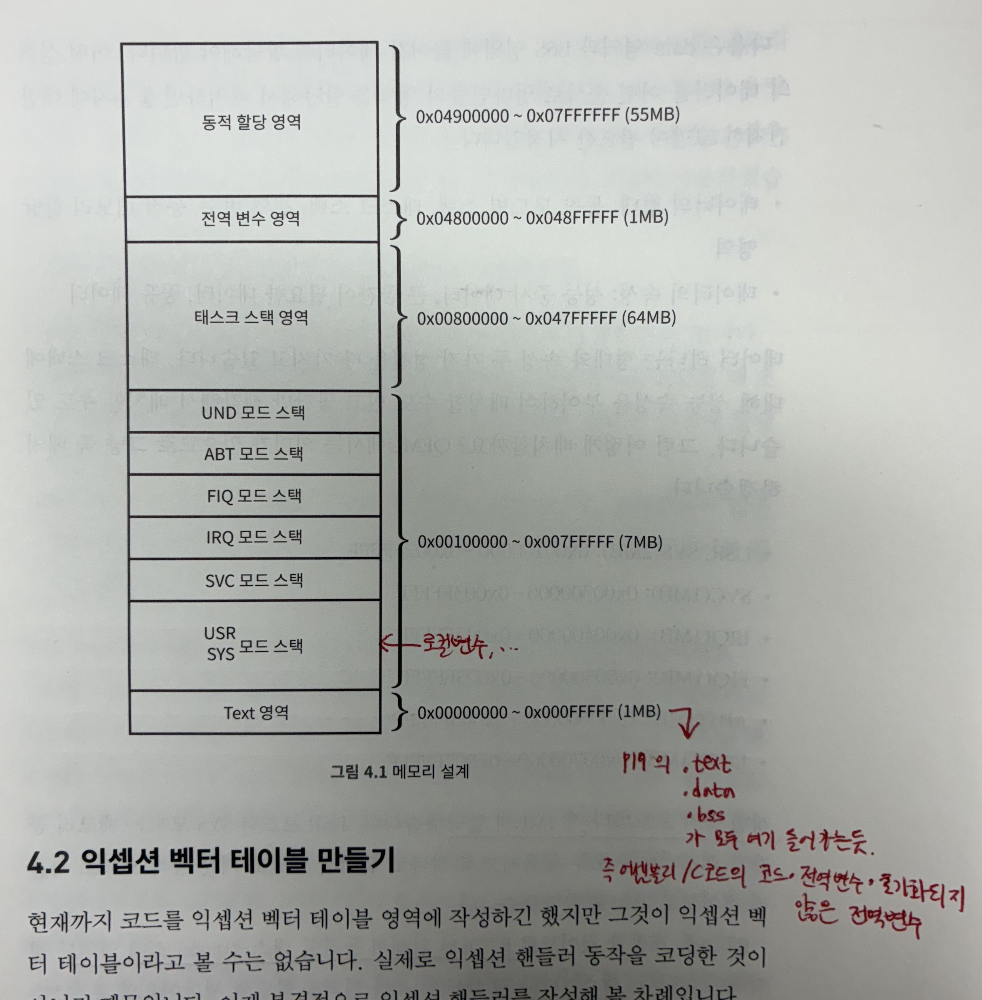
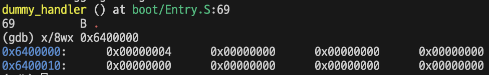

# 4. 부팅하기

보통 부팅이라고 하면 시스템에 전원이 들어가서 모든 초기화 작업을 마치고 펌웨어가 대기 상태가 될 때까지를 말하거나, 시스템에 전원이 들어가고 ARM 코어가 리셋 익셉션 핸들러를 모두 처리한 다음에 본격적으로 C언어 코드로 넘어가기 직전까지를 말한다.

보통은 전자가 일반적이지만 이 책에서는 후자를 부팅으로 정의한다.

## 4.1 메모리 설계

QEMU는 메모리를 용량 제한 없이 사용할 수 있다.

실제 펌웨어 개발 시에는 성능과 비용 사이에서 최적의 결과를 내기 위해 메모리 구조가 꽤 복잡하지만, 이 책에서는 메모리를 넉넉하게 사용한다.

실행 파일은 메모리를 크게 세 가지로 나누어 사용한다.

- text 영역: 코드가 있는 공간
- data 영역: 초기화한 전역 변수가 있는 공간
- BSS 영역: 초기화하지 않은 전역 변수가 있는 공간

text영역에는 1MB를 할당한다. 익셉션 벡터 테이블을 text 영역에 포함시킬 것이므로 시작 주소는 0x00000000 이다.

크기를 1MB로 설정하면 끝나는 주소는 0x000FFFFF 이다.

개별 동작 모드마다 태스크 스택 영역을 1MB씩 할당한다.

USR, SYS(2MB): 0x00100000 ~ 0x002FFFFF
SVC(1MB): 0x00300000~0x003FFFFF
IRQ(1MB): 0x00400000~0x004FFFFF
FIQ(1MB): 0x00500000~0x005FFFFF
ABT(1MB): 0x00600000~0x006FFFFF
UND(1MB): 0x00700000~0x007FFFFF 

이후 태스크마다 각 1MB씩 스택 영역을 할당하여 총 64MB를 배정한다.



## 4.2 익셉션 벡터 테이블 만들기

```asm
.text       @ .end가 나올 때까지의 모든 코드가 text 섹션이라는 의미
  .code 32  @ 명령어의 크기가 32비트라는 뜻 

  .global vector_start @ 다른 파일에서도 사용 가능한 전역 심볼로 정의.
  .global vector_end

  vector_start: @ 레이블 선언
    LDR PC, reset_handler_addr
    LDR PC, undef_handler_addr
    LDR PC, svc_handler_addr
    LDR PC, pfch_abt_handler_addr
    LDR PC, data_abt_handler_addr
    B .
    LDR PC, irq_handler_addr
    LDR PC, fiq_handler_addr

    reset_handler_addr:    .word reset_handler
    undef_handler_addr:    .word dummy_handler
    svc_handler_addr:      .word dummy_handler
    pfch_abt_handler_addr: .word dummy_handler
    data_abt_handler_addr: .word dummy_handler
    irq_handler_addr:      .word dummy_handler
    fiq_handler_addr:      .word dummy_handler
  vector_end:

  reset_handler:
    LDR R0, =0x10000000
    LDR R1, [R0]

  dummy_handler:
    B .
.end
```

> 익셉션 벡터 테이블에 각 핸들러로 점프하는 코드 작성.
> 각 핸들러는 아직 작성되지 않은 상태.

LDR Reg, Label : 레이블 주소에 저장된 값을 Reg에 저장

LDR Reg, =Label : 레이블의 주소값을 Reg에 저장.

- 이 때 레이블의 주소는 코드 섹션 바로 뒤에 리터럴 풀 형태로 저장. 그 후 LDR Reg, [PC, #offset] 형태로 변환됨.

.word value : 워드 크기의 값을 메모리에 저장하라는 지시어

LDR 명령어에서의 =

- =는 주소를 로드하는데 사용됨
- LDR R0, =0x1234 에서 0x1234는 메모리에 저장되어 있다.
- 즉 =0x1234는 0x1234를 저장하는 주소를 의미하는 것이고, LDR R0, =0x1234 명령어는 해당 주소에 저장되어 있는 0x1234값을 R0에 저장한다.
- LDR R0, =0x1234는 결국 LDR R0, [PC, #offset] 같은 형태로 바뀐다고 보면 된다.
- 만약 #offset이 너무 커서 표현 불가능하면 상수 저장-로드 하는 식으로 코드가 늘어날 수 있다.

MOV 명령에서의 #

- #은 즉시 값을 나타내는데 사용됨.
- MOV R0, #0x12 는 0x12라는 상수 값을 직접 R0 레지스터에 넣는 것
- 즉시 값은 8비트 상수와 회전 값을 결합하여 표현
- 즉시 값은 기계어에 직접 삽입
- #로 표현 불가능하면 = 사용

## 4.3 익셉션 핸들러 만들기

가장 먼저 만들어야 할 익셉션 핸들러는 리셋 익셉션 핸들러이다.

리셋 익셉션 핸들러에서 가장 먼저 해야 할 일은 메모리 맵을 설정해 주는 작업이다.

4.1절에서 설계한 동작 모드별 스택 주소를 각 동작 모드의 뱅크드 레지스터 SP에 설정하는 작업을 하는 것이다.

동작 모드별 스택이 모두 설정되고 나면 C언어 main() 함수로 진입할 것이다.

그 후부터는 어셈블리어가 아닌 C언어로 임베디드 시스템을 제어할 수 있습니다.

ARM은 동작 모드가 7개 있다. 이중 USR모드와 SYS모드는 레지스터를 공유하므로 SP 레지스터는 총 6개가 뱅크드 레지스터로 제공된다.

리셋 익셉션 핸들러에서는 동작 모드를 순서대로 변경해 가면서 SP 레지스터에 정해진 값을 넣는 작업을 수행한다. 이러면 각 동작 모드의 스택이 초기화되는 것이다.

먼저 4.1절에서 설계한 메모리 맵을 C언어 코드로 표현하여 include 디렉터리 안의 MemoryMap.h 파일로 저장한다.

```c
#define INST_ADDR_START       0
#define USRSYS_STACK_START    0x00100000
#define SVC_STACK_START       0x00300000 
#define IRQ_STACK_START       0x00400000
#define FIQ_STACK_START       0x00500000
#define ABT_STACK_START       0x00600000
#define UND_STACK_START       0x00700000
#define TASK_STACK_START      0x00800000
#define GLOBAL_ADDR_START     0x04800000
#define DALLOCK_ADDR_START    0x04900000

#define INST_MEM_SIZE       (USRSYS_STACK_START - INST_ADDR_START)
#define USRSYS_STACK_SIZE   (SVC_STACK_START - USRSYS_STACK_START)
#define SVC_STACK_SIZE      (IRQ_STACK_START - SVC_STACK_START)
#define IRQ_STACK_SIZE      (FIQ_STACK_START - IRQ_STACK_START)
#define FIQ_STACK_SIZE      (ABT_STACK_START - FIQ_STACK_START)
#define ABT_STACK_SIZE      (UND_STACK_START - ABT_STACK_START)
#define UND_STACK_SIZE      (TASK_STACK_START - UND_STACK_START)
#define TASK_STACK_SIZE     (GLOBAL_ADDR_START - TASK_STACK_START)
#define DALLOC_MEM_SIZE     (55 * 1024 * 1024)

#define USRSYS_STACK_TOP    (USRSYS_STACK_START + USRSYS_STACK_SIZE - 4)
#define SVC_STACK_TOP       (SVC_STACK_START + SVC_STACK_SIZE - 4)
#define IRQ_STACK_TOP       (IRQ_STACK_START + IRQ_STACK_SIZE - 4)
#define FIQ_STACK_TOP       (FIQ_STACK_START + FIQ_STACK_SIZE - 4)
#define ABT_STACK_TOP       (ABT_STACK_START + ABT_STACK_SIZE - 4)
#define UND_STACK_TOP       (UND_STACK_START + UND_STACK_SIZE - 4)
```

이후 cpsr에 값을 설정하여 동작 모드를 바꿀 수 있는 값을 아래에 정의하였다.

```c
#define ARM_MODE_BIT_USR 0x10
#define ARM_MODE_BIT_FIQ 0x11
#define ARM_MODE_BIT_IRQ 0x12
#define ARM_MODE_BIT_SVC 0x13
#define ARM_MODE_BIT_ABT 0x17
#define ARM_MODE_BIT_UND 0x1B
#define ARM_MODE_BIT_SYS 0x1F
#define ARM_MODE_BIT_MON 0x16
```

다음은 동작 모드 스택을 초기화하는 리셋 익셉션 핸들러이다.

어셈블리어 코드도 헤더 파일을 포함하는 문법은 C언어와 같다.

```asm
#include "ARMv7AR.h"
#include "MemoryMap.h"

.text       @ .end가 나올 때까지의 모든 코드가 text 섹션이라는 의미
  .code 32  @ 명령어의 크기가 32비트라는 뜻 

  .global vector_start @ 다른 파일에서도 사용 가능한 전역 심볼로 정의.
  .global vector_end

  vector_start: @ 레이블 선언
    LDR PC, reset_handler_addr
    LDR PC, undef_handler_addr
    LDR PC, svc_handler_addr
    LDR PC, pfch_abt_handler_addr
    LDR PC, data_abt_handler_addr
    B .
    LDR PC, irq_handler_addr
    LDR PC, fiq_handler_addr

    reset_handler_addr:    .word reset_handler
    undef_handler_addr:    .word dummy_handler
    svc_handler_addr:      .word dummy_handler
    pfch_abt_handler_addr: .word dummy_handler
    data_abt_handler_addr: .word dummy_handler
    irq_handler_addr:      .word dummy_handler
    fiq_handler_addr:      .word dummy_handler
  vector_end:

  reset_handler:
    MRS r0, cpsr @ move PSR to Register
    BIC r1, r0, #0x1F @ r0에서 하위 5비트 클리어 후 r1에 저장
    ORR r1, r1, #ARM_MODE_BIT_SVC @ r1과 동작모드 비트 or하여 r1에 저장
    MSR cpsr, r1 @ 동작 모드 변경
    LDR sp, =SVC_STACK_TOP @ 해당 동작 모드의 스택 주소 초기화

    MRS r0, cpsr
    BIC r1, r0, #0x1F
    ORR r1, r1, #ARM_MODE_BIT_IRQ
    MSR cpsr, r1
    LDR sp, =IRQ_STACK_TOP

    MRS r0, cpsr
    BIC r1, r0, #0x1F
    ORR r1, r1, #ARM_MODE_BIT_FIQ
    MSR cpsr, r1
    LDR sp, =FIQ_STACK_TOP

    MRS r0, cpsr
    BIC r1, r0, #0x1F
    ORR r1, r1, #ARM_MODE_BIT_ABT
    MSR cpsr, r1
    LDR sp, =ABT_STACK_TOP

    MRS r0, cpsr
    BIC r1, r0, #0x1F
    ORR r1, r1, #ARM_MODE_BIT_UND
    MSR cpsr, r1
    LDR sp, =UND_STACK_TOP

    MRS r0, cpsr
    BIC r1, r0, #0x1F
    ORR r1, r1, #ARM_MODE_BIT_SYS
    MSR cpsr, r1
    LDR sp, =USRSYS_STACK_TOP

  dummy_handler:
    B .
.end
```

> 스택은 높은 주소에서 낮은 주소로 자라고, 메모리는 증가하는 방향으로 사용하기 때문에 SP 에는 스택의 꼭대기 주소를 넣어주어야 한다.

스택은 메모리를 반대방향으로 사용한다. 0x00009088 주소에 데이터를 쓰면 그다음에는 0x00009084 주소에 데이터를 쓴다.

따라서 스택을 초기화 할 때는 아래의 공식으로 스택 꼭대기 주소를 구하여 그 값을 사용한다.

스택의 꼭대기 주소 = 스택의 시작 주소 + 스택의 크기 - 4

스택에 값을 push 할 때 SP가 먼저 감소한 후, 해당 주소에 값을 쓰므로 4바이트는 빼지 않아도 되지만, 이 책에서는 일종의 패딩으로 4바이트를 빼주었다.

헤더파일이 추가되었으므로 Makefile에 헤더파일이 있는 디렉터리 경로 정보를 추가해야 한다.

RTOS와 펌웨어의 기본 동작 모드가 SYS이므로, SYS모드의 스택을 마지막으로 설정한다.

```makefile
build/%.o: boot/%.S
    mkdir -p $(shell dirname $@)
    $(AS) -march=$(ARCH) -mcpu=$(MCPU) -I $(INC_DIRS) -g -o $@ $<
```

-I 옵션은 헤더 파일 디렉터리 경로를 지시하는 옵션이다.

또한 #define 구문은 전처리기에 의해 처리된다. arm-none-eabi-as는 어셈블러일 뿐이고 전처리는 해 주지 않는다. 그래서 전처리기까지 하려면 arm-none-eabi-gcc를 사용해야 한다.

```makefile
$(AS) -march=$(ARCH) -mcpu=$(MCPU) -I $(INC_DIRS) -g -o $@ $<

$(CC) -march=$(ARCH) -mcpu=$(MCPU) -I $(INC_DIRS) -c -g -o $@ $<
```

또한 gcc는 기본적으로 실행 파일을 만드므로 오브젝트 파일을 만들라고 지시하는 -c 옵션도 추가해야 한다.

```makefile
$(CC) -mcpu=$(MCPU) -marm -I $(INC_DIRS) -c -g -o $@ $<
```
> -march 와 -mcpu가 충돌할 수 있다는 warning 때문에 위와 같이 바꾸었다.

## 4.4 메인으로 진입하기

Entry.S의 리셋 익셉션 핸들러 마지막 부분에 아래와 같은 코드를 추가한다.

```asm
BL main
```

BL main : 지정한 주소로 분기하고, 현재 명령어의 다음 주소를 링크 레지스터(LR)에 저장한다.

이 줄로 어셈블리어 코드에서 C언어 코드로 진입할 수 있다.

어셈블리어 코드에서 브랜치 명령(BL)으로 점프를 하려면 점프 대상 레이블이 같은 파일 안에 있어야 한다. 다른 파일에 있다면 링커가 링킹할 수 있도록 레이블을 .global로 선언해야 한다. 컴파일러는 C언어 함수 이름을 링커가 자동으로 접근할 수 있는 전역 심벌로 만든다.

```c
#include "stdint.h"

void main(void) {
  uint32_t* dummyAddr = (uint32_t*)(1024*1024*100);
  *dummyAddr = sizeof(long);
}
```
위 코드는 100MB 주소 영역(0x6400000) 에 의미 없는 값을 쓰는 코드이다.

이후 Makefile 내용을 수정해서 C언어 소스 파일을 컴파일할 수 있게 한다.

```makefile
LINKER_SCRIPT = ./navilos.ld
MAP_FILE = build/navilos.map
@ 링커가 생성하는 파일.
@ 링커는 링킹 작업을 할 때 심벌에 할당된 메모리 주소를 map 파일에 기록함.

C_SRCS = $(wildcard boot/*.c)
C_OBJS = $(patsubst boot/%.c, build/%.o, $(C_SRCS))
@ C언어 소스 파일이 컴파일되어 만들어진 오브젝트 파일 이름 저장 변수

$(navilos): $(ASM_OBJS) $(C_OBJS) $(LINKER_SCRIPT)
    $(LD) -n -T $(LINKER_SCRIPT) -nostdlib -o $(navilos) $(ASM_OBJS) \
    $(C_OBJS) -Map=$(MAP_FILE) @ map 파일 생성
    $(OC) -O binary $(navilos) $(navilos_bin)
    $(OD) -D -mcpu=$(MCPU) -marm -D -S $(navilos) > $(navilos_asm)
    @ 만들어진 실행 파일을 디스어셈블하여 navilos.S 에 저장

build/%.os: $(ASM_SRCS)
    mkdir -p $(shell dirname $@)
    $(CC) -marm -mcpu=$(MCPU) -I $(INC_DIRS) -c -g -o $@ $<

build/%.o: $(C_SRCS)
    mkdir -p $(shell dirname $@)
    $(CC) -marm -mcpu=$(MCPU) -I $(INC_DIRS) -c -g -o $@ $<
```

x/8wx 메모리주소 : 메모리 주소로부터 8개를 4바이트씩 16진수로 출력하라는 명령



0x6400000 메모리 주소에 sizeof(long) 인 4가 저장되어 있다.

어셈블리 코드에서 C언어의 main 함수로의 진입에 성공했음을 알 수 있다.

## 4.5 요약

이 장에서는 펌웨어의 초기화 코드를 작성하였다. 

ARM 프로세서의 최초 진입 코드를 만들었고, 앞으로 만들 rtos의 메모리 맵을 구성하였다.