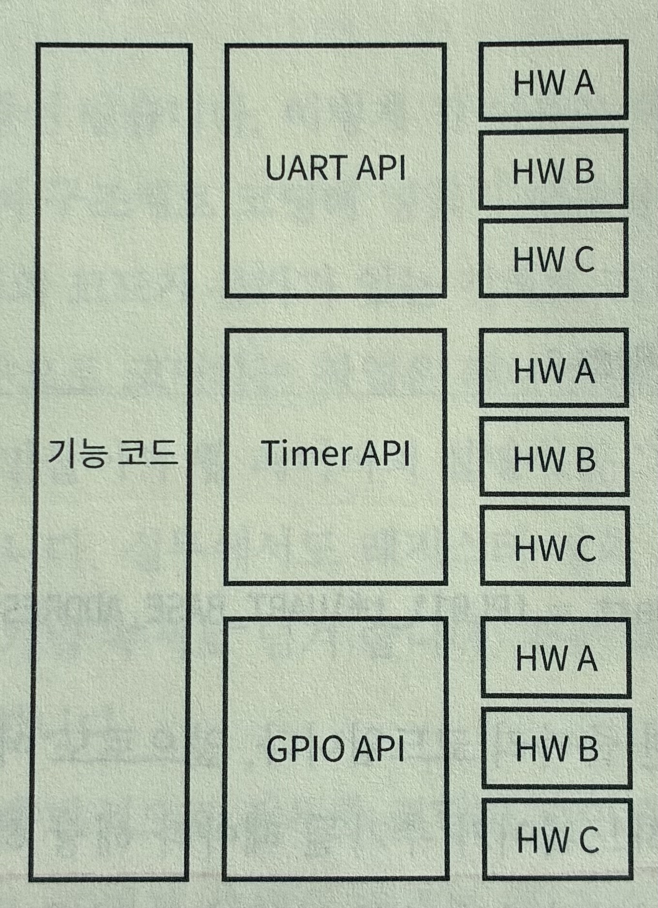
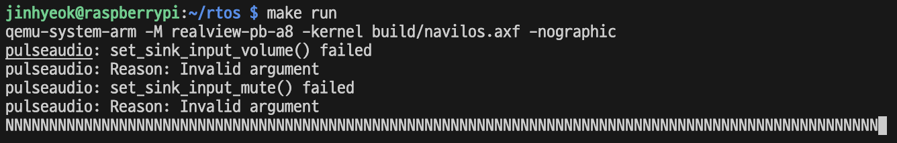
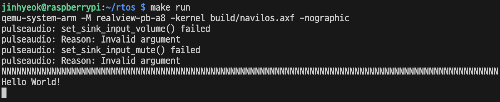
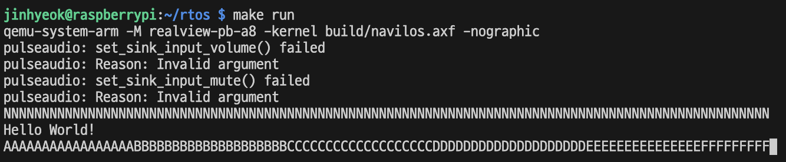
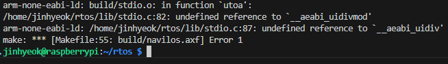
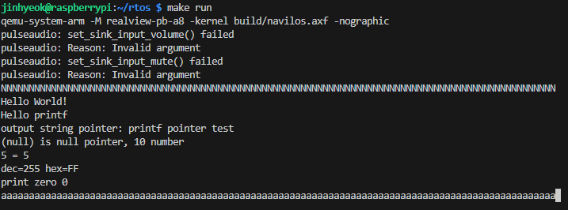

# 5. UART

QEMU를 사용하는 환경에서 쓸 수 있는 하드웨어는 제한되어 있다. 이 장에서 작업할 첫 번째 하드웨어는 UART 이다.

## 5.1 UART 출력하기

UART는 Universal Asynchronous Receiver/Transmitter의 약자로, 범용 비동기화 송수신기라는 뜻이다. 실무에서는 주로 UART라고 쓰고, 유아트라고 읽는다.

RealViewPB에는 PL011 이라는 UART 하드웨어 모듈이 붙어있다. ARM 홈페이지에서 이 하드웨어의 데이터시트를 확인할 수 있다.

UART는 보통 콘솔 입출력용으로 사용한다. UART는 어떤 데이터 값이든 주고 받을 수 있어서, 아스키 데이터도 주고 받을 수 있다.

터미널 프로그램을 UART 포트와 연결하면 UART를 통해서 받은 아스키 코드를 그 코드에 해당하는 문자로 화면에 출력한다. 그러면 터미널 프로그램을 사용해서 임베디드 시스템을 제어할 수 있다.

UART를 사용하기 위해 가장 먼저 해야 할 일은 UART 하드웨어의 레지스터를 코드로 만드는 것이다.

데이터시트를 보면, PL011 에는 꽤 많은 레지스터를 가지고 있는데, 하드웨어를 사용하는 목적은 매우 다양하므로 제조사 입장에서 그 다양한 요구사항을 최대한 만족하도록 많은 기능을 추가해 넣었기 때문이다.

실제 레지스터가 각 비트별로 어떤 의미를 가졌고 어떻게 설정하는지는 데이터시트에 다 설명되어 있다.

UARTDR은 데이터 레지스터로, 한 번에 8비트, 즉 1바이트씩 통신할 수 있는 하드웨어이다.


그림 5.2를 어떻게 코드로 옮길 수 있을까?

두 가지 방법이 있는데, 첫 번째는 C언어 매크로를 이용하는 방법이고, 두 번째는 구조체를 이용하는 방법이다. 이 책에서는 두 번째 방법을 이용한다.

```c
typedef union UARTDR_t {
  uint32_t all;
  struct {
    uint32_t DATA:8; // 7:0 (8 비트의 unsigned int)
    uint32_t FE:1;   // 8   (1 비트의 unsigned int)
    uint32_t PE:1;   // 이러한 방식은 구조체 비트 필드라고 부른다.
    uint32_t BE:1;   // 구조체 비트 필드를 사용하면 구조체 멤버를 비트 단위로 저장할 수 있다.
    uint32_t OE:1;
    uint32_t reserved:20;
  } bits; // 익명 구조체. 구조체 정의, 인스턴스 선언 합친 형태
}

typedef union UARTCR_t {
  ...
}

typedef struct PL011_t {
  UARTDR_t uartdr;
  ...
  UARTCR_t uartcr;
} PL011_t;
```

각 레지스터별로 비트 오프셋은 구조체의 비트 멤버 변수 선언을 사용하여 정의한다.

컴파일러는 자동으로 비트 시프트와 마스킹 연산을 수행하여 비트필드의 크기와 위치에 맞게 값을 저장한다.

이렇게 레지스터를 코드로 옮기면, 아래와 같이 작업할 수 있다.

```c
PL011_t* Uart = (PL011_t*)UART_BASE_ADDR; // 데이터시트를 보면 RealViewPB에서 UART의 기본 주소는 0x10009000이다.

Uart->uartdr.DATA = data & 0xFF;
if (Uart->uartdr.FE || Uart->uartdr.PE || Uart->uartdr.BE || Uart->uartdr.OE) {
  // 에러 처리 코드
}
```

hal 이라는 이름으로 디렉터리를 새로 만들고, 그 밑에 rvpb 디렉터리를 만든다. 그 안에 Uart.h 파일을 만들고 그 파일에 PL011의 레지스터를 코딩해 넣는다.

구조를 이렇게 한 것은 여러 플랫폼을 지원하는 것을 염두에 두었기 때문이다.

예를 들어 라즈베리파이로 확장한다고 하면 라즈베리파이 보드가 종속된 하드웨어 코드는 hal/rasppi 라는 디렉터리를 만들고 그 안에 넣을 것이다.

다음으로 Reg.c 파일을 만들고, UART 하드웨어를 제어할 수 있는 변수를 선언할 것이다.

```c
volatile PL011_t* Uart = (PL011_t*)UART_BASE_ADDRESS0;
```

> 컴파일러는 보통 메모리 주소를 여러 번 읽으면 첫 번째 값만 읽고 캐싱하여 최적화하려고 한다.
> 하지만 하드웨어 레지스터는 그렇게 하면 안되고, 매번 메모리를 직접 읽고 써야 하므로 volatile을 붙여서 이 변수 대상으로는 최적화 하지 말고 직접 접근해야 한다는 것을 컴파일러에게 알려주는 것이다.

앞으로 초기화하는 하드웨어가 추가될 때마다 해당 하드웨어의 레지스터 구조와 베이스 주소를 연결해서 추가할 것이다.

### 5.1.1 UART 공용 인터페이스

PL011 은 RealViewPB의 UART 이다. 다른 플랫폼은 다른 종류의 UART 하드웨어를 가지고 있을 것이다.

이들 각자의 레지스터와 접근 변수는 지금까지 설명한 방식으로 만들 수 있다.

개별 하드웨어는 각자의 방식으로 동작하더라도 이를 사용하는 코드는 공용 인터페이스를 통해서 같은 방식으로 사용할 수 있어야 한다.

일종의 디바이스 드라이버 같은 것이 필요한 것이다.

실제로 윈도우나 리눅스는 PC에서 쓰는 수많은 하드웨어를 제어할 수 있어야 하므로, 디바이스 드라이버 레이어가 매우 복잡하다.

보통 펌웨어에서는 그렇게 극단적으로 범용성을 생각할 필요는 없고, 적당한 수준의 범용성만 만족하면 된다.

그래서 공용 인터페이스 API만 정의해 놓고, 해당 API를 갖자의 하드웨어가 구현하는 식으로 범용성을 추구한다.

이러한 공용 인터페이스 혹은 API 설계를 HAL(Hardware Abstraction Layer) 이라고 한다. 서로 다른 하드웨어를 추상화 계층이 중계해 주는 것이다.



위 그림처럼 설계하면, 기능 코드를 변경하지 않아도 펌웨어를 다른 하드웨어에 이식할 수 있다.

첫 작업으로 UART 공용 HAL 인터페이스를 정의한다. 이름은 HalUart.h 이다.

위 그림의 HW A가 hal/rvpb 가 되고 HW B는 hal/rasppi 가 된다.

HalUart.h 는 RealViewPB와 라즈베리파이 보드가 공통으로 접근하는 인터페이스 이므로 hal 바로 밑에 위치하게 된다.

```c
// UART 공용 인터페이스
#ifndef HAL_HALUART_H_
#define HAL_HALUART_H_

void Hal_uart_init(void);
void Hal_uart_put_char(uint8_t ch);

#endif /* HAL_HALUART_H_ */
```

먼저 출력부터 테스트할 것이기 때문에 UART 하드웨어를 초기화하는 Hal_uart_init() 함수와 UART로 알파벳 한 글자를 보내서 최종적으로 터미널에 알파벳 한 글자를 출력하는 Hal_uart_put_char() 함수를 정의하였다.

이렇게 HalUart.h 파일을 만들어 놓고 각 하드웨어 HAL 구현체에서는 HalUart.h 파일을 #include로 추가하고 각자 하드웨어에 맞춰서 구현하는 것이다.

즉 한 헤더 파일에 대해서 여러 소스 파일이 존재하는 것이다. 그리고 펌웨어 바이너리를 만들 때, 여러 C 소스 파일 중에서 현재 타깃에 맞는 하드웨어의 C 소스 파일만 컴파일해서 사용하는 것이다.

```
HalUart.h 
- hal/rvpb/Uart.c (RealViewPB가 타깃일 때 선택하여 컴파일)
- hal/rasppi/Uart.c
- hal/.../Uart.c
```

이렇게 여러 플랫폼을 지원 가능하게끔 디자인한다.

### 5.1.2 UART 공용 인터페이스 구현

지금까지는 UART 공용 인터페이스 API를 설계하였고, 이제 해당 API를 만족하는 코드를 구현해야 한다.

```c
#include "stdint.h"
#include "Uart.h"
#include "HalUart.h"

extern volatile PL011_t* Uart; // Uart 변수 extern으로 불러오기

void Hal_uart_init(void) {
  // UART 하드웨어 초기화
  Uart->uartcr.bits.UARTEN = 0; // 하드웨어 끄기
  Uart->uartcr.bits.TXE = 1; // 출력 켜기
  Uart->uartcr.bits.RXE = 1; // 입력 켜기
  Uart->uartcr.bits.UARTEN = 1; // 하드웨어 다시 켜기
}

void Hal_uart_put_char(uint8_t ch) {
  while(Uart->uartfr.bits.TXFF); // UART 하드웨어의 출력 버퍼가 0이 될 때까지(출력 버퍼가 빌 때까지) 기다림
  Uart->uartdr.bits.DATA = (ch & 0xFF); // 데이터 레지스터를 통해서 알파벳 한 글자를 출력 버퍼로 보냄
}
```

실물 하드웨어를 초기화하려면 훨씬 복잡한 코드를 작성해야 하지만, QEMU는 생략하여도 UART가 동작한다.

정상 작동한다면 Hal_uart_put_char 함수가 실행 완료되면, UART를 통해서 데이터가 호스트로 전송된다.

```c
#include "stdint.h"
#include "HalUart.h"

static void Hw_init(void);

void main(void) {
  Hw_init();

  uint32_t i = 100;
  while(i--) {
    Hal_uart_put_char('N');
  }
}

static void Hw_init(void){
  Hal_uart_init();
}
```
위 코드를 통해 UART 초기화가 제대로 되었고, 출력 코드가 정상인지 확인할 수 있다.

이후 Makefile도 수정한다.

```makefile
ARCH = armv7-a
MCPU = cortex-a8

TARGET = rvpb // TARGET 추가

CC = arm-none-eabi-gcc
AS = arm-none-eabi-as
LD = arm-none-eabi-ld
OC = arm-none-eabi-objcopy
OD = arm-none-eabi-objdump

LINKER_SCRIPT = ./navilos.ld
MAP_FILE = build/navilos.map

ASM_SRCS = $(wildcard boot/*.S)
ASM_OBJS = $(patsubst boot/%.S, build/%.os, $(ASM_SRCS))

VPATH = boot \
        hal/$(TARGET) // %.* 형식에서 VPATH에 추가된 디렉토리에서 %.* 파일을 찾는다.

C_SRCS = $(notdir $(wildcard boot/*.c))
C_SRCS += $(notdir $(wildcard hal/$(TARGET)/*.c))
C_OBJS = $(patsubst %.c, build/%.o, $(C_SRCS))

INC_DIRS = -I include \
           -I hal     \
                     -I hal/$(TARGET)

CFLAGS = -c -g -std=c11

navilos = build/navilos.axf
navilos_bin = build/navilos.bin
navilos_asm = build/navilos.S

.PHONY: all clean run debug gdb

all: $(navilos)

clean:
    @rm -rf build

run: $(navilos)
    qemu-system-arm -M realview-pb-a8 -kernel $(navilos) -nographic // -nographic 옵션을 추가하면 QEMU는 GUI를 출력하지 않고 시리얼 포트 입출력을 현재 호스트의 콘솔과 연결한다.

debug: $(navilos)
    qemu-system-arm -M realview-pb-a8 -kernel $(navilos) -S -gdb tcp::1234,ipv4

gdb:
    gdb-multiarch $(navilos)

$(navilos): $(ASM_OBJS) $(C_OBJS) $(LINKER_SCRIPT)
    $(LD) -n -T $(LINKER_SCRIPT) -nostdlib -o $(navilos) $(ASM_OBJS) $(C_OBJS) -Map=$(MAP_FILE)
    $(OC) -O binary $(navilos) $(navilos_bin)
    $(OD) -D -mcpu=$(MCPU) -marm -D -S $(navilos) > $(navilos_asm)

build/%.os: %.S
    mkdir -p $(shell dirname $@)
    $(CC) -marm -mcpu=$(MCPU) $(INC_DIRS) -c -g -o $@ $<

build/%.o: %.c
    mkdir -p $(shell dirname $@)
    $(CC) -marm -mcpu=$(MCPU) $(INC_DIRS) -c -g -o $@ $<
```



## 5.2 Hello, World!

지금 만들고 있는 펌웨어에서는 printf() 함수조차 만들어 써야 한다.

printf() 함수를 만들기 전에 기초 작업으로 문자열 출력을 해보자.

전략은 단순하다. 앞 장에서 문자 한 개를 출력하는 함수를 만들었으므로, 이 함수를 반복 호출해서 서로 다른 문자를 연속 출력하면 된다.

문자를 한 개 출력하는 함수는 UART 하드웨어에 직접 접근해야 구현 가능하다. 하지만 문자열을 출력하는 함수는 UART 하드웨어를 직접 건드리는 작업이 아니라, UART 하드웨어를 직접 접근하는 함수를 다시 호출하는 방식으로 구현하여 계층을 나눌 것이다

lib 디렉터리를 만들고, 그 안에 stdio.c와 stdio.h 두 파일을 생성한다.

```c
// stdio.h
#ifndef LIB_STDIO_H_
#define LIB_STDIO_H_

uint32_t putstr(const char* s);

#endif

// stdio.c
#include "stdint.h"
#include "stdio.h"
#include "HalUart.h"

uint32_t putstr(const char* s) {
  uint32_t c = 0;
  while(*s) {
    Hal_uart_put_char(*s++);
    ++c;
  }
  return c;
}
```

Makefile 도 수정하여 lib 디렉터리 밑에 있는 *.c 파일들도 빌드에 포함한다.

```makefile
VPATH = ... \ lib
C_SRCS += $(notdir $(wildcard lib/*.c))
INC_DIRS = ... \ -I lib
```

main() 함수에 적절한 코드를 추가해서 "Hello World!"를 출력해보자.

```c
void main(void) {
  Hw_init();

  uint32_t i = 100;
  while(i--) {
    Hal_uart_put_char('N');
  }
  Hal_uart_put_char('\n');

  putstr("Hello World!\n");
}
```



## 5.3 UART로 입력 받기

지금까지 UART 출력을 구현했다. 출력을 구현했으니 UART 입력을 구현하자.

UART 출력을 할 때에는, 먼저 보내기 버퍼가 비어 있는지 확인한 다음, 비어 있으면 데이터 레지스터를 통해서 데이터를 보내기 버퍼로 보낸다.

그러면 하드웨어가 알아서 나머지 작업을 처리해 주고, 하드웨어와 연결된 콘솔에 데이터가 나타난다.

입력은 출력의 반대이다. 입력은 받기 버퍼가 채워져 있는지 확인한 다음, 받기 버퍼에 데이터가 있으면 데이터 레지스터를 통해서 데이터를 하나 읽어오면 된다.

데이터는 콘솔과 하드웨어를 통해서 전달되어 레지스터에서 펌웨어가 읽어가기를 기다리고 있을 것이다.

UART 에서 1바이트 데이터를 읽어오는 코드를 단순하게 작성하고, 최적화해 나가자.

```c
uint8_t Hal_uart_get_char(void) {
  uint8_t data;

  while(Uart->uartfr.bits.RXFE);

  // Check for an error flag
  if(Uart->uartdr.bits.BE || Uart->uartdr.bits.FE || 
     Uart->uartdr.bits.OE || Uart->uartdr.bits.PE) {
      //Clear the error
      Uart->uartrsr.bits.BE = 1;
      Uart->uartrsr.bits.FE = 1;
      Uart->uartrsr.bits.OE = 1;
      Uart->uartrsr.bits.PE = 1;
      return 0;
  }

  data = Uart->uartdr.bits.DATA;
  return data;
}
```

위 코드는 직관적이지만 매우 비효율적이다.

1. 에러를 확인하기 위해 레지스터를 4번이나 접근한다.

2. 에러 플래그를 클리어 하는데도 레지스터 접근, 비트 시프트, 데이터 복사가 4번 발생한다.

즉 매우 비효율적이다. 위의 코드를 아래와 같이 1차로 최적화할 수 있다.

```c
uint8_t Hal_uart_get_char(void) {
  uint8_t data;

  while(Uart->uartfr.bits.RXFE);

  // Check for an error flag
  if(Uart->uartdr.all & 0xFFFFFF00) {
    // Clear the error
    Uart->uartrsr.all = 0xFF;
    return 0;
  }

  data = Uart->uartdr.bits.DATA;
  return data;
}
```

레지스터 접근이 두번으로 줄었고, 비교 연산 한 번, 데이터 입력 연산도 한 번으로 줄었다. 여기서 아래와 같이 더 최적화 할 수 있다.

```c
uint8_t Hal_uart_get_char(void) {
  uint32_t data;

  while(Uart->uartfr.bits.RXFE);

  data = Uart->uartdr.all;

  // Check for an error flag
  if(data & 0xFFFFFF00) {
    // Clear the error
    Uart->uartrsr.all = 0xFF;
    return 0;
  }

  return (uint8_t)(data & 0xFF); // 32비트를 8비트로 변환하면 상위 비트는 버리고, 하위 비트(LSB) 쪽이 반환된다.
}
```

data를 32비트로 선언하고, uartdr.all을 받아오면 에러 플래그와 데이터를 한 번에 받아올 수 있으므로 하드웨어 레지스터에 접근하는 횟수를 줄일 수 있다.

하드웨어 레지스터에 접근하는 시간보다 로컬변수에 접근하는 속도가 훨씬 빠르기 때문에(로컬 변수는 보통 스택에 생성되거나 ARM의 범용 레지스터에 할당된다) 이 방식이 더 나은 방식이다.

main() 함수에 아래와 같은 코드를 추가하고 결과를 확인해 보자. 제대로 동작한다면, UART에서 1바이트 데이터를 읽어서 그대로 UART에 출력할 것이므로 입력을 100개까지 그대로 화면에 출력할 것이다.

```c
i = 100;
  while(i--) {
    uint8_t ch = Hal_uart_get_char();
    Hal_uart_put_char(ch);
  }
```



에코 기능이 잘 동작하는 것을 확인할 수 있다.

## 5.4 printf 만들기

그냥 문자열을 출력하는 것과 printf() 함수의 결정적인 차이는 printf() 함수에는 포맷을 지정할 수 있다는 것이다. 즉 %s %c %x %u 같이 데이터를 출력하는 형식을 지정할 수 있다는 것이다.

펌웨어에서도 printf() 함수는 로그나 디버깅 등에 매우 유용하고 자주 사용되는 함수이므로 반드시 만들어야 한다.

실제 printf() 함수는 꽤 복잡하고 기능이 많지만, 펌웨어는 그 많은 기능이 다 필요하지 않으므로 필요한 기능만 최소로 구현하도록 하겠다.

printf() 함수 이름을 그대로 사용하면, 컴파일러 최적화 과정에서 문제가 생길 수 있기 때문에 여기서는 debug_printf() 라는 이름으로 함수를 만든다.

보통 잠재적인 문제를 피하기 위해 표준 라이브러리 함수를 다시 만들어 사용하는 경우에는 함수 이름을 똑같게 만들지는 않는다고 한다.

```c
// 최소 하나의 고정 인자는 있어야 한다.
// format은 고정인자, ... 은 가변인자이다.
uint32_t debug_printf(const char* format, ...) { 
  va_list args; // 가변 인자를 가리킬 수 있는 참조자 선언
  va_start(args, format); // va_start(참조자, 가변인자 이전에 위치한 마지막 고정인자). 참조자가 가변인자를 실제로 참조할 수 있게 함
  vsprintf(print_buf, format, args);
  va_end(args); // 메모리 해제

  return putstr(printf_buf);
}
```

debug_printf() 함수는 가변인자를 이용하여 설계한다.

%u, %x 등의 형식 문자를 처리하는 코드는 vsprintf() 함수에서 구현한다.

전통적으로 C언어는 가변 인자를 처리하는 데 stdarg.h에 있는 va_start, va_end, va_arg 매크로와 va_list 라는 자료형을 사용한다. 이는 표준 라이브러리가 아니라 컴파일러의 빌트인 함수로 지원된다.

컴파일러의 빌트인 함수이므로 컴파일러마다 이름이 조금씩 달라서, 컴파일러의 빌트인 함수를 전통적인 이름으로 재정의해서 사용하겠다.

> 라이브러리 함수는 실제로 구현된 코드가 있고, 이를 링크 시 외부에서 가져와 실행한다.
>
> 반면 빌트인 함수는 컴파일러가 이를 인식하고, 호출을 만나면 컴파일러 수준에서 특정 명령어로 변환하거나 최적화된 코드를 생성해준다.

```c
#ifndef INCLUDE_STDARG_H_
#define INCLUDE_STDARG_H_

typedef __builtin_va_list va_list;
// __builtin_va_list: typedef __va_list_tag __builtin_va_list[1]
// typedef char ch10[10]; ch10 str == char str[10];
// typedef char *pchar; pchar c == char* c;
// typedef void (*func)(int); func f; f: (void (*)(int)) 형 변수

#define va_start(v,l)  __builtin_va_start(v,l)
#define va_end(v)      __builtin_va_end(v)
#define va_arg(v,l)    __builtin_va_arg(v,l)

#endif
```

다음 단계는 vsprintf() 함수를 만드는 것이다. 이 함수는 가변 인자의 정보를 담고 있는 va_list 타입의 파라미터를 받아서 처리한다. vsprintf() 함수는 %c, %u, %x, %s만 구현한다. (문자, 부호 없는 10진수, 부호 없는 16진수, 문자열)

```c
uint32_t vsprintf(char* buf, const char* format, va_list arg) {
  uint32_t c = 0;

  char ch;
  char* str;
  uint32_t uint;
  uint32_t hex;

  for (uint32_t i = 0; format[i]; ++i) {
    if (format[i] == '%') {
      ++i;
      switch(format[i]) {
      case 'c':
        ch = (char)va_arg(arg, int32_t);
        buf[c++] = ch;
        break;
      case 's':
        str = (char*)va_arg(arg, char*);
        if (str == NULL) {
          str = "(null)";
        }
        while (*str) {
          buf[c++] = (*str++);
        }
        break;
      case 'u':
        uint = (uint32_t)va_arg(arg, uint32_t);
        c += utoa(&buf[c], uint, utoa_dec);
        break;
      case 'x':
        hex = (uint32_t)va_arg(arg, uint32_t);
        c += utoa(&buf[c], hex, utoa_hex);
        break;
      }
    }
    else {
      buf[c++] = format[i];
    }

    if (c >= PRINTF_BUF_LEN) {
        buf[0] = '\0';
        return 0;
      }
  }

  buf[c] = '\0';
  return c;
}

uint32_t utoa(char* buf, uint32_t val, utoa_t base) {
  uint32_t c = 0;
  int32_t idx = 0;
  char tmp[11];

  do {
    uint32_t t = val % (uint32_t)base;
    if (t >= 10) {
      t += 'A' - 10 - '0';
    }
    tmp[idx++] = (t + '0');
    val /= base;
  } while(val);

  // reverse
  --idx; // idx를 부호 있는 정수형으로 선언한 이유
  while (idx >= 0) {
    buf[c++] = tmp[idx--];
  }

  return c;
}
```

va_arg(참조자, 참조 대상 자료형) 형태로 사용한다.

C언어 표준에 따르면 char, short는 가변 인자 리스트에 전달될 때 int로 자동 변환된다.



utoa() 함수에서 나머지와 나누기 연산자를 사용했는데, ARM은 기본적으로 나누기와 나머지를 지원하는 하드웨어가 없다고 간주한다.

따라서 GCC가 이를 소프트웨어로 구현해 놓은 라이브러리 함수로 자동으로 링킹을 한다.

따라서 gcc에 -lgcc (libgcc) 옵션을 주어서 gcc의 저수준 라이브러리를 추가해주어야 한다. 운영체제와 독립적인 기본적인 수학 연산과 런타임 기능을 제공한다.

```makefile
LD = arm-none-eabi-gcc // GCC로도 링킹을 할 수 있다. 내부적으로 GCC가 LD를 호출하게 된다. 그 과정에서 몇 가지 번거로운 옵션을 알아서 추가해준다.

LDFLAGS = -nostartfiles -nostdlib -nodefaultlibs -static -lgcc
// -lgcc 앞의 모든 옵션은 표준 라이브러리를 사용하지 않겠다는 의미.

$(LD) -n -T $(LINKER_SCRIPT) -nostdlib -o $(navilos) $(ASM_OBJS) $(C_OBJS) -Wl,-Map=$(MAP_FILE) $(LDFLAGS)

// LD 가 gcc로 바뀜. LDFLAGS 추가. -Wl,-Map=$(MAP_FILE) : 링커에 특정 옵션 전달. (링크된 파일에 대한 메모리 맵 출력 지시)
```



debug_printf() 함수 테스트용으로 추가한 코드의 결과이다.

## 5.5 요약

이 장에서는 글자를 화면에 출력하고 키보드로 입력을 받았다.

그리고 printf() 함수를 임베디드 환경에서 쓰려면 어떤 과정과 작업이 필요한지 설명했다.

문자의 입출력이 당연한 것이 아니라 하드웨어를 제어해서 구현하는 기능이라는 것을 배웠다.

다음 장에서는 인터럽트를 통해서 키보드 입력을 받는 법을 배운다.