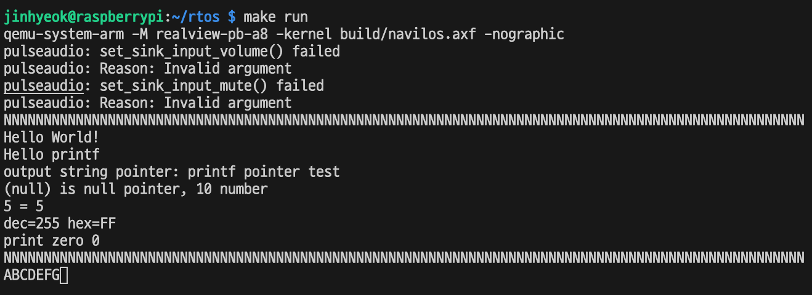

# 6. 인터럽트 

인터럽트는 임베디드 시스템을 포함한 모든 컴퓨팅 시스템의 꽃이다.

컴퓨팅 시스템은 사람이든 다른 시스템이든 외부의 다른 존재와의 상호작용을 인터럽트로 처리한다.

키보드를 누르면 키보드 안에서 동작하는 펌웨어는 인터럽트를 받아서 처리하고 그 결과로 PC에 정해진 신호를 보낸다. 그러면 PC에서도 인터럽트가 발생하고 이 인터럽트를 운영체제가 받아서 처리한다. 그리고 운영체제는 정해진 신호를 모니터로 보낸다. 그러면 모니터에 달려있는 하드웨어는 PC에서 받은 신호로 인터럽트를 발생시킨다. 모니터에 있는 펌웨어는 이 인터럽트를 받아서 적절한 처리를 하고 그 결과로 화면에 글자가 출력된다.

사용자와 상호작용하는 것뿐만 아니라 그냥 하드웨어 자체적으로 인터럽트가 발생하는 것도 있다. 타이머 같은 종류의 인터럽트이다.

인터럽트를 처리하기 위해서는 먼저 인터럽트 컨트롤러를 초기화하고 사용하는 코드를 작성해야 한다. 이후 실제 인터럽트를 발생시키는 하드웨어와 인터럽트 컨트롤러를 연결해야 한다.

예를 들어 UART 하드웨어는 인터럽트를 발생시킨다. 그러므로 UART 하드웨어가 인터럽트 컨트롤러로 인터럽트 신호를 보낸다. 인터럽트 컨트롤러는 ARM 코어로 인터럽트를 보낸다. 펌웨어에서 cpsr의 IRQ 혹은 FIQ 마스크를 끄면 IRQ나 FIQ가 발생했을 때 코어가 자동으로 익셉션 핸들러를 호출한다. 따라서 익셉션 핸들러도 작성해야 한다. 익셉션 핸들러에서 적절한 인터럽트 핸들러를 호출하면 인터럽트 처리를 완료한 것이다.

main() 함수의 마지막에 while(true)로 무한 루프를 도는 코드를 추가하자.

```c
void main(void) {
  ...
  Printf_test();

  while(true);
}
```

이러면 Printf_test() 함수가 끝난 후 펌웨어가 무한 루프를 돌기 때문에 키보드를 눌러도 아무런 반응이 없다. QEMU가 그냥 멈춰있는 것처럼 보이게 된다.

인터럽트를 사용하면 이 무한 루프 상황에서도 어떤 동작을 하게 할 수 있다.

## 6.1 인터럽트 컨트롤러

RealViewPB에는 Generic Interrupt Controller라는 이름의 인터럽트 컨트롤러 하드웨어가 달려 있다.

줄여서 GIC라고 부른다. GIC는 나름의 방식으로 인터럽트를 처리한다.

GIC는 레지스터를 크게 두 그룹으로 구분한다.

하나는 CPU Interface registers이고, 다른 하나는 Distributor registers 이다.

가장 먼저 할 일은 GIC의 레지스터 구조체를 만드는 일이다. 이후 실제 인스턴스를 선언하기 위해 hal/rvpb/Regs.c 파일을 수정한다. 구조체 포인터 변수를 선언하고 베이스 주소를 할당하는 것이다. 그러면 이제 구조체 포인터로 GIC의 레지스터를 제어할 수 있는 인스턴스가 생긴다.

```c
#include "stdint.h"
#include "Uart.h"
#include "Gic.h"

volatile PL011_t* Uart = (PL011_t*)UART_BASE_ADDRESS0;
volatile GicCput_t* GicCpu = (GicCput_t*)GIC_CPU_BASE;
volatile GicDist_t* GicDist = (GicDist_t*)GIC_DIST_BASE;
```

레지스터 구조체도 만들었고 제어 인스턴스도 만들었으니 이제 공용 API를 설계해야 한다. UART때 한 것처럼 할 수 있는 한 일반적이고 공통적인 요소를 뽑아서 API를 설계해야 한다. hal/HalGic.c 파일을 만든다.

```c
#ifndef HAL_HALGIC_H_
#define HAL_HALGIC_H_

#include "stdint.h"

#define INTERRUPT_HANDLER_NUM 255

typedef void (*InterHdlr_fptr)(void);

void Hal_interrupt_init(void);
void Hal_interrupt_enable(uint32_t interrupt_num);
void Hal_interrupt_disable(uint32_t interrupt_num);
void Hal_interrupt_register_handler(InterHdlr_fptr handler, uint32_t interrupt_num);
void Hal_interrupt_run_handler(void);

#endif
```

초기화 함수, 인터럽트 활성화 함수, 인터럽트 비활성화 함수, 인터럽트 핸들러 등록 함수, 인터럽트 핸들러를 호출하는 함수이다.

Hal_interrupt_enable, Hal_interrupt_disable 함수는 파라미터로 인터럽트 번호를 받는다. 대부분 임베디드 시스템은 인터럽트를 한 개 이상 처리하므로 인터럽트 각각을 구분하는 번호를 부여한다. 앞의 UART 는 44번이다. 따라서 Hal_interrupt_enable 함수에 44를 전달하면 44번을 켜고, Hal_interrupt_disable 함수에 44를 전달하면 44번 인터럽트를 끈다.

Hal_interrupt_register_handler 함수와 Hal_interrupt_run_handler 함수는 개별 인터럽트별로 따로 연결해야 하는 인터럽트 핸들러를 등록하고 실행하는 역할을 하는 함수이다. 

ARM은 모든 인터럽트를 IRQ나 FIQ 핸들러로 처리하므로 IRQ나 FIQ 핸들러에서 개별 인터럽트의 핸들러를 구분해야 한다. 개별 인터럽트의 핸들러를 구분해서 핸들러를 실행하는 함수가 Hal_interrupt_run_handler 이다.

```c
void Hal_interrupt_init(void) {
  GicCpu->cpucontrol.bits.Enable = 1; // GicCpu 컨트롤러 켜기
  GicCpu->prioritymask.bits.Prioritymask = GIC_PRIORITY_MASK_NONE;
  // 모든 인터럽트 허용. 인터럽트 우선순위 사용하면서 정교하게 제어할 것이 아니므로 단순하게 모두 허용
  GicDist->distributorctrl.bits.Enable = 1; // GicDist 컨트롤러 켜기

  for(uint32_t i = 0; i < INTERRUPT_HANDLER_NUM; ++i) {
    sHandlers[i] = NULL;
  }

  enable_irq(); // ARM의 CPSR을 제어해서 코어 수준의 IRQ를 켜는 함수
}
void Hal_interrupt_enable(uint32_t interrupt_num) {
  if ((interrupt_num < GIC_IRQ_START) || (GIC_IRQ_END < interrupt_num)) {
    return;
  }

  uint32_t bit_num = interrupt_num - GIC_IRQ_START; 

  if (bit_num < GIC_IRQ_START) {
    SET_BIT(GicDist->setenable1, bit_num);
  }
  else {
    bit_num -= GIC_IRQ_START;
    SET_BIT(GicDist->setenable2, bit_num);
  }
}
void Hal_interrupt_disable(uint32_t interrupt_num) {
  if ((interrupt_num < GIC_IRQ_START) || (GIC_IRQ_END < interrupt_num)) {
    return;
  }

  uint32_t bit_num = interrupt_num - GIC_IRQ_START;

  if (bit_num < 32) {
    CLR_BIT(GicDist->setenable1, bit_num);
  }
  else {
    bit_num -= 32;
    CLR_BIT(GicDist->setenable2, bit_num);
  }
}
void Hal_interrupt_register_handler(InterHdlr_fptr handler, uint32_t interrupt_num) {
  sHandlers[interrupt_num] = handler;
}
void Hal_interrupt_run_handler(void) {
  uint32_t interrupt_num = GicCpu->interruptack.bits.InterruptID; // 하드웨어에서 대기중인 인터럽트 IRQ 번호

  if (sHandlers[interrupt_num] != NULL) {
    sHandlers[interrupt_num]();
  }

  GicCpu->endofinterrupt.bits.InterruptID = interrupt_num; // 인터럽트 컨트롤러에 해당 인터럽트에 대한 처리가 끝났다는 것을 알려줌
}
```

GIC는 인터럽트를 64개 관리할 수 있다. 그래서 각각 32개씩 레지스터 두 개에 할당해놓고 이름을 Set Enable1과 Set Enable2 레지스터라고 붙여놨다. IRQ의 시작 번호는 32이다.

인터럽트 번호는 인터럽트 컨트롤러에 의해 미리 정의된다. GIC는 인터럽트 라인과 IRQ 번호를 매핑하여 관리한다.

GIC는 32~95 총 64개를 관리한다.

CPSR을 제어하려면 어셈블리어를 사용해야 한다.

두 가지 방법이 있다. Entry.S 처럼 어셈블리어 소스 파일을 만들어 완전히 어셈블리어로 작성하는 방법과 C언어 소스 파일을 만들고 C언어 함수 속에서 인라인 어셈블리어를 사용하는 방법이다.

아래는 인라인 어셈블리어를 사용한 코드이다.

```c
void enable_irq(void) {
  __asm__ ("PUSH {r0, r1}");
  __asm__ ("MRS r0, cpsr");
  __asm__ ("BIC r1, r0, #0x80");
  __asm__ ("MSR cpsr, r1");
  __asm__ ("POP {r0, r1}");
}
```

인라인 어셈블리어를 사용하면 장점이 있다. 스택에 레지스터를 백업 및 복구하는 코드와 리턴 처리하는 코드를 컴파일러가 자동으로 만든다.

## 6.2 UART 입력과 인터럽트 연결

GIC를 설정하는 작업을 마무리하였다. 그런데 GIC만 설정해서는 실제로 인터럽트를 활용할 수 없다. 왜냐하면 인터럽트를 발생시키는 하드웨어와 연결되어 있지 않기 때문이다.

인터럽트를 받고 처리할 준비를 했으므로 하드웨어를 설정해서 인터럽트 컨트롤러로 인터럽트를 보내야 인터럽트를 활용할 수 있다.

가장 먼저 작업하는 하드웨어는 UART이다.

```c
static void interrupt_handler(void);

void Hal_uart_init(void) {
  // Enable UART
  Uart->uartcr.bits.UARTEN = 0;
  Uart->uartcr.bits.TXE = 1;
  Uart->uartcr.bits.RXE = 1;
  Uart->uartcr.bits.UARTEN = 1;

  // Enable input interrupt
  Uart->uartimsc.bits.RXIM = 1;

  // Register UART interrupt handler
  // Hal_interrupt_enable(UART_INTERRUPT0); -> 인터럽트를 사용할 때에만 키자
  Hal_interrupt_register_handler(interrupt_handler, UART_INTERRUPT0); // static 함수지만 주솟값으로 전달하면 호출 가능
}

static void interrupt_handler(void) {
  uint8_t ch = Hal_uart_get_char();
  Hal_uart_put_char(ch);
}
```

먼저 UART에 input 인터럽트를 활성화 시키고, GIC의 UART 인터럽트도 활성화 시킨다. 이후 interrupt_handler 함수를 핸들러로 연결한다.

이제 Main.c 파일에서 하드웨어 초기화 코드를 수정한다. 인터럽트와 UART가 독립되어 있지 않고 연결되었으므로 초기화 순서를 맞춰줘야 한다.

> 책에서는 UART를 초기화 할 때, GIC의 UART 입력 인터럽트 번호를 활성화했지만, 그렇게 하면 기존의 Hal_uart_get_char() 함수를 사용할 수 없게 되어 주석 처리 하였다.
>
> 인터럽트를 감지해야 할 때 Hal_interrupt_enable(UART_INTERRUPT0); 를 받도록 하자.

```c
static void Hw_init(void){
  Hal_interrupt_init();
  Hal_uart_init();
}
```

Hal_uart_init 함수 내부에서 인터럽트 관련 함수를 호출하므로, 그 전에 인터럽트 컨트롤러를 초기화해야 한다.

## 6.3 IRQ 익셉션 벡터 연결

인터럽트가 발생하면 인터럽트 컨트롤러는 이 인터럽트를 접수해서 ARM 코어로 바로 전달한다.

인터럽트는 FIQ와 IRQ 두 종류가 있는데, 이 책에서는 IRQ만 사용하므로 ARM 코어는 인터럽트를 받으면 IRQ 익셉션을 발생시킨다. 

이후 동작 모드가 IRQ 모드로 바뀌고, 익셉션 벡터 테이블의 IRQ 익셉션 벡터로 바로 점프한다. 그래서 하드웨어 동작을 빼고 소프트웨어 동작만 보면, 인터럽트 종류가 무엇이든 일단 익셉션 벡터 테이블의 IRQ 익셉션 핸들러가 무조건 실행된다. 그렇다면 남은 작업은 익셉션 벡터 테이블의 IRQ 익셉션 벡터와 인터럽트 컨트롤러의 인터럽트 핸들러를 연결하는 작업이다.

```c
#include "stdbool.h"
#include "stdint.h"
#include "HalGic.h"

__attribute__ ((interrupt ("IRQ"))) void Irq_handler(void) {
  Hal_interrupt_run_handler();
}

__attribute__ ((interrupt ("FIQ"))) void Irq_handler(void) {
  while (true);
}
```

위 코드는 GCC의 확장 기능을 활용해 익셉션 핸들러 함수를 선언하였다. __attribute__는 GCC의 컴파일러 확장 기능을 사용하겠다는 지시어이다. GCC 매뉴얼을 보면 매우 많은 __attribute__ 기능을 볼 수 있는데, 이중 __attribute__ ((interrupt("IRQ")))와 __attribute__ ((interrupt ("FIQ))) 는 ARM용 GCC의 전용 확장 기능이다. 

IRQ와 FIQ 핸들러에 진입하는 코드와 나가는 코드를 자동으로 만들어 준다. 익셉션 종류마다 파이프라인 내에서 유발되는 단계가 다르고, 그에 따른 PC 주소(LR에 저장되는 값) 이 다르기 때문에 익셉션별로 다르게 처리해주어야 하는데, 이를 자동으로 만들어준다.

위 코드를 빌드하고 생성된 오브젝트 파일을 역어셈블하면 다음과 같은 코드가 나온다.

```asm
sub    lr, lr, #4 // LR에서 4를 뺀다
push   {r0, r1, r2, r3, r4, fp, ip, lr}
add    fp, sp, #28
bl     0 <Hal_interrupt_run_handler>
sub    sp, fp, #28
ldm    sp!, {r0, r1, r2, r3, r4, fp, ip, pc}^
// sp!: 데이터를 스택에서 로드한 이후 sp 증가시킴
// ^: PC를 복원할 경우 함께 쓰이면 SPSR->CPSR 복사 동작 수행함

```

만약 attribute 없이 코드를 작성하면 아래와 같은 코드를 만들어 낸다.

```asm
push    {fp, lr}
add     fp, sp, #4
bl      0 <Hal_interrupt_run_handler>
pop     {fp, pc}
```

이러면 LR에서 4를 빼는 코드가 없기 때문에, IRQ 익셉션 핸들러를 수행하고 제대로 된 위치로 복귀하지 못하고 펌웨어가 오작동하게 된다.

익셉션 핸들러를 만들었으니 이제 간단하게 익셉션 벡터 테이블에서 위 코드의 함수 이름으로 연결만 해주면 된다.

```asm
...
irq_handler_addr: .word Irq_Handler
fiq_handler_addr: .word Fiq_Handler
```

> 어셈블리 파일에서는 함수의 프로토타입 선언이 필요하지 않다. 링커가 해결해준다.

```c
void main(void) {
  Hw_init();

  uint32_t i = 100;
  while(i--) {
    Hal_uart_put_char('N');
  }
  Hal_uart_put_char('\n');

  putstr("Hello World!\n");

  Printf_test();

  i = 100;
  while(i--) {
    uint8_t ch = Hal_uart_get_char();
    Hal_uart_put_char(ch);
  }
  Hal_uart_put_char('\n');

  Hal_interrupt_enable(UART_INTERRUPT0);
  while(true);
  Hal_interrupt_disable(UART_INTERRUPT0);
}
```

100바이트를 UART로부터 입력 받은 후 개행하고, UART 인터럽트를 켠 후 무한반복문을 돌며 UART 입력 인터럽트가 들어올 때 처리할 수 있도록 하였다.


