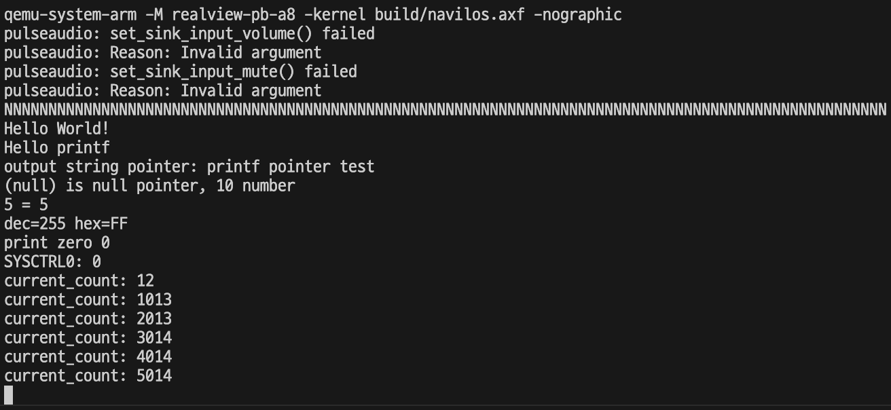

# 7. 타이머

이번에 다룰 하드웨어는 타이머이다. 임베디드 시스템에서는 시간에 의존해서 동작을 제어해야 하는 상황이 꽤나 많다. 그러려면 시간이 얼마나 흘렀는지 측정해야 하고, 그 기능을 해주는 것이 타이머이다.

일반적으로 타이머는 목표 카운트 레지스터와 측정 카운트 레지스터를 조합해서 활용한다. 목표 카운트 레지스터 값을 지정하고 측정 카운트 레지스터를 증가 혹은 감소로 설정한다.

측정 카운트가 증가할 때는 0부터 시작해서 목표 카운트 값과 같아지면 인터럽트를 발생한다. 반대로 측정 카운트가 감소할 때에는 목표 카운트부터 시작해서 0이 되면 인터럽트를 발생시킨다.

RealViewPB는 SP804라는 타이머 하드웨어를 가지고 있다. 이 타이머는 측정 카운터가 감소하는 형식이다. 우리의 목표는 일정 시간 간격으로 타이머 인터럽트를 발생시켜서 얼마만큼 시간이 지났는지 알아내는 것이다. 이것을 알아내면 대표적으로 delay() 함수를 구현할 수 있다.

## 7.1 타이머 하드웨어 초기화

새로운 하드웨어를 추가하는 첫 작업은, 해당 하드웨어의 레지스터를 구조체로 추상화하여 hal에 추가하는 작업이다.

```c
typedef union TimerXControl_t {
  uint32_t all;
  struct {
    uint32_t OneShot : 1;     //0
    uint32_t TimerSize : 1;   //1
    uint32_t TimerPre : 2;    //3:2
    uint32_t Reserved0 : 1;   //4
    uint32_t IntEnable : 1;   //5
    uint32_t TimerMode : 1;   //6
    uint32_t TimerEn : 1;     //7
    uint32_t Reserved1 : 24;  //31:8
  } bits;
} TimerXControl_t;
...
typedef struct Timer_t {
  uint32_t        timerxload;     // 0x00
  uint32_t        timerxvalue;    // 0x04
  TimerXControl_t timerxcontrol;  // 0x08
  uint32_t        timerxintclr;   // 0x0C
  TimerXRIS_t     timerxris;      // 0x10
  TimerXMIS_t     timerxmis;      // 0x14
  uint32_t        timerxbgload;   // 0x18
} Timer_t;
```

Timer_t 타입의 구조체를 보면 레지스터 7개가 정의되어 있다. timerxload는 카운터의 목표 값을 지정하는 레지스터이다. timerxvalue는 감소하는 레지스터이다. 그래서 타이머가 켜지면 timerxvalue에 timerxload 값을 복사하고 timerxvalue가 감소한다. 감소하다가 0이 되면 인터럽트가 발생하는 것이다.

timerxcontrol은 타이머 하드웨어의 속성을 설정하는 레지스터이다. timerxintclr은 인터럽트 처리가 완료되었음을 타이머 하드웨어에 알려주는 레지스터이다.

TimerXControl_t의 OneShot이 1이면 타이머 인터럽트가 한 번 발생하고 타이머가 바로 꺼진다. TimerSize는 timerxload와 timerxvalue의 크기를 설정한다. 0이면 16비트만 사용하고 1이면 32비트를 모두 사용한다. TimerPre는 클럭마다 카운터를 줄일지, 16번마다 줄일지, 256번마다 줄일지를 설정한다. 여기서는 클럭마다 카운터를 줄이도록 설정한다.

IntEnable은 타이머 하드웨어의 인터럽트를 켠다. 

TimerMode는 timerxload를 사용할지 사용하지 않을지를 결정한다. 0이면 사용하지 않는다. timerxload를 사용하지 않으면 timerxvalue는 최댓값(0xFFFF or 0xFFFFFFFF) 부터 0까지 카운트가 내려가야 인터럽트가 발생한다. 이걸 하드웨어 제조업체는 프리-러닝(free-running) 모드라고 이름 붙여놓았다.

1일때는 timerxload를 사용한다. 그래서 timerxload에 지정한 값부터 0까지 카운트가 내려가면 인터럽트가 발생한다. 하드웨어 제조업체는 이 모드를 피리오딕 모드라고 이름 붙여놓았다. 이 책에서는 피리오딕 모드를 사용한다.

TimerEn은 타이머 하드웨어 전체를 끄고 켜는 레지스터이다.

TIMER_CPU_BASE는 타이머 하드웨어 레지스터가 할당되어 있는 메모리 주소이다. RealViewPB의 데이터시트에 보면 0x10011000에 타이머 0과 1이 할당되어 있다. 여기서 멀티타이머는 고려하지 않는다.

TIMER_INTERRUPT는 타이머 하드웨어가 인터럽트를 발생시킬 때 GIC에 전달하는 인터럽트 번호이다.

UART와 GIC와 마찬가지로 hal/HalTimer.h 파일을 만들어 공용 인터페이스 API를 확정하고, 그것에 맞추어 구현 코드를 만든다.

```c
#ifndef HAL_HALTIMER_H_
#define HAL_HALTIMER_H_

void Hal_timer_init();

#endif
```

API는 하나씩 추가해 나갈 것이다.

```c
#include "stdint.h"
#include "Timer.h"
#include "HalTimer.h"
#include "HalInterrupt.h"

extern volatile Timer_t* Timer;

static void interrupt_handler(void);

static uint32_t internal_1ms_counter;

void Hal_timer_init(void) {
  // interface reset
  Timer->timerxcontrol.bits.TimerEn = 0;
  Timer->timerxcontrol.bits.TimerMode = 0;
  Timer->timerxcontrol.bits.OneShot = 0;
  Timer->timerxcontrol.bits.TimerSize = 0;
  Timer->timerxcontrol.bits.TimerPre = 0;
  Timer->timerxcontrol.bits.IntEnable = 1;
  Timer->timerxload = 0;
  Timer->timerxvalue = 0xFFFFFFFF;

  // set periodic mode
  Timer->timerxcontrol.bits.TimerMode = TIMER_PERIOIC;
  Timer->timerxcontrol.bits.TimerSize = TIMER_32BIT_COUNTER;
  Timer->timerxcontrol.bits.OneShot = 0;
  Timer->timerxcontrol.bits.TimerPre = 0;
  Timer->timerxcontrol.bits.IntEnable = 1;

  uint32_t interval_1ms = TIMER_INTERVAL / 100;

  Timer->timerxload = interval_1ms;
  Timer->timerxcontrol.bits.TimerEn = 1;

  internal_1ms_counter = 0;

  // Register Timer interrupt handler
  Hal_interrupt_enable(TIMER_INTERRUPT);
  Hal_interrupt_register_handler(interrupt_handler, TIMER_INTERRUPT);
}

static void interrupt_handler(void) {
  ++internal_1ms_counter;
  Timer->timerxintclr = 1;
}
```

타이머 하드웨어를 초기화 하는 부분은 SP804의 데이터시트에서 절차를 찾아 그대로 코드로 옮긴 것이다.

이후의 코드는 피리오딕 모드로 1밀리초 간격으로 인터럽트를 발생하게 타이머를 설정하는 코드이다. interval_1ms 변수의 값이 로드 레지스터로 들어가게 된다.

마지막 부분은 인터럽트 핸들러를 등록하는 부분이다. 이 핸들러는 1밀리초마다 실행될 것이므로 internal_ims_counter 변수의 값은 1밀리초마다 1씩 증가하게 된다. 변수 값을 증가시킨 다음에는 반드시 타이머 하드웨어에서 인터럽트를 클리어해야 한다. 그렇지 않으면 하드웨어가 인터럽트 신호를 계속 GIC에 보내서 원하는 동작을 하지 않게 된다.

## 7.2 타이머 카운터 오버플로

임베디드 시스템에 전원이 들어오면 숫자가 증가하기 시작해서 전원이 꺼질 때까지 계속 증가한다. 여기서 고려할 점은 이 변수의 크기가 32비트이므로 최대 크기까지 카운터가 증가하고 나면 다시 변수의 값이 0이 된다는 것이다. 그래서 타이머 카운터를 이용하는 코드를 만들 때에는 항상 이 오버플로 문제를 염두에 두고 작성해야 한다.

32비트 변수의 최댓값은 0xFFFFFFFF이고, 10진수로는 4295967295이다. 1밀리초마다 1씩 증가하므로 타이머 카운트가 1000씩 올라갈 때마다 1초가 지난 것이다. 1000으로 나누면 약 4295967 이다. 즉 약 4294967초, 약 49.7일 정도 계속 켜 놓으면 타이머 카운터가 오버플로를 일으켜서 0이 된다.

다음 절에서 만들 delay() 함수는 타이머 카운터를 사용한다. 그래서 타이머 카운터 오버플로가 생겼을 때도 정상 동작하는지를 확인해야 한다.

## 7.3 delay() 함수

타이머 하드웨어를 활성화하고 타이머 카운터를 만들어서 시간을 측정하는 이유는 다양한 형태의 시간 지연 함수를 만들어 사용하기 위해서이다.

이 장에서는 가장 간단한 형태의 시간 지연 함수인 delay() 함수를 만든다. delay() 함수는 특정 시간만큼 아무 일도 하지 않고 시간이 지날 때까지 기다리는 함수이다.

먼저 Timer.c의 카운터 값을 외부 파일에서 받아올 수 있도록 Hal_timer_get_1ms_counter 함수를 추가한다.

이제 이 함수를 이용해서 delay() 함수의 본체를 만든다.

```c
void delay(uint32_t ms) {
  uint32_t goal = Hal_timer_get_1ms_counter() + ms;
  while(goal != Hal_timer_get_1ms_counter());
}
```

```c
void main(void) {
  Hw_init();

  uint32_t i = 100;
  while(i--) {
    Hal_uart_put_char('N');
  }
  Hal_uart_put_char('\n');

  putstr("Hello World!\n");

  Printf_test();

  Timer_test();
}

static void Timer_test(void) {
  while(true) {
    debug_printf("current_count: %u\n", Hal_timer_get_1ms_counter());
    delay(1000);
  }
}
```



## 7.4 요약

이 장에서는 타이머 하드웨어를 제어하는 방법을 공부하였다. 임베디드 시스템에서 시간을 다루는 일은 매우 중요하다. 중요한 동기화 처리를 위해 일정 시간 동안 어떤 정보를 기다려야 하는 상황은 매우 흔하다. 이럴 때 시간을 정확하게 제어할 수 있어야 딱 필요한 시간만큼만 기다릴 수 있다.

다음장에서는 태스크를 구현한다. 지금까지는 펌웨어 자체를 구현했다면 이제부터는 펌웨어를 RTOS라고 부를 수 있는 기능들을 만들 것이다.