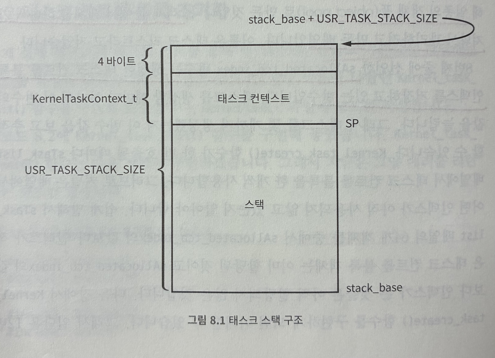

# 8. 태스크

## 8.1 태스크 컨트롤 블록

태스크 컨트롤 블록이란 개별 태스크 자체를 추상화하는 자료구조를 말한다. 태스크 블록에 포함되는 내용은 다양할 수 있지만, 이 책에서는 필수적인 내용만 태스크 컨트롤 블록에 구현한다.

태스크는 운영체제에서 동작하는 프로그램 그 자체이다. 태스크가 바뀐다는 것은 동작하는 프로그램이 바뀐다는 말이다.

예를 들어 워드프로세서에 어떤 내용을 타이핑하고 있다가 화면을 전환해서 웹 브라우저에서 또 다른 내용을 타이핑한다면 그 순간 워드 프로세서 프로그램이 웹 브라우저 프로그램으로 바뀐 것이다.

이것을 RTOS 용어로 바꾸면 현재 실행중인 태스크가 워드 프로세서 태스크에서 웹 브라우저 태스크로 전환(switching) 되었다고 표현한다.

태스크 간 전환이 생길 때 프로그램의 흐름에 어떤 문제가 생기면 안된다. 이것을 보장하기 위해서 태스크 컨트롤 블록은 현재 진행 중인 프로그램의 현재 상태 정보를 기록하고 있어야 한다. 이 프로그램의 현재 상태 정보를 **컨텍스트**라고 한다.

컨텍스트 말고도 태스크의 이름, 번호, 우선순위 등 개발자가 판단하여 태스크를 관리하는 데 필요한 부수적인 정보를 태스크 컨트롤 블록에 넣을 수 있다.

태스크 컨트롤 블록 구현은 RTOS 커널을 만드는 첫 번째 작업이다. kernel이라는 디렉터리를 새로 만들고 task.c 파일과 task.h 파일을 만들겠다.

```c
#ifndef KERNEL_TASK_H_
#define KERNEL_TASK_H_

#include "MemoryMap.h"

#define NOT_ENOUGH_TASK_NUM 0xFFFFFFFF
#define USR_TASK_STACK_SIZE 0x100000 // 각 태스크의 스택 사이즈는 1MB
#define MAX_TASK_NUM (TASK_STACK_SIZE / USR_TASK_STACK_SIZE) // 64MB / 1MB = 64개 태스크 운영 가능

typedef struct KernelTaskContext_t {
  uint32_t spsr;
  uint32_t r0_r12[13];
  uint32_t pc;
} KernelTaskContext_t;

typedef struct KernelTcb_t {
  uint32_t sp;
  uint8_t* stack_base;
} KernelTcb_t;

typedef void (*KernelTaskFunc_t)(void);

void Kernel_task_init(void);
uint32_t Kernel_task_create(KernelTaskFunc_t startFunc);

#endif
```

KernelTaskContext_t와 KernelTcb_t가 테스크 컨트롤 블록이다. KernelTaskContext_t는 컨텍스트를 추상화한 자료구조이다. ARM의 프로그램 상태 레지스터와 범용 레지스터를 백업할 수 있는 영역을 구조체로 확보해 놓은 것이다.

KernelTcb_t에는 스택 관련 정보를 저장하고 있다. sp는 스택 포인터이고, stack_base는 컨텍스트에 포함되지 않는 부가 데이터이다. 개별 태스크의 스택 베이스 주소를 저장한다.

태스크 컨텍스트는 결국 레지스터와 스택 포인터의 값이다. 스택 포인터도 레지스터의 일부이므로 태스크 컨텍스트를 전환한다는 것은 코어의 레지스터 값을 다른 태스크의 것으로 바꾼다는 말과 같다.

> 각 태스크는 종료하지 않는다고 가정했으므로, lr 레지스터 값은 저장하지 않아도 된다.

## 8.2 태스크 컨트롤 블록 초기화

이제 실제 메모리에 태스크 컨트롤 블록 인스턴스를 만들고 기본값을 할당하는 코드를 작성한다. kernel/task.c 파일에 코드를 작성한다.

```c
static KernelTcb_t sTask_list[MAX_TASK_NUM];
static uint32_t sAllocated_tcb_index;

static uint32_t cpsr_cp;
void Kernel_task_init(void) {
  sAllocated_tcb_index = 0;
  sCurrent_tcb_index = 0;

  __asm__ ("MRS r0, cpsr");
  __asm__ ("LDR r1, =cpsr_cp");
  __asm__ ("STR r0, [r1]");

  for (uint32_t i = 0; i < MAX_TASK_NUM; ++i) {
    sTask_list[i].stack_base = (uint8_t*)(TASK_STACK_START + (i * USR_TASK_STACK_SIZE));
    sTask_list[i].sp = (uint32_t)sTask_list[i].stack_base + USR_TASK_STACK_SIZE - 4;

    sTask_list[i].sp -= sizeof(KernelTaskContext_t);
    KernelTaskContext_t* ctx = (KernelTaskContext_t*)sTask_list[i].sp;
    // ctx->spsr = ARM_MODE_BIT_SYS;
    ctx->spsr = cpsr_cp;
  }
}
```

태스크 컨트롤 블록을 64개 배열로 선언했다. sAllocated_tcb_index 변수는 생성한 태스크 컨트롤 블록 인덱스를 저장하고 있는 변수다. 태스크를 생성할 때마다 하나씩 이 변수의 값을 늘린다.

Kernel_task_create() 함수가 한 번 호출될 때마다 sTake_list 배열에서 태스크 컨트롤 블록을 한 개씩 사용한다.

Kernel_task_init() 함수에서는 sTask_list 배열을 초기화한다.

각 태스크마다 stack_base 주소를 할당하고, 스택 포인터 값을 계산한다. 스택은 주소가 작아지는 방향으로 자라나므로, 스택 포인터는 stack_base + USR_TASK_STACK_SIZE가 된다. 이 책에서는 스택 사이의 간격을 표시하기 위해 4바이트를 빼주었다.

이 책에서의 RTOS는 컨텍스트를 해당 태스크의 **스택**에 저장한다. 태스크의 컨텍스트를 어디에 저장하느냐는 개발자가 설계를 어떻게 하느냐에 따라 달라지는 문제이지 정답은 없다.

이 책에서는 단순히 ctx->spsr 값을 ARM_MODE_BIT_SYS 로 초기화하는데, 이렇게 하지 않고 현재 cpsr 값을 cpsr_cp 에 복사하고, 이 값을 ctx->spsr 값에 저장해주었다.



태스크가 전환될 때, 전환되는 태스크는 스택에서 컨텍스트를 모두 pop 하여 레지스터로 옮기기 때문에 동작중인 태스크의 스택에는 태스크 컨텍스트가 존재하지 않는다.

## 8.3 태스크 생성

이 함수는 태스크로 동작할 함수를 태스크 컨트롤 블록에 등록한다. 그리고 태스크 컨트롤 블록을 커널에 만든다.

```c
uint32_t Kernel_task_create(KernelTaskFunc_t startFunc) {
  KernelTcb_t* new_tcb = &sTask_list[sAllocated_tcb_index++];

  if (sAllocated_tcb_index > MAX_TASK_NUM) {
    return NOT_ENOUGH_TASK_NUM;
  }

  KernelTaskContext_t* ctx = (KernelTaskContext_t*)new_tcb->sp;
  ctx->pc = (uint32_t)startFunc;

  return (sAllocated_tcb_index - 1);
}
```

파라미터로 들어오는 함수의 시작 주소를 PC에 넣어준다. 이 코드가 태스크 함수를 태스크 컨트롤 블록에 등록하는 코드이다. 등록한 함수의 sTask_list 상의 인덱스 값을 태스크 컨트롤 블록의 아이디로 사용하고, 반환한다.

보통은 전체 시스템을 각 기능별로 나누어 개발하고 해당 기능을 실행하는 태스크 함수를 대표로 하나 만든다. 그리고 펌웨어가 시작될 때 RTOS를 초기화하는 코드에서 개별적으로 태스크를 등록한다. 

이 책에서는 Main.c 파일에 더미 태스크 함수를 만들고 커널에 등록한다.

```c
void User_task0(void);
void User_task1(void);
void User_task2(void);

static void Kernel_init(void) {
  uint32_t taskId;

  Kernel_task_init();

  void (*f[3])(void) = { User_task0, User_task1, User_task2 };

  for(uint32_t idx = 0; idx < 3; ++idx) {
    taskId = Kernel_task_create(f[idx]);
    if(NOT_ENOUGH_TASK_NUM == taskId) {
      debug_printf("Task%u creation fail\n", idx);
    }
  }
}

void User_task0(void) {
  debug_printf("User Task #0\n");
  while(true);
}
void User_task1(void) {
  debug_printf("User Task #1\n");
  while(true);
}
void User_task2(void) {
  debug_printf("User Task #2\n");
  while(true);
}
```

함수 포인터를 파라미터로 Kernel_task_create()에 넘긴다. 해당 함수 포인터는 태스크 컨트롤 블록의 PC에 저장된다. 그러면 나중에 컨텍스트 스위칭을 할 때 ARM 코어의 PC 레지스터에 태스크 컨트롤 블록의 PC 값이 저장된다. 그 순간 해당 태스크 함수가 호출되는 것이다.

현재 각각의 태스크의 마지막 부분은 while 무한 루프인데, 지금까지 만든 rtos의 태스크 관리 설계에는 태스크의 종료를 보장하는 기능이 없기 때문이다.

## 8.4 요약

이 장에서는 태스크 컨트롤 블록 자료 구조를 설계하고 구현했다. 그리고 태스크 컨트롤 블록에 함수 포인터를 연결해서 함수를 태스크로 만들었다.

각 태스크 함수는 겉보기에는 그냥 C언어 함수와 다를 바 없이 생겼지만 각 태스크 함수는 스택 주소와 레지스터를 독립적으로 가지고 있다. 따라서 기능적으로 완전히 독립된 프로세스라고 볼 수 있다.

다음 장에서는 스케줄러를 만들고, 그 스케줄러로 태스크의 동작 순서를 결정한다.