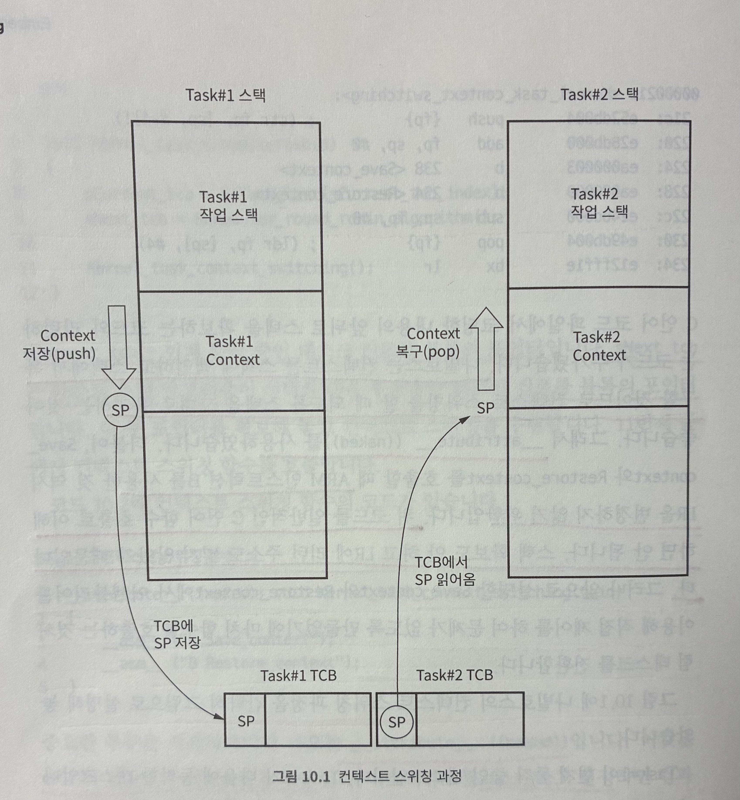
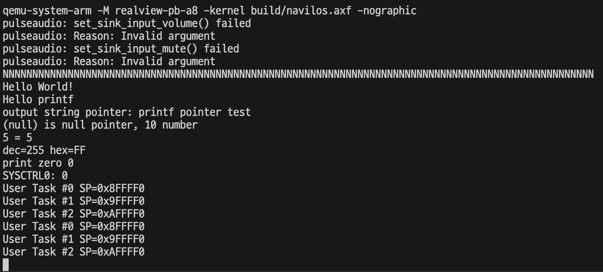

# 10. 컨텍스트 스위칭

컨텍스트 스위칭이란 컨텍스트를 전환한다는 뜻이다. 태스크란 동작하는 프로그램이고, 동작하는 프로그램의 정보는 컨텍스트이다. 이 컨텍스트를 어딘가에 저장하고 또 다른 어딘가에서 컨텍스트를 가져다가 프로세서 코어에 복구하면 다른 프로그램이 동작한다. 바로 태스크가 바뀐 것이다.

앞에서 태스크 컨텍스트를 스택에 저장했으므로, 컨텍스트 스위칭은 다음 과정으로 진행된다.

1. 현재 동작하고 있는 태스크의 컨텍스트를 현재 스택에 백업한다.
2. 다음에 동작할 태스크 컨트롤 블록을 스케줄러에서 받는다.
3. 2에서 받은 태스크 컨트롤 블록에서 스택 포인터를 읽는다.
4. 3에서 읽은 태스크의 스택에서 컨텍스트를 읽어서 ARM 코어에 복구한다.
5. 다음에 동작할 태스크의 직전 프로그램 실행 위치로 이동한다. 이러면 이제 현재 동작하고 있는 태스크가 된다.

```c
static KernelTcb_t* sCurrent_tcb;
static KernelTcb_t* sNext_tcb;

void Kernel_task_scheduler(void) {
  sCurrent_tcb = &sTask_list[sCurrent_tcb_index];
  sNext_tcb = Scheduler_round_robin_algorithm();

  Kernel_task_context_switching();
}

__attribute__ ((naked)) void Kernel_task_context_switching(void){
  __asm__ ("B Save_context");
  __asm__ ("B Restore_context");
}
```

```__attribute__``` ((naked)) 는 GCC의 컴파일러 어트리뷰트 기능인데, 어트리뷰트를 naked라고 설정하면 컴파일러가 함수를 컴파일할 때 자동으로 만드는 스택 백업, 복구, 리턴 관련 어셈블리어가 전혀 생성되지 않고 내부에 코딩한 코드 자체만 그대로 남는다.

```asm
  // push {fp}
  // add fp, sp, #0
  b <Save_context>
  b <Restore_context>
  // sub sp, fp, #0
  // pop {fp}
  // bx lr
```

컨텍스트를 스택에 백업하고 스택에서 복구할 것이므로 컨텍스트 스위칭을 할 때 되도록 스택을 그대로 유지하는 것이 좋다. 그래서 위와 같은 방식을 사용하였다.

또한 Save_context와 Restore_context에서 ARM 인스트럭션 B를 사용한 것 역시 LR을 변경하지 않기 위함이다.

> lr은 함수 내부에서 다른 함수를 호출하는 부분이 있을 때만 함수 맨 처음에 스택에 push 한다.
> lr에 다른 값이 덮어씌워질 일이 없기 때문이다.
> 각 동작모드마다 lr은 뱅크드 레지스터로 설정되어 있기 때문에, 인터럽트가 발생된다 하더라도 lr은 덮어 씌워지지 않는다.



## 10.1 컨텍스트 백업하기

앞에서 봤던 컨텍스트 자료 구조를 보자.
```c
typedef struct KernelTaskContext_t {
  uint32_t spsr;
  uint32_t r0_r12[13];
  uint32_t pc;
} KernelTaskContext_t;
```
spsr, r0_r12, pc 순서이다. C언어에서 구조체의 멤버 변수는 메모리 주소가 작은 값에서부터 큰 값으로 배정된다. 하지만 스택은 메모리 주소가 큰 값에서 작은 값으로 진행한다. 따라서 KernelTaskContext_t에 맞춰 컨텍스트를 스택에 백업할 때는 pc, r0_r12, spsr 순서로 백업해야 의도한 자료 구조 의미에 맞는 메모리 주소에 값이 저장된다.

```c
static __attribute__ ((naked)) void Save_context(void) {
  // save current task context into the current task stack
  __asm__ ("PUSH {lr}"); // Kerenl_task_context_switching을 호출한 함수에서의 PC + 4가 저장되어 있다.
  __asm__ ("PUSH {r0, r1, r2, r3, r4, r5, r6, r7, r8, r9, r10, r11, r12}");
  // 왼쪽부터 낮은 주소로 들어간다. 즉 전부 삽입했을 때 맨 왼쪽이 저장된 위치가 스택 top이 된다.
  __asm__ ("MRS r0, cpsr");
  __asm__ ("PUSH {r0}");
  // save current task stack pointer into the current TCB
  __asm__ ("LDR r0, =sCurrent_tcb"); // sCurrent_tcb의 주소값이 r0에 저장
  __asm__ ("LDR r0, [r0]"); // r0에 저장된 메모리 주소에서 값을 읽어서 r0에 저장 (sCurrent_tcb 값 저장됨)
  __asm__ ("STMIA r0!, {sp}"); // r0에 저장된 값을 베이스 메모리 주소로 해서 SP를 저장
}
```
아래 세 코드는 다음과 같이 표현할 수 있다.

(uint32_t)(*sCurrent_tcb) = ARM_코어_SP_레지스터값;

태스크 컨트롤 블록 자료 구조인 KernelTcb_t의 첫 번째 멤버 변수가 sp이므로 포인터 값을 읽어서 그대로 사용할 수 있다. (만약 두 번째라면 4바이트를 더해서 저장해야 했을 것이다.)

## 10.2 컨텍스트 복구하기
컨텍스트를 복구하는 작업은 컨텍스트를 백업하는 작업의 역순이다. 정확하게 반대로 동작하는 코드를 작성하면 된다.

```c
static __attribute__ ((naked)) void Restore_context(void) {
  // restore next task stack pointer from the next TCB
  __asm__ ("LDR r0, =sNext_tcb");
  __asm__ ("LDR r0, [r0]");
  __asm__ ("LDMIA r0!, {sp});
  // restore next task context from the next task stack
  __asm__ ("POP {r0}");
  __asm__ ("MSR cpsr, r0");
  __asm__ ("POP {r0, r1, r2, r3, r4, r5, r6, r7, r8, r9, r10, r11, r12}");
  __asm__ ("POP {pc}");
}
```

첫 번째 작업은 sNext_tcb에서 스택 포인터 값을 읽어오는 작업이다.

이후 스택에 저장되어 있는 cpsr 값을 꺼내어 ARM 코어의 CPSR에 값을 쓴다. 그 다음 R0부터 R12까지의 범용 레지스터를 복구하고 그 다음 스택 값을 꺼내 PC에 저장한다.

마지막 줄이 실행되는 순간 ARM 코어는 컨텍스트가 백업된 직후의 코드 위치로 PC를 옮기고 실행을 이어서 하게 된다.

```c
__attribute__ ((naked)) void Kernel_task_context_switching(void){
  __asm__ ("B Save_context");
  __asm__ ("B Restore_context");
}
```
이 책의 저자는 위와 같이 코드를 작성하였다. 근데 이렇게 하면 단순히 Save_context와 Restore_context가 메모리 상 연속된 위치에 저장되기 때문에 Save_context와 Restore_context가 실행되는 것이고, 두 번째 B 명령어가 실행되는 건 아닌것 같다. (B Save_context를 하면 PC가 Save_context 시작 주소로 바뀌고 PC를 복구하지 않는다.)

따라서 나는 Kernel_task_context_switching 함수 내부에 두 함수의 구현을 모두 집어넣는 방식으로 구현하였다.

```c
__attribute__ ((naked)) void Kernel_task_context_switching(void) {
  // 1. Save context

  // save current task context into the current task stack
  __asm__ ("PUSH {lr}");
  __asm__ ("PUSH {r0, r1, r2, r3, r4, r5, r6, r7, r8, r9, r10, r11, r12}");
  __asm__ ("MRS r0, cpsr");
  __asm__ ("PUSH {r0}");
  // save current task stack pointer into the current TCB
  __asm__ ("LDR r0, =sCurrent_tcb");
  __asm__ ("LDR r0, [r0]");
  __asm__ ("STMIA r0!, {sp}");

  // 2. Restore context

  // restore next task stack pointer from the next TCB
  __asm__ ("LDR r0, =sNext_tcb");
  __asm__ ("LDR r0, [r0]");
  __asm__ ("LDMIA r0!, {sp}");
  // restore next task context from the next task stack
  __asm__ ("POP {r0}");
  __asm__ ("MSR cpsr, r0");
  __asm__ ("POP {r0, r1, r2, r3, r4, r5, r6, r7, r8, r9, r10, r11, r12}");
  __asm__ ("POP {pc}");
}
```

## 10.3 yield 만들기

스케줄러와 컨텍스트 스위칭을 합쳐서 **스케줄링**이라고 한다. 그렇다면 언제 스케줄링할 것인지를 결정해야 한다.

만약 정기적으로 발생하는 타이머 인터럽트에 연동해서 스케줄링을 하고 각 태스크가 일정한 시간만 동작하고 다음 태스크로 전환되는 시스템이라면 이 시스템의 운영체제를 **시분할 시스템** 이라고 한다.

태스크가 명시적으로 스케줄링을 요청하지 않았는데 커널이 강제로 스케줄링을 하는 시스템을 **선점형 멀티태스킹 시스템** 이라고 한다.

반대로 태스크가 명시적으로 스케줄링을 요청하지 않으면 커널이 스케줄링하지 않는 시스템을 **비선점형 멀티태스킹 시스템** 이라고 한다.

일반적으로 시분할 시스템은 거의 선점형 멀티태스킹 시스템이다. RTOS를 시분할로 할지 하지 않을지, 그리고 선점형으로 할지 비선점형으로 할지 하는 결정은 RTOS가 동작할 임베디드 시스템의 요구사항에 따라 달라진다.

이 책에서는 시분할이 아닌 시스템에 비선점형 스케줄링을 사용한다. 이 말은 스케줄링을 하려면 태스크가 명시적으로 커널에 스케줄링을 요청해야 한다는 말이다. 태스크가 커널에 스케줄링을 요청하는 동작은 태스크가 CPU 자원을 다음 태스크에 양보한다는 의미로 해석할 수 있다. 그래서 일반적으로 이런 동작을 하는 함수의 이름은 양보한다는 의미로 yield를 많이 쓴다.

kernel/Kernel.h 와 kernel/Kernel.c 에 yield 함수를 만들도록 하겠다.

```c
#ifndef KERNEL_KERNEL_H_
#define KERNEL_KERNEL_H_

#include "task.h"

void Kernel_yield(void);

#endif

#include "stdint.h"
#include "stdbool.h"

#include "Kernel.h"

void Kernel_yield(void) {
  Kernel_task_scheduler(); // lr은 이 다음 리턴 코드의 위치를 가리킬 것.
}
```

구현은 매우 간단하다. Kernel_task_scheduler() 함수를 직접 호출하는 것이 전부이다. 태스크가 더 이상 할 일이 없을 때 Kernel_yield() 함수를 호출하면 즉시 스케줄러를 호출해서 다음에 동작할 태스크를 선정한다. 그리고 컨텍스트 스위칭을 수행한다.

Kernel_yield()를 호출한 태스크의 컨텍스트를 스택에 백업하고 스케줄러가 선정해 준 태스크의 스택 포인터를 복구한다. 그리고 스택 포인터로부터 컨텍스트를 복구한다.

그러면 다음에 동작할 코드의 위치는 태스크의 Kernel_yield()의 리턴 코드 직전이다. 즉 스케줄링 직후로 돌아와서 다음 태스크가 CPU를 사용하는 것이다.

## 10.4 커널 시작하기

스케줄러도 있고 컨텍스트 스위칭도 만들었기 때문에 커널을 시작해서 태스크 세 개를 동작시킬 수 있다. 방법은 매우 간단하다. 그냥 스케줄러를 실행하면 된다.

다만 처음 커널을 시작할 때는 주의해주어야 한다. 커널을 시작할 때에는 시작하는 태스크의 스택에 컨텍스트가 존재한다. 또한 이 스택에는 태스크를 추상화한 함수의 주소가 존재한다. 

따라서 맨 처음 태스크를 시작할 때는 스택에서 컨텍스트를 빼내어 저장하도록 하고 그 이후부터는 앞에서 만들었던 스케줄링 함수를 호출하면 된다.

최초 스케줄링을 처리하는 함수인 Kernel_task_start() 함수를 task.c 에 생성한다.

```c
void Kernel_task_start(void) {
  sNext_tcb = &sTask_list[sCurrent_tcb_index];

  // restore next task stack pointer from the next TCB
  __asm__ ("LDR r0, =sNext_tcb");
  __asm__ ("LDR r0, [r0]");
  __asm__ ("LDMIA r0!, {sp}");
  // restore next task context from the next task stack
  __asm__ ("POP {r0}");
  __asm__ ("MSR cpsr, r0");
  __asm__ ("POP {r0, r1, r2, r3, r4, r5, r6, r7, r8, r9, r10, r11, r12}"); // 쓰레기 값들로 채워짐
  __asm__ ("POP {pc}");
}
```

맨 처음에 시작하는 태스크는 위와 같이 스택에서 컨텍스트 값을 빼내기만 한다.

아래는 task.h와 task.c 완성본이다.

```c
#ifndef KERNEL_TASK_H_
#define KERNEL_TASK_H_

#include "MemoryMap.h"
#include "stdint.h"

#define NOT_ENOUGH_TASK_NUM 0xFFFFFFFF
#define USR_TASK_STACK_SIZE 0x100000
#define MAX_TASK_NUM (TASK_STACK_SIZE / USR_TASK_STACK_SIZE)

typedef struct KernelTaskContext_t {
  uint32_t spsr;
  uint32_t r0_r12[13];
  uint32_t pc;
} KernelTaskContext_t;

typedef struct KernelTcb_t {
  uint32_t sp;
  uint8_t* stack_base;
} KernelTcb_t;

typedef void (*KernelTaskFunc_t)(void);

void Kernel_task_init(void);
uint32_t Kernel_task_create(KernelTaskFunc_t startFunc);
void Kernel_task_scheduling(void);
void Kernel_task_start(void);

static KernelTcb_t* Scheduler_round_robin(void);
static __attribute__ ((naked)) void Kernel_task_context_switching(void);

#endif
```

```c
#include "stdint.h"
#include "stdbool.h"

#include "ARMv7AR.h"
#include "task.h"

static KernelTcb_t sTask_list[MAX_TASK_NUM];
static uint32_t sAllocated_tcb_index;

static uint32_t sCurrent_tcb_index;
static KernelTcb_t* sCurrent_tcb;
static KernelTcb_t* sNext_tcb;

static uint32_t cpsr_cp;
void Kernel_task_init(void) {
  sAllocated_tcb_index = 0;
  sCurrent_tcb_index = 0;

  __asm__ ("MRS r0, cpsr");
  __asm__ ("LDR r1, =cpsr_cp");
  __asm__ ("STR r0, [r1]");

  for (uint32_t i = 0; i < MAX_TASK_NUM; ++i) {
    sTask_list[i].stack_base = (uint8_t*)(TASK_STACK_START + (i * USR_TASK_STACK_SIZE));
    sTask_list[i].sp = (uint32_t)sTask_list[i].stack_base + USR_TASK_STACK_SIZE - 4;

    sTask_list[i].sp -= sizeof(KernelTaskContext_t);
    KernelTaskContext_t* ctx = (KernelTaskContext_t*)sTask_list[i].sp;
    ctx->spsr = cpsr_cp;
  }
}

uint32_t Kernel_task_create(KernelTaskFunc_t startFunc) {
  KernelTcb_t* new_tcb = &sTask_list[sAllocated_tcb_index++];

  if (sAllocated_tcb_index > MAX_TASK_NUM) {
    return NOT_ENOUGH_TASK_NUM;
  }

  KernelTaskContext_t* ctx = (KernelTaskContext_t*)new_tcb->sp;
  ctx->pc = (uint32_t)startFunc;

  return (sAllocated_tcb_index - 1);
}

void Kernel_task_scheduling(void) {
  sCurrent_tcb = &sTask_list[sCurrent_tcb_index];
  sNext_tcb = Scheduler_round_robin();

  Kernel_task_context_switching();
}

void Kernel_task_start(void) {
  sNext_tcb = &sTask_list[sCurrent_tcb_index];
  __asm__ ("LDR r0, =sNext_tcb");
  __asm__ ("LDR r0, [r0]");
  __asm__ ("LDMIA r0!, {sp}");

  __asm__ ("POP {r0}");
  __asm__ ("MSR cpsr, r0");
  __asm__ ("POP {r0, r1, r2, r3, r4, r5, r6, r7, r8, r9, r10, r11, r12}"); // 쓰레기 값들로 채워짐
  __asm__ ("POP {pc}"); // 태스크 함수의 위치로 점프
}

static KernelTcb_t* Scheduler_round_robin(void) {
  ++sCurrent_tcb_index;
  sCurrent_tcb_index %= sAllocated_tcb_index;

  return &sTask_list[sCurrent_tcb_index];
}

static __attribute__ ((naked)) void Kernel_task_context_switching(void) {
  // 1. Save context

  // save current task context into the current task stack
  __asm__ ("PUSH {lr}");
  __asm__ ("PUSH {r0, r1, r2, r3, r4, r5, r6, r7, r8, r9, r10, r11, r12}");
  __asm__ ("MRS r0, cpsr");
  __asm__ ("PUSH {r0}");
  // save current task stack pointer into the current TCB
  __asm__ ("LDR r0, =sCurrent_tcb");
  __asm__ ("LDR r0, [r0]");
  __asm__ ("STMIA r0!, {sp}");

  // 2. Restore context

  // restore next task stack pointer from the next TCB
  __asm__ ("LDR r0, =sNext_tcb");
  __asm__ ("LDR r0, [r0]");
  __asm__ ("LDMIA r0!, {sp}");
  // restore next task context from the next task stack
  __asm__ ("POP {r0}");
  __asm__ ("MSR cpsr, r0");
  __asm__ ("POP {r0, r1, r2, r3, r4, r5, r6, r7, r8, r9, r10, r11, r12}");
  __asm__ ("POP {pc}");
}
```

다음은 Main.c 이다.

```c
void main(void) {
  Hw_init();

  uint32_t i = 100;
  while(i--) {
    Hal_uart_put_char('N');
  }
  Hal_uart_put_char('\n');

  putstr("Hello World!\n");

  Printf_test();

  Kernel_init();
  Kernel_start();
}

static void Kernel_init(void) {
  uint32_t taskId;

  Kernel_task_init();

  taskId = Kernel_task_create(User_task0);
  if (taskId == NOT_ENOUGH_TASK_NUM) {
    putstr("Task0 creation fail\n");
  }

  taskId = Kernel_task_create(User_task1);
  if (taskId == NOT_ENOUGH_TASK_NUM) {
    putstr("Task0 creation fail\n");
  }

  taskId = Kernel_task_create(User_task2);
  if (taskId == NOT_ENOUGH_TASK_NUM) {
    putstr("Task0 creation fail\n");
  }
}

void User_task0(void) {
  uint32_t local = 0;
  while(true) {
    debug_printf("User Task #0 SP=0x%x\n", &local);
    delay(1000);
    Kernel_yield();
  }
}
void User_task1(void) {
  uint32_t local = 0;
  while(true) {
    debug_printf("User Task #1 SP=0x%x\n", &local);
    delay(1000);
    Kernel_yield();
  }
}
void User_task2(void) {
  uint32_t local = 0;
  while(true) {
    debug_printf("User Task #2 SP=0x%x\n", &local);
    delay(1000);
    Kernel_yield();
  }
}
```



모든 태스크의 스택 공간은 1MB 씩이다.

TASK_STACK_START 는 0x00800000 이다.

따라서 태스크 컨트롤 블록 초기화 후 할당된 Task0의 스택 포인터의 초기값은 0x00800000 + 1M - 4(padding) = 0x008FFFFC가 될 것이다.

여기서 컴파일러가 사용하는 스택이 몇 개 되고, 그 다음에 로컬 변수가 스택에 잡히므로 스택 메모리 주소가 0x8FFFF0 으로 출력된 것이다.

마찬가지 원리로 Task1과 Task2의 스택도 잘 출력되었다.

## 10.5 요약

이 장에서는 컨텍스트 스위칭을 만들었다. 일반적으로 쉽게 이해할 수 있는 함수의 호출-리턴 관계가 아니라 강제로 컨텍스트를 백업-리스토어 하는 과정이라 어렵다. 이제 여러 태스크가 동시에 동작하는 것처럼 보인다. 그렇다면 이 태스크간에 정보 교환을 할 수 있어야 한다. 다음 장에서는 이벤트를 구현해서 태스크 간에 간단한 신호를 주고받는다.