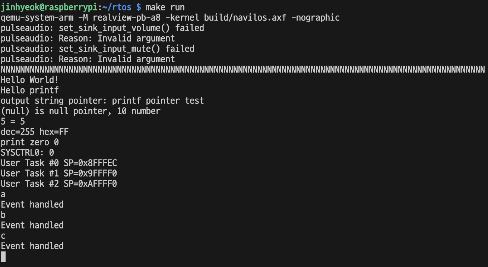
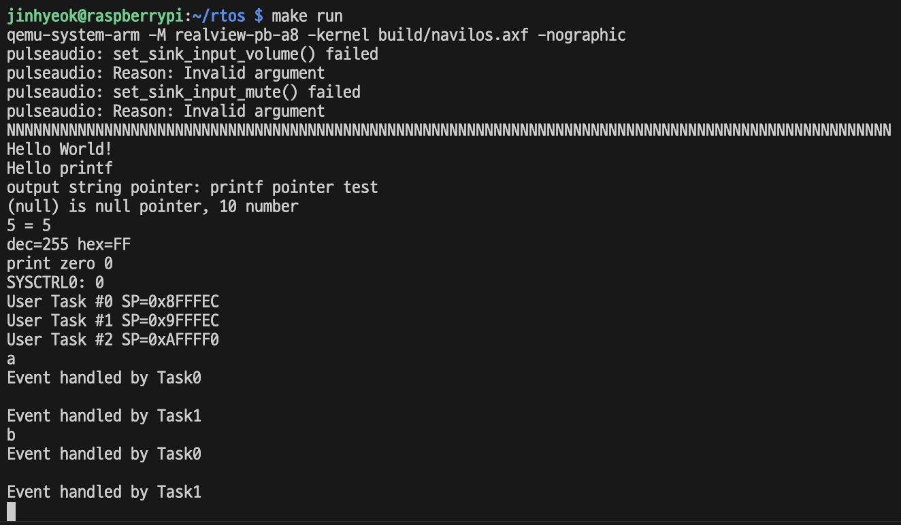
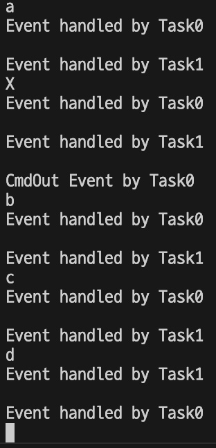

## 11. 이벤트

어떤 임베디드 시스템에 있는 버튼을 사용자가 눌렀다. 시스템 내부적으로는 버튼에 연결된 스위치에서 전기가 연결된다. 컨트롤러는 해당 전기 신호를 인식하여 ARM 코어에 인터럽트를 보낸다. IRQ나 FIQ의 핸들러에서 인터럽트 컨트롤러의 레지스터를 읽어서 해당 인터럽트의 핸들러를 호출하면 인터럽트 핸들러에서 버튼이 눌렸을 때의 처리를 한다.

지금은 RTOS 커널이 태스크를 관리하고 있으므로 좀 더 멋있고 유연하게 동작하려면 인터럽트 핸들러의 구체적인 기능을 태스크로 옮기는 것이 좋다. 그렇다면 인터럽트와 태스크 간의 연결 매체가 필요한데 이 때 사용하는 것이 이벤트이다.

### 11.1 이벤트 플래그

이벤트는 개발자가 정한 어떤 값으로 전달된다. 개발자가 처리할 수 있는 어떠한 형태로든 이벤트를 만들 수 있다.

여기서는 이벤트를 비트맵으로 치리한다. 각각의 이벤트 값을 겹치지 않는 비트 위치에 할당하는 것이다.

특정 비트 위치에 독립된 이벤트를 할당해서 이벤트가 있다 없다를 표시하는 방식으로, **이벤트 플래그** 라고 부른다.

이것을 처리하는 커널의 기능을 kernel/event.h 와 kernel/event.c 로 만든다.

```c
#ifndef KERNEL_EVENT_H_
#define KERNEL_EVENT_H_

#include "stdbool.h"

typedef enum KernelEventFlag_t {
  KernelEventFlag_UartIn = 0x00000001,

  ...

  KernelEventFlag_Empty = 0x00000000,
} KernelEventFlag_t;

void Kernel_event_flag_init(void);
void Kernel_event_flag_set(KernelEventFlag_t event);
void Kernel_event_flag_clear(KernelEventFlag_t event);
bool Kernel_event_flag_check(KernelEventFlag_t event);

#endif
```

```c
#include "stdint.h"
#include "stdbool.h"

#include "stdio.h"
#include "event.h"

static uint32_t sEventFlag;

void Kernel_event_flag_init(void) {
  sEventFlag = 0;
}
void Kernel_event_flag_set(KernelEventFlag_t event) {
  sEventFlag |= (uint32_t)event;
}
void Kernel_event_flag_clear(KernelEventFlag_t event) {
  sEventFlag &= ~((uint32_t)event);
}
bool Kernel_event_flag_check(KernelEventFlag_t event) {
  if(sEventFlag & (uint32_t)event) {
    Kernel_event_flag_clear(event);
    return true;
  }
  return false;
}
```

32비트 변수 sEventFlag는 이벤트 플래그 32개를 기록하는 커널 자료 구조이다.

태스크에서는 커널 API를 통해서 이벤트를 처리하도록 한다. 따라서 Kernel.c에 Kernel_send_events()와 Kernel_wait_events() 함수를 추가한다.

```c
void Kernel_send_events(uint32_t event_list) {
  for(uint32_t i = 0; i < 32; ++i) {
    if((event_list >> i) & 1) {
      KernelEventFlag_t sending_event = KernelEventFlag_Empty;
      sending_event = (KernelEventFlag_t)SET_BIT(sending_event, i);
      Kernel_event_flag_set(sending_event);
    }
  }
}

KernelEventFlag_t Kernel_wait_events(uint32_t waiting_list) {
  for(uint32_t i = 0; i < 32; ++i) {
    if((waiting_list >> i) & 1) {
      KernelEventFlag_t waiting_event = KernelEventFlag_Empty;
      waiting_event = (KernelEventFlag_t)SET_BIT(waiting_event, i);

      if(Kernel_event_flag_check(waiting_event)) {
        return waiting_event;
      }
    }
  }

  return KernelEventFlag_Empty;
}
```

이벤트를 전달할때는 누가 이벤트를 받아서 처리하는지 상관 없이 일단 보내고 끝낸다. 마찬가지로 이벤트를 기다리는 함수도 어디서 보낸 이벤트인지 상관 없이 그냥 처리한다.

위 함수에서 파라미터는 KernelEventFlag_t 가 아니라 그냥 uint32_t 이다. 이는 한 번에 이벤트를 여러 개 보내고 받기 위한 구현이다. 이벤트를 여러 개 보내거나 받을 때 커널 API를 여러번 호출하는게 아니라, 비트맵을 이용해서 한 번에 보내거나 받는다.

```c
Task#1
Kernel_send_events(event1 | event2 | event3)

Task#2
Kernel_wait_events(event1 | event3)

Task#3
Kernel_wait_events(event2)
```

### 11.2 인터럽트와 이벤트

이벤트는 인터럽트와 엮어서 사용하는 것이 일반적이다. 지금까지의 구현은 UART 인터럽트 핸들러에서 UART 입력 인터럽트가 발생하면 UART 하드웨어에서 입력된 글자를 받아서 다시 그대로 UART로 출력하는 일을 한다.

여기서의 목표는 이 기능을 태스크의 이벤트 핸들러로 옮기는 것이다.

우선은 UART 인터럽트 핸들러에 태스크의 이벤트 핸들러가 동작하는 것을 확인한다.

```c
static void interrupt_handler(void) {
  uint8_t ch = Hal_uart_get_char();
  Hal_uart_put_char(ch);
  Kernel_send_events(KernelEventFlag_UartIn);
}
```

위와 같이 한 줄을 추가함으로써 인터럽트와 이벤트의 연결이 끝난다. 이후 태스크에서 이벤트를 받아서 처리하는 코드를 넣고 시험한다.

> Main.c 가 너무 커져서, boot/Tasks.c 와 boot/Tasks.h 를 만들어 태스크 관련 함수를 따로 빼주었다.

```c
// Tasks.c
void add_task(KernelTaskFunc_t f, uint32_t t_id) {
  uint32_t taskId;

  taskId = Kernel_task_create(f);
  if (taskId == NOT_ENOUGH_TASK_NUM) {
    debug_printf("Task%u creation fail\n", t_id);
  }
}

void User_task0(void) {
  uint32_t local = 0;
  debug_printf("User Task #0 SP=0x%x\n", &local);

  while(true) {
    KernelEventFlag_t handle_event = Kernel_wait_events(KernelEventFlag_UartIn);
    switch(handle_event) {
    case KernelEventFlag_UartIn:
      debug_printf("\nEvent handled\n");
      break;
    }
    Kernel_yield();
  }
}
void User_task1(void) {
  uint32_t local = 0;
  debug_printf("User Task #1 SP=0x%x\n", &local);
  while(true) {
    Kernel_yield();
  }
}
void User_task2(void) {
  uint32_t local = 0;
  debug_printf("User Task #2 SP=0x%x\n", &local);
  while(true) {
    Kernel_yield();
  }
}
```



키보드를 누르면 해당 자판의 글자가 화면에 나오고, 이벤트 목록에 UartIn 이벤트가 추가된다.

User_task0 에서는 UartIn 이벤트가 있는지 확인한 후, 있다면 Event handled 문자열을 출력한다.

### 11.3 사용자 정의 이벤트

이벤트를 꼭 인터럽트와 연관지어 사용해야 하는것은 아니다. 필요하다고 생각되면 사용하지 않는 이벤트 플래그 하나에 이름을 주어서 태스크에서 태스크로 이벤트를 보낼 수도 있다.

KernelEventFlag_CmdIn = 0x00000002 로 정의하여 이 이벤트 플레그를 Task0에서 보내고, Task1 에서 받도록 해보겠다.

```c
void User_task0(void) {
  uint32_t local = 0;
  debug_printf("User Task #0 SP=0x%x\n", &local);

  while(true) {
    KernelEventFlag_t handle_event = Kernel_wait_events(KernelEventFlag_UartIn);
    switch(handle_event) {
    case KernelEventFlag_UartIn:
      debug_printf("\nEvent handled by Task0\n");
      Kernel_send_events(KernelEventFlag_CmdIn);
      break;
    }
    Kernel_yield();
  }
}
void User_task1(void) {
  uint32_t local = 0;
  debug_printf("User Task #1 SP=0x%x\n", &local);
  while(true) {
    KernelEventFlag_t handle_event = Kernel_wait_events(KernelEventFlag_CmdIn);
    switch(handle_event) {
    case KernelEventFlag_CmdIn:
      debug_printf("\nEvent handled by Task1\n");
      break;
    }
    Kernel_yield();
  }
}
```

UART 인터럽트 핸들러에서 UartIn 이벤트를 보내고 스케줄러이 의해 Task0이 실행되면 UartIn 이벤트를 확인하고 받아온다. 그리고 이벤트 처리 코드를 실행한다.

이 이벤트 처리 코드 안에서 또 다시 Kernel_send_events 커널 API를 호출해서 CmdIn 이벤트를 보낸 후 스케줄링을 한다. 다음에 스케줄링을 받은 태스크는 Task1이고, CmdIn 이벤트를 기다린다.



### 11.4 여러 이벤트 플래그를 동시에 보내고 처리하기

이벤트 플래그를 설계할 때 비트맵을 사용한 가장 큰 이유는 바로 이벤트 플래그를 동시에 여러 개 보내고 받을 수 있게끔 코딩할 수 있게 하기 위해서이다.

KernelEventFlag_CmdOut = 0x00000004 이벤트를 추가한다.

그리고 UART 인터럽트 핸들러에서 동시에 여러개 이벤트를 보내도록 수정한다.

```c
static void interrupt_handler(void) {
  uint8_t ch = Hal_uart_get_char();
  Hal_uart_put_char(ch);
  Kernel_send_events(KernelEventFlag_UartIn | KernelEventFlag_CmdIn);
  if(ch == 'X') {
    Kernel_send_events(KernelEventFlag_CmdOut);
  }
}
```

위 코드를 보면 이벤트 플래그 두 개를 비트 OR 연산자로 이어 한번에 보낸다. 추가로 대문자 X를 눌렀을 때 KernelEventFlag_CmdOut 이벤트를 발생시키도록 하였다.

```c
void User_task0(void) {
  uint32_t local = 0;
  debug_printf("User Task #0 SP=0x%x\n", &local);

  while(true) {
    KernelEventFlag_t handle_event = Kernel_wait_events(KernelEventFlag_UartIn | KernelEventFlag_CmdOut);
    switch(handle_event) {
    case KernelEventFlag_UartIn:
      debug_printf("\nEvent handled by Task0\n");
      break;
    case KernelEventFlag_CmdOut:
      debug_printf("\nCmdOut Event by Task0\n");
      break;
    }
    Kernel_yield();
  }
}
```

이후 User_task0 에서 UartIn과 CmdOut 이벤트를 비트맵으로 설정하여 동시에 기다릴 수 있도록 하였다.

이렇게 하면 비트맵으로 설정한 두 이벤트 중 하나가 커널에 대기 중일 때 해당 이벤트 값을 Kernel_wait_events() 함수가 리턴한다. 물론 이벤트 두 개를 동시에 처리하지는 않고, 호출 한 번에 한 개씩 받아온다.



위 결과를 보면 X가 입력되었을 때 Task0이 UartIn 이벤트를 응답하고, Task1이 CmdIn 이벤트를 응답하고, 다시 Task0이 CmdOut 이벤트를 응답한다.

while문을 돌며 모든 이벤트를 다 응답한 경우에만 Kernel_yield() 함수를 호출하도록 변경할 수도 있을 것이다.

어느 쪽이 더 좋은게 아니라, RTOS가 동작하는 임베디드 시스템의 요구사항에 따라서 코드를 다르게 작성해야 할 뿐이다.

이벤트는 어떤 태스크를 어떤 상황에서 골라서 동작시켜야 할지를 제어하는 아주 유용한 수단이다. 실제로 윈도우나 리눅스 같은 범용 운영체제에서도 폭넓게 사용되는 개념이다.

### 11.5 요약

이 장에서는 이벤트 기능을 만들었다. 이벤트 플래그를 비트맵으로 만들어서 각 태스크가 이벤트를 보내고 받도록 하였다.

이벤트는 태스크 간 정보 전달 뿐 아니라 인터럽트 핸들러에서 태스크로 정보를 전달할 때도 유용하게 쓸 수 있다. 이벤트로는 매우 단편적인 정보만 전달할 수 있는데, 다음 장에서는 다량의 데이터를 전달할 수 있는 메시징 기능을 만든다.