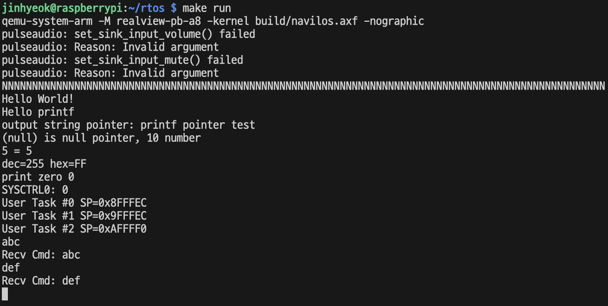
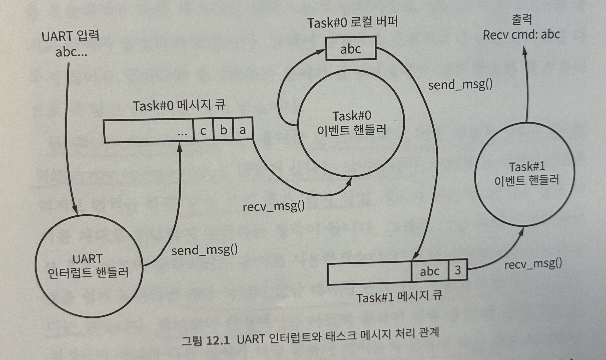

# 12. 메시징

이제 인터럽트 핸들러에서 태스크로 혹은 태스크에서 태스크로 이벤트를 보낼 수 있다. 하지만 충분하지 않다. 이벤트 이상의 더 많은 정보를 보낼 수 없기 때문이다. 문자 자체를 전달할 방법을 만들어야 한다.

따라서 메시징 기능을 만들 것이다. 메시징은 임의의 데이터를 메시지라는 이름으로 전송하는 기능이다.

실생활에 비유하면 이벤트는 일종의 벨이다. 알릴 것이 있으면 그저 벨이 땡 하고 울리는 것이다.

메시징은 사서함 같은 것이다. 우체국의 사서함처럼 정해진 공간이 있고 그 공간에 편지가 쌓인다. 그리고 사서함의 주인이 필요할 때 사서함에 쌓인 편지를 가져오는 것이다.

우체국에서 사서함 주인의 집으로 연결된 벨이 있어서 사서함에 편지가 도착할 때마다 우체국에서 벨을 울려준다면, 사서함 주인은 벨이 울릴 때 우체국으로 가서 편지를 가져올 수 있을 것이다.

이벤트와 메시징을 섞어서 사용하면 이와 같은 원리로 데이터를 다룰 수 있다.

kernel 디렉터리 밑에 msg.h와 msg.c 파일을 만들어 그 안에 메시징 기능을 구현한다.

## 12.1 메시지 큐

메시징 기능의 설계는 메시지를 어떻게 관리할 것이냐 하는 결정에서 시작한다. 여기서는 큐로 결정하였다.

메시지를 큐로 관리한다고 하여 **메시지 큐** 라고 부른다.

큐는 FIFO(First In First Out)혹은 선입선출 이라고 불리는 데이터 구조이다. 먼저 들어간 데이터가 먼저 나온다는 뜻이다. 여기서는 배열로 큐를 구현한다.

```c
#ifndef KERNEL_MSG_H_
#define KERNEL_MSG_H_

#define MSG_Q_SIZE_BYTE 512

typedef enum KernelMsgQ_t {
  KernelMsgQ_Task0,
  KernelMsgQ_Task1,
  KernelMsgQ_Task2,

  KernelMsgQ_Num
} KernelMsgQ_t;

typedef struct KernelCirQ_t {
  uint32_t front;
  uint32_t rear;
  uint8_t Queue[MSG_Q_SIZE_BYTE];
} KernelCirQ_t;

void Kernel_msgQ_init(void);
bool Kernel_msgQ_is_empty(KernelMsgQ_t Qname);
bool Kernel_msgQ_is_full(KernelMsgQ_t Qname);
bool Kernel_msgQ_enqueue(KernelMsgQ_t Qname, uint8_t data);
bool Kernel_msgQ_dequeue(KernelMsgQ_t Qname, uint8_t* out_data);

#endif
```

큐의 정의에 따라 뒤에 데이터를 넣고 앞에서 데이터를 뺀다. 이 책에서는 태스크당 한 개씩의 메시지 큐를 배정한다.

```c
#include "stdint.h"
#include "stdbool.h"
#include "stdlib.h"

#include "msg.h"

static KernelCirQ_t sMsgQ[KernelMsgQ_Num];

void Kernel_msgQ_init(void) {
  for (uint32_t i = 0; i < KernelMsgQ_Num; ++i) {
    sMsgQ[i].front = 0;
    sMsgQ[i].rear = 0;
  }
}
bool Kernel_msgQ_is_empty(KernelMsgQ_t Qname) {
  if (Qname >= KernelMsgQ_Num) {
    return false;
  }
  if (sMsgQ[Qname].front == sMsgQ[Qname].rear) {
    return true;
  }
  return false;
}
bool Kernel_msgQ_is_full(KernelMsgQ_t Qname) {
  if (Qname >= KernelMsgQ_Num) {
    return false;
  }
  if (((sMsgQ[Qname].rear) + 1) % MSG_Q_SIZE_BYTE == sMsgQ[Qname].front) {
    return true;
  }
  return false;
}
bool Kernel_msgQ_enqueue(KernelMsgQ_t Qname, uint8_t data) {
  if (Qname >= KernelMsgQ_Num) {
    return false;
  }
  if (Kernel_msgQ_is_full(Qname)) {
    return false;
  }
  ++sMsgQ[Qname].rear;
  sMsgQ[Qname].rear = (sMsgQ[Qname].rear + 1) % MSG_Q_SIZE_BYTE;

  sMsgQ[Qname].Queue[sMsgQ[Qname].rear] = data;
  return true;
}
bool Kernel_msgQ_dequeue(KernelMsgQ_t Qname, uint8_t* out_data) {
  if (Qname >= KernelMsgQ_Num) {
    return false;
  }
  if (Kernel_msgQ_is_empty(Qname)) {
    return false;
  }
  ++sMsgQ[Qname].front;
  sMsgQ[Qname].front = (sMsgQ[Qname].front + 1) % MSG_Q_SIZE_BYTE;
  
  *out_data = sMsgQ[Qname].Queue[sMsgQ[Qname].front];

  return true;
}
```

이후 커널 API로 조금 더 활용성 높게 만든다. 메시지 큐의 enqueue 함수와 dequeue 함수는 1바이트 크기의 데이터만 처리할 수 있도록 만들 것에 비해 커널 API는 count 크기만큼의 데이터를 한번에 처리할 수 있도록 설계하였다.

따라서 데이터를 넣거나 빼는 도중에 count 크기만큼 처리를 다 마치지 못했는데 메시지 큐가 꽉 차거나 비어 버리는 상황을 처리해주어야 한다.

```c
bool Kernel_send_msg(KernelMsgQ_t Qname, void* data, uint32_t count) {
  uint8_t* d = (uint8_t*)data;

  for(uint32_t i = 0; i < count; ++i) {
    if(!Kernel_msgQ_enqueue(Qname, *d)) {
      for(uint32_t j = 0; j < i; ++j) {
        uint8_t rollback;
        Kernel_msgQ_dequeue(Qname, &rollback);
      }
      return false;
    }
    ++d;
  }

  return true;
}

uint32_t Kernel_recv_msg(KernelMsgQ_t Qname, void* out_data, uint32_t count) {
  uint8_t* d = (uint8_t*)out_data;

  for(uint32_t i = 0; i < count; ++i) {
    if(!Kernel_msgQ_dequeue(Qname, d)) {
      return i;
    }
    ++d;
  }

  return count;
}
```

큐에 데이터를 넣다가 큐가 꽉 찼다면 지금까지 넣은 데이터를 다시 빼내는 작업을 수행한다.

큐에서 데이터를 읽다가 큐가 비었다면, 지금까지 읽은 바이트 수만 리턴하고 호출하는 쪽에서 처리하도록 한다.

## 12.2 태스크 간 데이터 전달

이 장에서는 앞 절에서 만든 메시징 기능을 이용하여 적당한 예제를 만든다. UART 인터럽트 핸들러에서 이벤트와 함께 UART를 통해서 들어온 키보드 입력 값을 메시지 큐로 보낸다.

```c
static void interrupt_handler(void) {
  uint8_t ch = Hal_uart_get_char();
  Hal_uart_put_char(ch);
  
  Kernel_send_msg(KernelMsgQ_Task0, &ch, 1);
  Kernel_send_events(KernelEventFlag_UartIn);
}
```

UART 입력 인터럽트가 들어오면, Task0용 메시지 큐에 UART 입력으로 받은 값을 전달하고, UartIn 이벤트를 보낸다.

Task0은 UartIn 이벤트를 기다리고 있다가 이벤트가 발생하면 메시지 큐에서 1바이트 값을 읽는다. Task0은 UART 인터럽트 핸들러에서 이벤트가 오면 메시지 큐에서 1바이트를 읽어서 내부 버퍼에 읽은 값을 계속 쌓아둔다. 그러다가 엔터 키가 입력되면 지금까지 버퍼에 쌓아 두었던 값을 Task1의 메시지 큐에 넣고 CmdIn 이벤트를 보낸다.

```c
void User_task0(void) {
  uint32_t local = 0;
  debug_printf("User Task #0 SP=0x%x\n", &local);

  uint8_t cmdBuf[16];
  uint8_t cmdBufIdx = 0;
  uint8_t uartch = 0;

  while(true) {
    KernelEventFlag_t handle_event = Kernel_wait_events(KernelEventFlag_UartIn);
    switch(handle_event) {
    case KernelEventFlag_UartIn:
      Kernel_recv_msg(KernelMsgQ_Task0, &uartch, 1);

      if (uartch == '\r') {
        cmdBuf[cmdBufIdx] = '\0';
        
        while(true) {
          if(!Kernel_send_msg(KernelMsgQ_Task1, &cmdBufIdx, 1)) {
            Kernel_yield();
          }
          else if(!Kernel_send_msg(KernelMsgQ_Task1, cmdBuf, cmdBufIdx)) {
            uint8_t rollback;
            Kernel_recv_msg(KernelMsgQ_Task1, &rollback, 1);
            Kernel_yield();
          }
          else {
            break;
          }
        }

        Kernel_send_events(KernelEventFlag_CmdIn);
        cmdBufIdx = 0;
      }
      else {
        cmdBuf[cmdBufIdx] = uartch;
        cmdBufIdx = (cmdBufIdx + 1) % 16;
      }
      break;
    }
    Kernel_yield();
  }
}
```

Task0은 UartIn 이벤트 발생 시 내부 버퍼에 값을 계속해서 저장하다가, 엔터 입력 시 Task1의 버퍼에 먼저 메시지의 길이를 보내고, 이어서 메시지 데이터를 보낸다.

```c
void User_task1(void) {
  uint32_t local = 0;
  debug_printf("User Task #1 SP=0x%x\n", &local);

  uint8_t cmdlen = 0;
  uint8_t cmd[16] = {0, };

  while(true) {
    KernelEventFlag_t handle_event = Kernel_wait_events(KernelEventFlag_CmdIn);
    switch(handle_event) {
    case KernelEventFlag_CmdIn:
      Kernel_recv_msg(KernelMsgQ_Task1, &cmdlen, 1);
      Kernel_recv_msg(KernelMsgQ_Task1, cmd, cmdlen);
      cmd[cmdlen] = 0;
      debug_printf("\nRecv Cmd: %s\n", cmd);
      break;
    }
    Kernel_yield();
  }
}
```

메시지 큐는 FIFO이므로 보낸 순서 그대로 받으면 된다.

Task1 에서는 CmdIn 이벤트를 받으면 먼저 데이터 길이를 받는다. 이후 데이터 길이 만큼을 버퍼에서 읽어 cmd 로컬 배열에 저장한다. 마지막으로 cmd 로컬 배열의 내용을 debug_printf() 함수로 출력한다.

사용자가 키보드를 누르면 UART 인터럽트 핸들러에서는 입력된 키보드 값을 일단 그대로 화면에 출력한다. 그 다음 그 값을 Task0의 큐로 보낸다. Task0은 UART 인터럽트 핸들러에서 받은 키보드 입력을 1바이트씩 버퍼에 쌓아둔다.

그러다가 엔터 키가 입력되면 Task1으로 모아둔 입력 값을 한 번에 보낸다. Task1은 이것을 받아서 화면에 출력한다.






## 12.3 요약

이번 장에서는 메시지 큐 형태로 메시징 기능을 만들었다. 태스크나 인터럽트 간에 데이터를 전달하고 싶을 때는 큐에 데이터를 넣기만 하면 된다.

또한 데이터를 받을 때는 큐에서 데이터를 꺼내기만 하면 된다.

이벤트를 조합해서 필요한 정보를 어떤 태스크가 보내고 받는지를 제어한다.