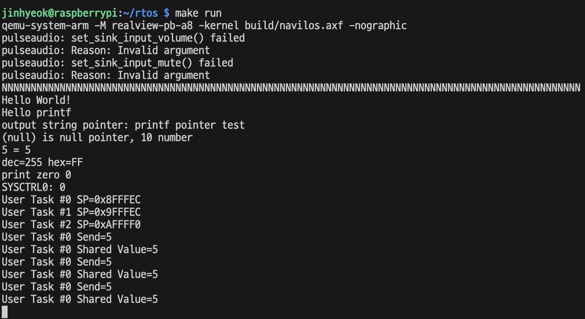
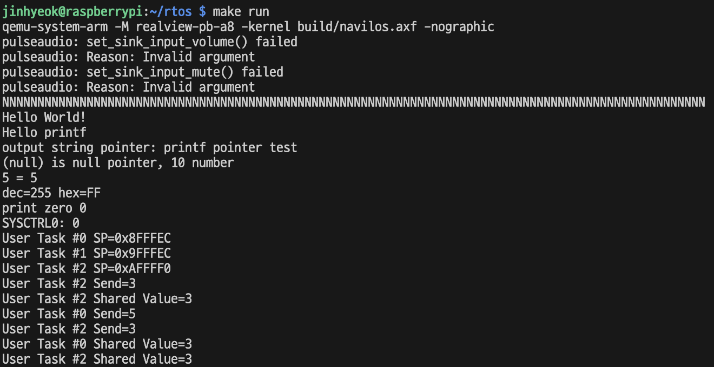
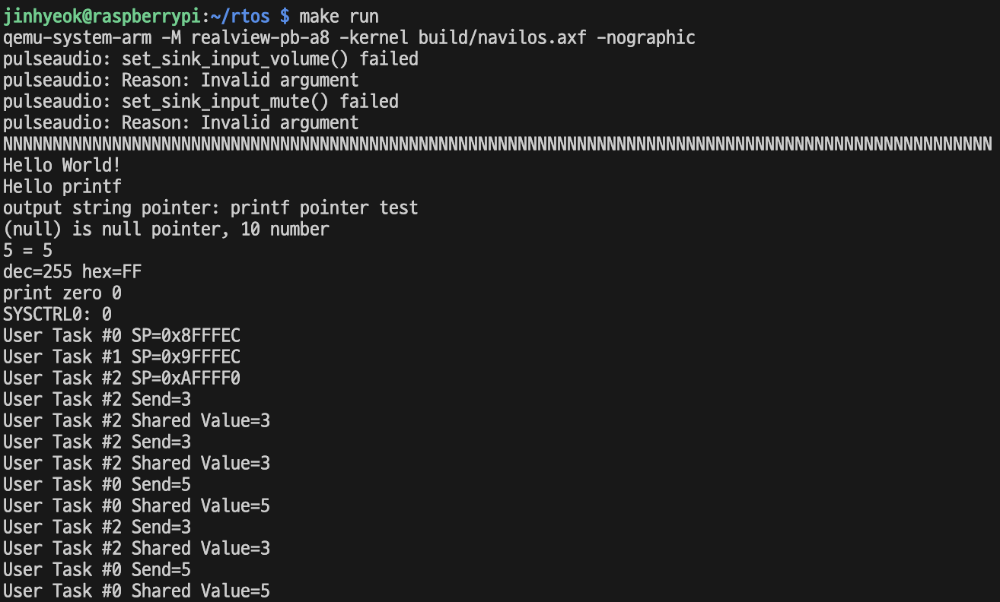
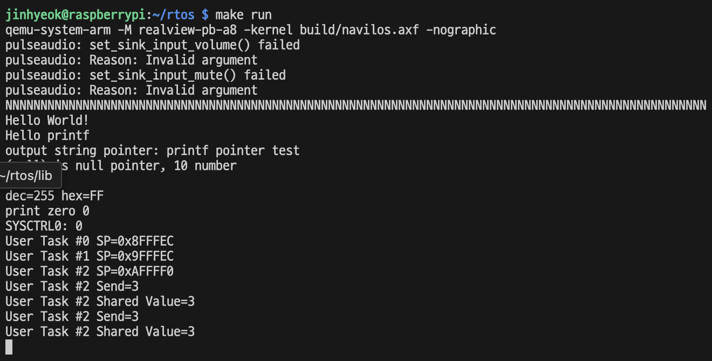
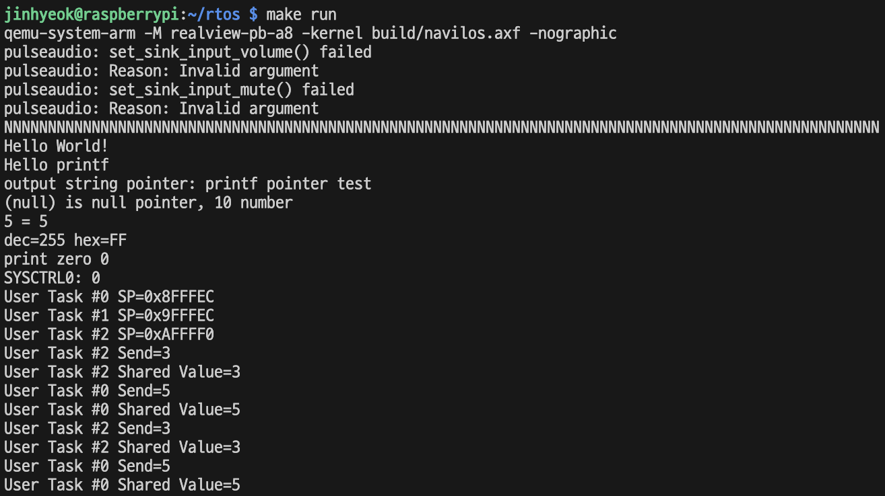

# 13. 동기화

**동기화(synchronization)**라는 용어는 운영체제에서 어떤 작업을 **아토믹 오퍼레이션(atomic operation)** 으로 만들어 준다는 의미이다. 어떤 작업이 아토믹하다는 것을 쉽게 표현하면 해당 작업이 끝날때까지 컨텍스트 스위칭이 발생하지 않는다는 말이다. 멀티코어 환경에서는 아토믹 동작이 진행 중일 때, 컨텍스트 스위칭 뿐만 아니라 다른 코어가 해당 동작에 끼어들지 못하게 하는 것을 의미한다.

어떤 작업이 아토믹하게 구현되어야만 한다면 해당 작업을 **크리티컬 섹션** 이라고 부른다.

즉 **동기화**란 어떤 작업이 **크리티컬 섹션**이라고 판단되었을 경우, 해당 크리티컬 섹션을 **아토믹 오퍼레이션**으로 만들어 주는 것을 말한다.

동기화를 구현하는 알고리즘에는 여러 종류가 있다. 그중 많이 쓰이는 세 가지를 이 책에서 구현한다.

첫 번째는 **세마포어**, 두 번째는 **뮤텍스**, 세 번째는 **스핀락** 이다.

## 13.1 세마포어

**세마포어**는 동기화 알고리즘 중에서 가장 유명한 알고리즘 중 하나이다.

세마포어의 의사 코드는 다음과 같다.

```
Test(S) {
  while S <= 0;
  --S;
}

Release(S) {
  ++S;
}
```

Test 함수는 이름 그대로 크리티컬 섹션에 진입 가능한지를 확인해 보는 함수이다. 다른 의미로는 세마포어를 잠글 수 있는지 확인하는 것이다.

Release 함수는 크리티컬 섹션을 나갈 때 호출해서 세마포어를 놓아주는 혹은 세마포어의 잠금을 푸는 역할을 한다.

여기서 동기화를 구현하는 중요한 개념이 나온다. 바로 잠금과 잠금의 해제이다. 크리티컬 섹션에 들어갈 때 잠그고 크리티컬 섹션을 나올 때 잠금을 푸는 것이다.

잠겨있는 도중에는 컨텍스트 스위칭도 발생하지 않고, 다른 코어가 끼어들지 못한다.

동기화 첫 번째로 세마포어를 구현하겠다. kernel 디렉터리 밑에 synch.h 파일과 synch.c 파일을 만든다.

```c
#include "synch.h"

#define DEF_SEM_MAX 8

static int32_t sSemMax;
static int32_t sSem;

void Kernel_sem_init(int32_t max) {
  sSemMax = (max >= DEF_SEM_MAX) ? DEF_SEM_MAX : max;

  sSem = sSemMax;
}
bool Kernel_sem_test(void) {
  if(sSem <= 0) {
    return false;
  }
  --sSem;
  return true;
}
void Kernel_sem_release(void) {
  ++sSem;
  if(sSem >= sSemMax) {
    sSem = sSemMax;
  }
}
```

Kernel_sem_init 함수는 세마포어의 초기화 함수인데, max 파라미터로 세마포어의 최댓값을 받는다.

예를 들어 max 값이 1이면 크리티컬 섹션에는 컨텍스트가 딱 한 개만 진입할 수 있다.

이런 세마포어를 **바이너리 세마포어** 라고 부른다. 이 값이 2개면 컨텍스트 2개까지, 3이면 컨텍스트 세 개까지 진입 가능하다.

세마포어는 커널 API를 통해서 사용한다. Kernel.c 파일에 세마포어용 커널 API를 구현한다.

```c
void Kernel_lock_sem(void) {
  while (!Kernel_sem_test()) {
    Kernel_yield();
  }
}

void Kernel_unlock_sem(void) {
  Kernel_sem_release();
}
```

세마포어의 의사 코드에서 while 무한 루프로 대기하는 기능을 여기서는 Kernel_yield() 함수를 호출해서 스케줄링을 하는 것으로 구현하였다. 이렇게 해야만 해당 크리티컬 섹션의 잠금을 소유하고 있는 다른 태스크로 컨텍스트가 넘어가서 세마포어의 잠금을 풀어줄 수 있기 때문이다.

지금까지 만든 rtos는 비선점형 스케줄링이고, 시분할 시스템이 아니기 때문에 동기화 문제가 발생하기 어렵다. 그래서 억지로 이상한 코드를 작성해서 상황을 만든다. 다음과 같이 UART 인터럽트 핸들러 코드를 수정한다.

```c
static void interrupt_handler(void) {
  uint8_t ch = Hal_uart_get_char();

  if (ch != 'X') {
    Hal_uart_put_char(ch);
    Kernel_send_msg(KernelMsgQ_Task0, &ch, 1);
    Kernel_send_events(KernelEventFlag_UartIn);
  }
  else {
    Kernel_send_events(KernelEventFlag_CmdOut);
  }
}
```

이후 Tasks.c를 수정한다.

```c
static uint32_t shared_value;
static void Test_critical_section(uint32_t p, uint32_t taskId) {
  debug_printf("User Task #%u Send=%u\n", taskId, p);
  shared_value = p;
  Kernel_yield();
  delay(1000);
  debug_printf("User Task #%u Send=%u\n", taskId, shared_value);
}

void User_task0(void) {
  uint32_t local = 0;
  debug_printf("User Task #0 SP=0x%x\n", &local);

  uint8_t cmdBuf[16];
  uint8_t cmdBufIdx = 0;
  uint8_t uartch = 0;

  while(true) {
    KernelEventFlag_t handle_event = Kernel_wait_events(KernelEventFlag_UartIn | KernelEventFlag_CmdOut);
    switch(handle_event) {
    case KernelEventFlag_UartIn: ...
    case KernelEventFlag_CmdOut:
      Test_critical_section(5, 0);
      break;
    }
    Kernel_yield();
  }
}
```

크리티컬 섹션을 만들려면 여러 태스크 혹은 여러 코어가 공유하는 공유 자원이 있어야 한다. 이 공유 자원 역할을 하는 것이 shared_value 전역 변수이다.

Test_critical_section 함수가 호출되면, 태스크의 번호와 어떤 입력을 넘겼는지를 출력하고 공유자원의 값을 바꾼다.

이후 Kernel_yield() 함수를 호출해서 억지스러운 스케줄링을 한다.

1초 딜레이를 준 후, 태스크 번호와 공유 변수의 값을 출력한다. 이러면 다음과 같은 결과가 나온다.



X 키를 누를 때마다 Task0이 숫자 5를 shared_value 변수에 전달했다는 것을 디버그 메시지로 출력한다.

Test_critical_section() 함수는 반드시 입력으로 전달한 값과 공유 변수의 값이 같아야만 제 역할을 했다고 볼 수 있다.

그런데 만약 같은 Test_critical_section() 함수를 Task2에서 동시에 호출한다면 어떻게 될까?

다음처럼 User_task2 코드를 수정해서 크리티컬 섹션에 동시에 접근하는 코드를 만든다.

```c
void User_task2(void) {
  uint32_t local = 0;
  debug_printf("User Task #2 SP=0x%x\n", &local);
  while(true) {
    Test_critical_section(3, 2);
    Kernel_yield();
  }
}
```

Task2는 Test_critical_section() 함수에 3을 전달한다. 이 상태에서 실행하면 Test2의 출력이 계속 나온다.



이러면 Task2가 Task0이 shared_value에 5를 넣는 동작을 방해하는 형태가 된다. 그래서 Task0에서 shared_value를 출력하는 시점에서 다음과 같이 shared_value 값을 3으로 출력하는 결과가 중간에 보인다.

Task0은 5를 보냈으므로 위와 같은 출력이 나오는 것은 분명히 잘못된 결과이다.

Task0이 shared_value 값을 5로 저장하였지만, Task2로 컨텍스트 스위칭애 됐을 때 shared_value의 값이 3으로 바뀐 것이다.

약간 억지스럽긴 하지만 멀티코어 환경에서 크리티컬 섹션에 이와 비슷한 성격의 공유 자원 문제는 매우 자주 발생한다. 여러 코어가 공유하는 자원에 대한 값을 바꾸고 사용하는 코드라면 개발자가 판단해서 이것을 크리티컬 섹션으로 식별하고 반드시 동기화 처리를 해야만 한다.

그럼 바이너리 세마포어를 만들어서 크리티컬 섹션에 동기화 처리를 해보도록 하겠다.

```c
static void Kernel_init(void) {
  ...
  Kernel_sem_init(1);
  ...
}
```

Kernel_sem_init() 함수에 1을 전달하여 바이너리 세마포어를 만든다.

```c
static void Test_critical_section(uint32_t p, uint32_t taskId) {
  Kernel_lock_sem();
  debug_printf("User Task #%u Send=%u\n", taskId, p);
  shared_value = p;
  Kernel_yield();
  delay(1000);
  debug_printf("User Task #%u Shared Value=%u\n", taskId, shared_value);
  Kernel_unlock_sem();
}
```

크리티컬 섹션에 진입할 때 Kernel_lock_sem() 커널 API를 사용해서 세마포어를 잠그고, 크리티컬 섹션이 끝나면 Kernel_unlock_sem() 커널 API를 사용해서 세마포어의 잠금을 풀어준다.

크리티컬 섹션으로 식별된 Text_critical_section() 함수의 동작을 아토믹 오퍼레이션으로 만든 것이다.

이제 다시 실행하여 동작을 확인하여 보겠다.



위와 같이 Task2의 입력값이 Task0에 출력되는 현상이 생기지 않는다. 이것으로 세마포어가 제대로 동작하는 것을 확인할 수 있다.

## 13.2 뮤텍스

또 다른 동기화 알고리즘으로 **뮤텍스** 가 있다. 뮤텍스는 바이너리 세마포어의 일종이다. 여기에 특별한 점이 있는데, 그것은 **소유** 의 개념이다.

세마포어는 잠금에 대한 소유 개념이 없으므로 누가 잠근 세마포어이든 간에 누구나 잠금을 풀 수 있다. 그러나 뮤텍스는 소유의 개념이 있다.

즉 뮤텍스를 잠근 태스크만이 뮤텍스의 잠금을 풀 수 있다는 말이다. 다시 말해 뮤텍스는 바이너리 세마포어에 소유의 개념을 더한 동기화 알고리즘이라고 할 수 있다.

뮤텍스는 synch.c 파일과 synch.h 파일에 추가하여 구현한다.

```c
typedef struct KernelMutex_t {
  uint32_t owner;
  bool lock;
} KernelMutext_t;

void Kernel_mutex_init(void);
bool Kernel_mutex_lock(uint32_t owner);
bool Kernel_mutex_unlock(uint32_t owner);
```

위의 함수는 각각 초기화, 잠금, 해제 함수로 세마포어와 같다. 다만 다른 점은 파라미터로 소유자를 받는다는 것이다.

뮤텍스는 KernelMutex_t 구조체로 구현되었고, owner과 lock 변수 두 개가 선언되어 있다. 뮤텍스의 소유자와 잠김을 표시하는 변수를 추상화한 구조체이다.

다음은 뮤텍스를 구현한 코드이다.

```c
static KernelMutex_t sMutex;
void Kernel_mutex_init(void) {
  sMutex.owner = 0;
  sMutex.lock = false;
}
bool Kernel_mutex_lock(uint32_t owner) {
  if(sMutex.lock) {
    return false;
  }

  sMutex.owner = owner;
  sMutex.lock = true;
  return true;
}
bool Kernel_mutex_unlock(uint32_t owner) {
  if (owner == sMutex.owner) {
    sMutex.lock = false;
    return true;
  }
  return false;
}
```
뮤텍스 자료 구조를 전역 변수로 만들고 제어한다.

뮤텍스 자료 구조의 lock 멤버 변수는 true일 때가 잠김이다.

잠겨있는 상태에서 Kernel_mutex_lock이 호출되면 false를 리턴하고 함수를 끝낸다. 뮤텍스가 잠겨있지 않다면 소유자를 뮤텍스 전역 변수에 등록하고 lock 멤버 변수를 true로 만들어 뮤텍스를 잠그고 true를 리턴한다.

잠금을 해제할 때는 우선 파라미터로 넘어온 owner의 값과 뮤텍스 전역 변수에 저장되어 있는 owner 값을 비교해서 같을 때만 뮤텍스의 잠금을 푼다. 소유자를 확인하고 뮤텍스를 잠갔던 소유자일 때만 뮤텍스의 잠금 해제를 허용하는 것이다.

뮤텍스의 소유자가 아닌 태스크에서 뮤텍스의 잠금 해제를 요청하면 무시하고 false를 리턴한다.

다음은 뮤텍스를 제어하는 커널 API 이다.

```c
void Kernel_lock_mutex(void) {
  while(true) {
    uint32_t current_task_id = Kernel_task_get_current_task_id();
    if(!Kernel_mutex_lock(current_task_id)) {
      Kernel_yield();
    }
    else {
      break;
    }
  }
}

void Kernel_unlock_mutex(void) {
  uint32_t current_task_id = Kernel_task_get_current_task_id();
  if(!Kernel_mutex_unlock(current_task_id)) {
    Kernel_yield();
  }
}
```

뮤텍스의 커널 API는 뮤텍스 함수가 false를 리턴할 때 Kernel_yield() 함수를 호출하고, 뮤텍스의 소유자를 뮤텍스에 알려준다.

뮤텍스 예제를 진행하기 전에 세마포어와의 차이를 확인할 수 있는 예제를 먼저 진행한다.

세마포어를 Task0에서 잠그고, Task1에서 잠금을 푸는 것이다.

```c
// Uart.c
static void interrupt_handler(void) {
  uint8_t ch = Hal_uart_get_char();

  if (ch == 'U') {
    Kernel_send_events(KernelEventFlag_Unlock);
    return;
  }
  if (ch == 'X') {
    Kernel_send_events(KernelEventFlag_CmdOut);
    return;
  }

  Hal_uart_put_char(ch);
  Kernel_send_msg(KernelMsgQ_Task0, &ch, 1);
  Kernel_send_events(KernelEventFlag_UartIn);
}

// Tasks.c
static void Test_critical_section(uint32_t p, uint32_t taskId) {
  Kernel_lock_sem();
  debug_printf("User Task #%u Send=%u\n", taskId, p);
  shared_value = p;
  Kernel_yield();
  delay(1000);
  debug_printf("User Task #%u Shared Value=%u\n", taskId, shared_value);
  // Kernel_unlock_sem();
}
```

Test_critical_section에서 크리티컬 섹션이 진입하면서 세마포어를 잠그기만 하고 해제는 하지 않도록 바꾼다.



User Task #2 Send=3
User Task #2 Shared Value=3
[멈춤]. U 키를 누르면
User Task #2 Send=3
User Task #2 Shared Value=3

크리티컬 섹션에 진입했을 때, Task2 자신이 잠갔던 세마포어에 걸려서 크리티컬 섹션에 진입하지 못한다. 이 상태에서 대문자 U를 입력하면 Task1이 세마포어를 푼다. 세마포어가 풀렸으므로 Task2가 크리티컬 섹션을 한 번 식행하고 다시 또 멈춘다. 이 과정이 반복된다.

이처럼 세마포어는 잠그는 주체와 푸는 주체가 달라져도 상관이 없다. 아무나 잠그고 아무나 풀 수 있다. 잠그고 푸는 횟수와 순서만 맞으면 된다.

뮤텍스틑 소유자라는 개념이 추가되었으므로 이와는 다르게 동작한다.

만약 위 예제에서 Kernel_lock_sem을 Kernel_lock_mutex로, Kernel_unlock_sem 을 Kernel_unlock_mutex로 바꾼다면, U키를 눌러도 직전 예제처럼 동작하지 않는다. 뮤텍스를 잠근 주체는 Task2이므로, Task1에서 뮤텍스를 풀 수 없기 때문이다.

다음은 Test_critical_section을 원래 목적에 맞게 뮤텍스를 이용해서 아토믹하게 만들어주는 예제이다.

```c
static void Test_critical_section(uint32_t p, uint32_t taskId) {
  //Kernel_lock_sem();
  Kernel_lock_mutex();
  debug_printf("User Task #%u Send=%u\n", taskId, p);
  shared_value = p;
  Kernel_yield();
  delay(1000);
  debug_printf("User Task #%u Shared Value=%u\n", taskId, shared_value);
  // Kernel_unlock_sem();
  Kernel_unlock_mutex();
}
```



Task2의 출력이 계속되는 중간에 키보드의 대문자 X를 입력하여 Task0이 크리티컬 섹션에 끼어들게 만든다.

뮤텍스로 크리티컬 섹션을 보호하고 있으므로 Task2가 잠근 뮤텍스는 Task2가 풀고 나오고, Task0이 잠근 뮤텍스는 Task0이 풀고 나온다. 크리티컬 섹션의 결과가 의도한 대로 잘 나오는 것을 볼 수 있다.

## 13.3 스핀락

스핀락(spin lock)은 바쁜 대기(busy waiting) 개념의 크리티컬 섹션 보호 기능이다.

바쁜 대기란스케줄링을 하지 않고 CPU를 점유한 상태, 즉 CPU가 여전히 바쁜 상태에서 락이 풀리는 것을 대기한다는 말이다.

스케줄링을 하지 않고 짧은 시간 동안 CPU를 점유하면서 잠금이 풀리는 것을 기다린다는 아이디어로 멀티코어 환경에서 유용하게 쓰인다.

하지만 싱글코어 환경에서는 다른 태스크가 잠금을 풀려면 스케줄링을 해야 하므로 스핀락의 개졈을 사용할 수 없다.

따라서 간단한 코드로 개념으로 설명한다. 실제 스핀락 구현은 바쁜 대기 자체가 완전히 아토믹해야 하기 때문에 배타적 메모리 연산을 지원하는 어셈블리어 명령으로 구현되지만, 이 책에서는 개념 설명을 우선하기 위해 C 언어 코드로 의사 코드를 작성하였다. 

코드를 이해할 때에는 해당 함수가 아토믹하게 동작한다고 가정하면 된다.

```c
static bool sSpinLock = false;

void spin_lock(void) {
  while (sSpinLock); // 대기
  sSpinLock = true;  // 잠금
}

void spin_unlock(void) {
  sSpinLock = false; // 해제
}
```

대기할 때 스케줄러를 호출하지 않고 그냥 while loop로 CPU를 점유한 채로 대기한다.

멀티코어 환경이라면 다른 코어에서 동작중인 스핀락을 잠갔던 태스크가 spin_unlock() 함수를 호출해서 공유 변수인 sSpinLock 변수를 false로 바꿔줄 것이므로 while loop에 바쁜 대기 중인 코어의 대기가 풀리면서 크리티컬 섹션에 진입할 수 있게 된다.

## 13.4 요약

이 장에서는 동기화 기능을 만들었다.

이 책에서의 rtos 설계상 싱글코어 환경에서는 동기화 문제가 발생하지 않아 약간 코드를 이상하게 만들어 실습을 했다.

> 함수 중간에 뜬금없이 Kernel_yield() 를 하는 부분을 시분할 시스템에서 시간이 다 되어 CPU 자원을 반납하는 상황이라고 생각하면 될 것 같다.

중요한 건 개념으로, 동기화를 어떤 식으로 설계했고 구현했는지 이해하는 것이다.